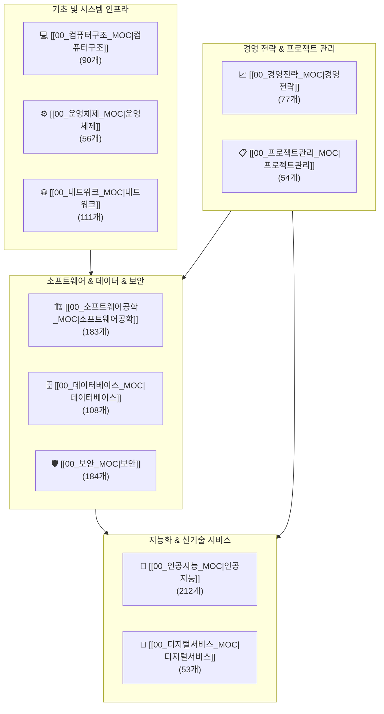

# 🌐 IT & 테크 10대 지식 도메인 마스터 맵 (Master MOC)

> **Welcome to IT & Tech Knowledge Base**  
> 정보관리기술사 및 컴퓨터시스템응용기술사 표준 지식 체계를 바탕으로 구성된 **1,128개**의 핵심 기술 노트 통합 인덱스입니다.  
> 원하는 도메인의 허브(MOC) 문서를 클릭하여 체계적인 학습 경로와 세부 토픽을 탐색하세요.

---

## 🗺️ 10대 도메인 상호 관계도

---

## 📊 10대 도메인별 MOC 허브 목록

| 도메인 | 허브 문서 (MOC) | 노트 수 | 주요 포함 주제 및 학습 로드맵 |
| :--- | :--- | :---: | :--- |
| **인공지능** | [[00_인공지능_MOC|🤖 인공지능 MOC]] | **212** | 수학·확률통계, 머신러닝, 딥러닝, LLM/생성형 AI, 컴퓨터 비전, XAI/윤리 |
| **보안** | [[00_보안_MOC|🛡️ 보안 MOC]] | **184** | 정보보안 원칙, 암호학·키관리, 네트워크/시스템 보안, 웹/앱 취약점, 침해대응, 프라이버시 |
| **소프트웨어공학** | [[00_소프트웨어공학_MOC|🏗️ 소프트웨어공학 MOC]] | **183** | SDLC 방법론, 애자일/DevOps, 요구사항 공학, 아키텍처/설계(MSA/DDD), 디자인 패턴, 테스팅/품질 |
| **네트워크** | [[00_네트워크_MOC|🌐 네트워크 MOC]] | **111** | OSI 7계층, IP 라우팅/스위칭, 전송 및 혼잡제어(QoS), 5G/6G 무선통신, 차세대 인프라(SDN) |
| **데이터베이스** | [[00_데이터베이스_MOC|🗄️ 데이터베이스 MOC]] | **108** | 데이터 모델링, 트랜잭션 동시성 제어, 장애 회복, 물리 저장·인덱스, 분산 DB/NoSQL, SQL 튜닝 |
| **컴퓨터구조** | [[00_컴퓨터구조_MOC|💻 컴퓨터구조 MOC]] | **90** | CPU 아키텍처, 캐시·메모리 계층, 고성능 AI 가속기(GPU/NPU), 기본 자료구조, 핵심 알고리즘 |
| **경영전략** | [[00_경영전략_MOC|📈 경영전략 MOC]] | **77** | 전략 수립 프레임워크(3C/SWOT), IT 거버넌스(EA/ISP), DX/BPR 혁신, ERP/CRM/SCM, BCP/DR |
| **운영체제** | [[00_운영체제_MOC|⚙️ 운영체제 MOC]] | **56** | 프로세스·스레드, CPU 스케줄링, 임계영역 동기화, 교착상태, 가상 메모리(페이징), 커널 |
| **프로젝트관리** | [[00_프로젝트관리_MOC|📋 프로젝트관리 MOC]] | **54** | PMBOK 7판 표준, 범위/일정 관리(WBS/CPM), 원가 산정(FP/EVM), 품질/위험/감리, 애자일 PM |
| **디지털서비스** | [[00_디지털서비스_MOC|🚀 디지털서비스 MOC]] | **53** | 클라우드 컴퓨팅(IaaS/PaaS/SaaS), 블록체인/Web3, IoT/스마트 인프라, Open API, 기능안전 표준 |
| **총합** | **10대 도메인 MOC 완성** | **1,128** | **전체 지식 노트 100% 색인 완료** |

---

## 🏷️ 디지털 가든 탐색 가이드
1. **상단 MOC 링크**: 각 도메인의 MOC 문서로 이동하여 세부 카테고리별로 구조화된 노트를 확인하세요.
2. **도메인 태그 검색**: 검색창(`Ctrl + K` 또는 우측 상단 돋보기)에서 도메인 태그(`#인공지능`, `#보안` 등)로 필터링할 수 있습니다.
3. **지식 그래프 탐색**: 페이지 우측 상단의 **Local Graph** 및 메인 화면의 **Global Graph**를 통해 시각적으로 연결된 개념을 탐색하세요.

---
[[content/index|🏠 Supreme Note 디지털 가든 메인으로 돌아가기]]
