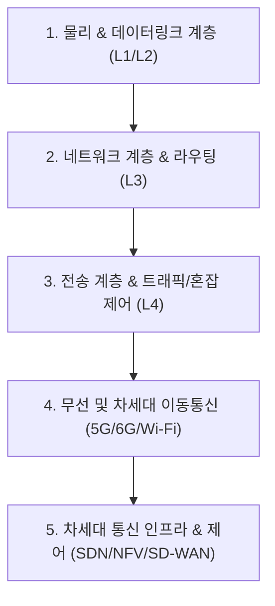

# 🌐 네트워크 MOC (Map of Content)

> **상위 허브**: [[00_02_IT_Tech_MOC|🏠 IT & 테크 마스터 MOC]] | **소속 토픽 수**: **111개**  
> OSI 7계층 및 TCP/IP 프로토콜 스택, 라우팅/스위칭, 전송 및 혼잡 제어, 무선·이동통신(5G/6G) 및 차세대 인프라(SDN/NFV)를 다루는 네트워크 지식 지도입니다.

---

## 🗺️ 지식 도메인 로드맵

---

## 📑 핵심 분류 체계 및 토픽 목록

### 1. OSI 7계층 & 데이터링크 계층 (L1/L2) (61)

> OSI 7계층, Ethernet, MAC 계층, CSMA/CD, CSMA/CA, ARP, 오류 검출 및 정정(CRC, 해밍코드)

- [[게이트웨이|게이트웨이]]
- [[네트워크 계층|네트워크 계층 (Network Layer)]]
- [[네트워크 슬라이싱|네트워크 슬라이싱]]
- [[네트워크 프로토콜|네트워크 프로토콜 (Network Protocol)]]
- [[다중화|다중화(Multiplexing)]]
- [[데이터 링크 계층|데이터 링크 계층 (Data Link Layer)]]
- [[디지털 트윈 네트워크|디지털 트윈 네트워크(Digital Twin Network)]]
- [[라우터|라우터]]
- [[링크 상태 알고리즘|링크 상태 알고리즘 (Link State Algorithm)]]
- [[매터|매터 (Matter)]]
- [[서비스 프리미티브|서비스 프리미티브 (Service Primitive)]]
- [[세션|세션]]
- [[순환중복검사|순환중복검사 (CRC Cyclic Redundancy Check)]]
- [[스위치|스위치]]
- [[스위치 이중화|스위치  이중화]]
- [[스위치 (Layer 3 Switch)|스위치 (Layer 3 Switch)]]
- [[스위치 (Layer 7 Switch)|스위치 (Layer 7 Switch)]]
- [[오픈플로우|오픈플로우(OpenFlow)]]
- [[자동재송요구|자동재송요구 (ARQ Automatic Repeat Request)]]
- [[전송 계층|전송 계층 (Transport Layer)]]
- [[전송부호화|전송부호화 (소스 코딩, 채널 코딩, 라인 코딩)]]
- [[쿠키|쿠키]]
- [[프로비저닝|프로비저닝]]
- [[프로토콜|프로토콜]]
- [[해밍코드|해밍코드(Hamming code)]]
- [[ARP|ARP]]
- [[BEC (Backward Error Correction)|BEC (Backward Error Correction)]]
- [[BGP|BGP(Border Gateway Protocol)]]
- [[CoAP|CoAP (Constrained Application Protocol)]]
- [[CRC|CRC(Cyclic Redundancy Check)]]
- [[CSMA CA|CSMA/CA]]
- [[CSMA CD|CSMA/CD]]
- [[Data Link(2) 레이어|Data Link(2) 레이어]]
- [[DHCP|DHCP(Dynamic Host Configuration Protocol)]]
- [[DiffServ (Differentiated Services)|DiffServ (Differentiated Services)]]
- [[DNS(Domain Name System)|DNS(Domain Name System)]]
- [[FEC(Forward Error Correction) BEC(Backward Error Correction)|FEC(Forward Error Correction) / BEC(Backward Error Correction)]]
- [[HTTP 3|HTTP/3]]
- [[ICMP|ICMP]]
- [[IGMP|IGMP]]
- [[IntServ (Integrated Services)|IntServ (Integrated Services)]]
- [[IoT Matter|IoT Matter]]
- [[IP|IP]]
- [[IPv4|IPv4]]
- [[IPv4와 IPv6 터널링|IPv4와 IPv6 터널링]]
- [[IPv6|IPv6]]
- [[Mobile Edge Computing|Mobile Edge Computing (MEC)]]
- [[MQTT (Message Queuing Telemetry Transport)|MQTT (Message Queuing Telemetry Transport)]]
- [[Network(3) 레이어|Network(3) 레이어]]
- [[OpenFlow|OpenFlow]]
- [[OSI 7 Layer|OSI 7 Layer (ISO 7498)]]
- [[RARP|RARP]]
- [[Routing Protocol|Routing Protocol]]
- [[SCTP (Stream Control Transmission Protocol)|SCTP (Stream Control Transmission Protocol)]]
- [[Service Primitive|Service Primitive(프리미티브)]]
- [[Session Layer|Session]]
- [[Subnetting (서브네팅)|Subnetting (서브네팅)]]
- [[TCP|TCP]]
- [[TCP 와 UDP 비교|TCP 와 UDP 비교]]
- [[Transport(4) 레이어|Transport(4) 레이어]]
- [[XMPP|XMPP (eXtensible Messaging and Presence Protocol)]]

### 2. 네트워크 계층 & 라우팅 프로토콜 (L3) (12)

> IPv4, IPv6, 서브네팅, 거리벡터 vs 링크상태, RIP, OSPF, BGP, ICMP, IGMP, 스위치 및 게이트웨이

- [[거리 벡터 알고리즘|거리 벡터 알고리즘 (Distance Vector Algorithm)]]
- [[라우팅 알고리즘|라우팅 알고리즘(Routing Protocol, 거리벡터, 링크상태)]]
- [[백본망|백본망]]
- [[서브네팅|서브네팅 (Subnetting)]]
- [[Distance Vector Algorithm|Distance Vector Algorithm]]
- [[End-to-End|End-to-End]]
- [[Link State Algorithm|Link State Algorithm]]
- [[MIMO|MIMO]]
- [[OFDM (Orthogonal Frequency Division Multiplexing)|OFDM (Orthogonal Frequency Division Multiplexing)]]
- [[SD-WAN (Software-Defined Wide Area Network)|SD-WAN (Software-Defined Wide Area Network)]]
- [[SDN(Software Defined Network)|SDN(Software Defined Network)]]
- [[WFQ|WFQ (Weighted Fair Queuing)]]

### 3. 전송 계층 & 트래픽 / 혼잡 제어 (L4) (21)

> TCP 3-Way Handshake, UDP, SCTP, 흐름제어(슬라이딩 윈도우), 혼잡제어(AIMD), QoS 및 패킷 스케줄링

- [[5G|5G 주요 기술]]
- [[네트워크 지능|네트워크 지능]]
- [[망 중립성|망 중립성 (Network Neutrality)]]
- [[무선 충전 기술|무선 충전 기술]]
- [[백홀 트래픽|백홀 트래픽]]
- [[소스코딩, 채널코딩, 라인코딩 샤논 정리|소스코딩, 채널코딩, 라인코딩 샤논 정리]]
- [[혼잡 제어|혼잡 제어]]
- [[CDN|CDN(Contents Delivery Network)]]
- [[Network Neutrality|Network Neutrality]]
- [[Passive WiFi|Passive WiFi]]
- [[PCM(Pulse-Code Modulation)|PCM(Pulse-Code Modulation)]]
- [[Point-to-Point|Point-to-Point]]
- [[QAM(Quadrature Amplitude Modulation)--|QAM(Quadrature Amplitude Modulation)]]
- [[QoS|QoS (Quality of Service)]]
- [[Sliding Window & 네이글(Nagle's) 알고리즘|Sliding Window & 네이글(Nagle's) 알고리즘]]
- [[TCP 연결의 설정 및 해제|TCP 연결의 설정 및 해제(Handshaking)]]
- [[TCP 혼잡제어|TCP 혼잡제어]]
- [[Traffic Policing (트래픽 정책처리)|Traffic Policing (트래픽 정책처리)]]
- [[Traffic Shaping (트래픽 쉐이핑)|Traffic Shaping (트래픽 쉐이핑)]]
- [[Wi-Fi 7|WI-FI 7 (IEEE 802.11be)]]
- [[Wi-Fi 8|Wi-Fi 8(IEEE 802.11bn)]]

### 4. 무선 및 차세대 이동통신 (5G/6G/Wi-Fi) (13)

> 5G(eMBB, URLLC, mMTC), 5G 특화망, 6G 비전, Wi-Fi 7/8, Bluetooth, 근거리 통신(NFC, RFID)

- [[5G 특화망|5G 특화망]]
- [[6G|6G]]
- [[비지상네트워크|비지상네트워크(NTN, Non-Terrestrial Networks)]]
- [[비직교 다중접속|비직교 다중접속 (NOMA) (Non-Orthogonal Multiple Access)]]
- [[저궤도 위성|저궤도 위성 (LEO, Low Earth Orbit)]]
- [[C-RAN(Centralized Cloud RAN)|C-RAN(Centralized / Cloud RAN)]]
- [[IEEE 802.11bn (Wi-Fi 8 표준)|IEEE 802.11bn (Wi-Fi 8 표준)]]
- [[NFC|NFC]]
- [[NWDAF(Network Data Analytics Function)|NWDAF(Network Data Analytics Function)]]
- [[O-RAN|O-RAN]]
- [[RAN(Radio Access Network) Sharing|RAN(Radio Access Network) Sharing]]
- [[RFID|RFID]]
- [[SDR (Software Defined Radio)|SDR (Software Defined Radio)]]

### 5. 통신 인프라 & 차세대 네트워크 기술 (4)

> SDN, NFV, SD-WAN, CDN, VAN, IoT 통신 프로토콜(CoAP, MQTT), XMPP 및 광전송망

- [[인텐트 기반 네트워킹|인텐트 기반 네트워킹(Intent-Based Networking)]]
- [[IBN(Intent-Based Networking)|IBN(Intent-Based Networking)]]
- [[NFV|NFV]]
- [[VAN|VAN]]

---

## 🧭 빠른 이동 및 관련 도메인
- [[00_02_IT_Tech_MOC|🏠 IT & 테크 마스터 MOC로 돌아가기]]
- [[content/index|🌐 Supreme Note 디지털 가든 홈]]
