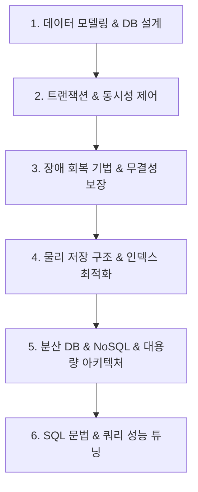

# 🗄️ 데이터베이스 MOC (Map of Content)

> **상위 허브**: [[00_02_IT_Tech_MOC|🏠 IT & 테크 마스터 MOC]] | **소속 토픽 수**: **108개**  
> 데이터 모델링, 트랜잭션 동시성 제어, 장애 회복, 물리적 저장 및 인덱스, 대용량 분산 DB/NoSQL 및 SQL 튜닝을 체계화한 데이터베이스 지식 지도입니다.

---

## 🗺️ 지식 도메인 로드맵

---

## 📑 핵심 분류 체계 및 토픽 목록

### 1. 데이터 모델링 & 관계형 DB 설계 (32)

> 개념/논리/물리 모델링, 정규화(1NF~BCNF), 반정규화, 함수적 종속성, 식별자, ERD, ANSI-SPARC 3단계 구조

- [[관계성|관계성]]
- [[데이터 가시화|데이터 가시화 (Data Visualization)]]
- [[데이터 마이닝 방법론|데이터 마이닝 방법론]]
- [[데이터 전처리|데이터 전처리]]
- [[데이터 클렌징|데이터 클렌징 (Data Cleansing)]]
- [[데이터 프로파일링|데이터 프로파일링 (Data Profiling)]]
- [[데이터베이스|데이터베이스]]
- [[데이터베이스 모델링|데이터베이스 모델링]]
- [[데이터베이스 반정규화|데이터베이스 반정규화(De-Normalization)]]
- [[데이터베이스 정규화|데이터베이스 정규화(Normalization)]]
- [[릴레이션 키|릴레이션 키(Key)]]
- [[스키마|스키마]]
- [[시스템 카탈로그|시스템 카탈로그 (System Catalog)]]
- [[암스트롱 공리|암스트롱 공리(Armstrong's Axioms)]]
- [[엔티티|엔티티(Entity)]]
- [[연결함정|연결함정(Connection Trap)]]
- [[자료 사전|자료 사전]]
- [[조인|조인(Join)]]
- [[카탈로그 시스템 카탈로그|카탈로그/시스템 카탈로그/ (System Catalog)]]
- [[특수화|특수화]]
- [[함수적 종속성|함수적 종속성 (Functional Dependency)]]
- [[Anomaly(이상현상)|Anomaly(이상현상)]]
- [[ANSI SPARC 모델(3-단계 데이터베이스 구조) 데이터 독립성|ANSI/SPARC 모델(3-단계 데이터베이스 구조) / 데이터 독립성]]
- [[BCNF|BCNF (Boyce-Codd Normal Form 3.5NF)]]
- [[DBMS|DBMS]]
- [[DDL|DDL]]
- [[Isolation Level (격리 레벨고립성 수준)|Isolation Level (격리 레벨고립성 수준)]]
- [[NoSQL (CAP 이론 BASE 속성)|NoSQL (CAP 이론 BASE 속성)]]
- [[NoSQL 데이터모델링 패턴|NoSQL 데이터모델링 패턴]]
- [[ODBC|ODBC]]
- [[OLAP|OLAP]]
- [[SQL 문법|SQL 문법]]

### 2. 트랜잭션 & 동시성 제어 (Concurrency) (36)

> ACID 원칙, 직렬성(Serializability), 트랜잭션 격리 수준, 2PL, MVCC, 타임스탬프 순서 기법, 이상현상(Dirty/Phantom Read)

- [[2PL|2PL (Two-Phase Locking Protocol)]]
- [[고립화 수준|고립화 수준]]
- [[공공데이터 품질인증 매뉴얼(2025.07.)|공공데이터 품질인증 매뉴얼(2025.07.)]]
- [[그림자페이지 기법|그림자페이지(Shadow Paging) 기법]]
- [[낙관적 검증 기법|낙관적 검증 (Validation) 기법]]
- [[다차원 색인구조|다차원 색인구조 (Multidimensional Index Structure)]]
- [[데이터 거버넌스 데이터 품질|데이터 거버넌스 데이터 품질]]
- [[데이터 레이크하우스|데이터 레이크하우스(Data Lakehouse)]]
- [[데이터 품질인증 가이드라인 - DQ인증 (2025.02.26)|데이터 품질인증 가이드라인 - DQ인증 (2025.02.26)]]
- [[데이터베이스 무결성|데이터베이스 무결성]]
- [[데이터베이스 파티셔닝|데이터베이스 파티셔닝(Partitioning)]]
- [[무결성|무결성]]
- [[연관성 분석|연관성 분석]]
- [[연관화|연관화]]
- [[집단화|집단화]]
- [[쿼리오프로딩|쿼리오프로딩(Query offloading)]]
- [[타임스탬프 순서 기법|타임스탬프 순서 기법 (Timestamp Ordering)]]
- [[트랜잭션|트랜잭션]]
- [[회복기법|회복기법]]
- [[Apriori 알고리즘|Apriori 알고리즘]]
- [[ARIES|ARIES (Algorithms for Recovery and Isolation Exploiting Semantics)]]
- [[CAP 이론과 BASE 이론|CAP 이론과 BASE 이론]]
- [[CockroachDB|CockroachDB(코크로치DB)]]
- [[DB 동시성제어|DB 동시성제어]]
- [[DB 성능 개선 방안|DB 성능 개선 방안 (Tuning)]]
- [[DB 회복기법|DB 회복기법]]
- [[Dirty Read|Dirty Read]]
- [[DML|DML]]
- [[FP(Frequent Pattern) - Growth 알고리즘|FP(Frequent Pattern) - Growth 알고리즘]]
- [[Locking|Locking]]
- [[MVCC(다중 버전 동시성 제어) 2가지 유형|MVCC(다중 버전 동시성 제어) 2가지 유형]]
- [[New SQL|New SQL]]
- [[OLTP|OLTP]]
- [[Phantom Read|Phantom Read]]
- [[RDBMS 인덱스(index)|RDBMS 인덱스(index)]]
- [[Timestamp Ordering|Timestamp Ordering]]

### 3. 장애 회복 기법 & 데이터 무결성 (8)

> DBMS 회복 원리, 로그 기반 회복(Undo/Redo), ARIES 알고리즘, 체크포인트, 그림자 페이징, 무결성 제약조건

- [[데이터 가치 평가 제도|데이터 가치 평가 제도]]
- [[데이터 표준화|데이터 표준화]]
- [[데이터 품질관리(ISO 8000)|데이터 품질관리(ISO 8000)]]
- [[용량산정|용량산정 (Capacity Sizing)]]
- [[절차형 SQL|절차형 SQL]]
- [[Dynamic SQL (동적 SQL)|Dynamic SQL (동적 SQL)]]
- [[PACELC|PACELC]]
- [[SQL 함수|SQL 함수]]

### 4. 물리 저장 구조 & 인덱스 최적화 (11)

> B-Tree, B+Tree, 다차원 색인, 클러스터드 인덱스, 뷰, 테이블 파티셔닝(Partitioning), 저장 메커니즘

- [[마이데이터|마이데이터]]
- [[분산 데이터베이스|분산 데이터베이스 (Distributed Database)]]
- [[빅데이터 관련 정보화 사업에 대한 감리 수행|빅데이터 관련 정보화 사업에 대한 감리 수행]]
- [[샤딩|샤딩 (Sharding)]]
- [[인덱스 구조에 따른 분류|인덱스 구조에 따른 분류 (Index Classification by Structure)]]
- [[파티셔닝|파티션]]
- [[DCL|DCL]]
- [[DHP(Direct Hashing & Pruning) 알고리즘|DHP(Direct Hashing & Pruning) 알고리즘]]
- [[EDW|EDW]]
- [[Hadoop 3.0|Hadoop 3.0]]
- [[HDFS|HDFS]]

### 5. 분산 데이터베이스 & NoSQL & 대용량 (5)

> CAP 이론, BASE, PACELC, NoSQL 유형, 샤딩, 복제, CockroachDB, CDC, ETL, 데이터 웨어하우스(DW), 데이터 레이크

- [[배깅|배깅]]
- [[아파치 카프카|아파치 카프카]]
- [[일반화|일반화]]
- [[Daap(Data as a product)|Daap(Data as a product)]]
- [[NoSQL 품질속성 PACELC|NoSQL 품질속성 PACELC]]

### 6. SQL 표준 문법 & 쿼리 성능 튜닝 (16)

> DDL/DML/DCL, 고급 SQL 함수, 옵티마이저(RBO/CBO), 실행계획, 조인(Join) 최적화, DB 튜닝 기법

- [[공공 데이터베이스 표준화 관리 매뉴얼 (2023.04)|공공 데이터베이스 표준화 관리 매뉴얼 (2023.04)]]
- [[공공데이터|공공데이터 (Open Data)]]
- [[관계대수|관계대수(Relational Algebra)]]
- [[관계해석|관계해석(Relational Calculus)]]
- [[데이터 분석 거버넌스|데이터 분석 거버넌스 (Data Analytics Governance)]]
- [[부스팅|부스팅 (Boosting)]]
- [[분류화|분류화]]
- [[분석 모델 평가 방법|분석 모델 평가 방법]]
- [[빅데이터 분석 기법|빅데이터 분석 기법 (알고리즘)]]
- [[옵티마이저|옵티마이저 (Optimizer)]]
- [[탐색적 데이터 분석과 확증적 데이터 분석|탐색적 데이터 분석과 확증적 데이터 분석]]
- [[ANN(Approximate Nearest Neighbor)알고리즘|ANN(Approximate Nearest Neighbor)알고리즘]]
- [[EDM|EDM]]
- [[JDBC|JDBC]]
- [[OPTIMIZER|OPTIMIZER]]
- [[SQL(Structured Query Language)|SQL(Structured Query Language)]]

---

## 🧭 빠른 이동 및 관련 도메인
- [[00_02_IT_Tech_MOC|🏠 IT & 테크 마스터 MOC로 돌아가기]]
- [[content/index|🌐 Supreme Note 디지털 가든 홈]]
