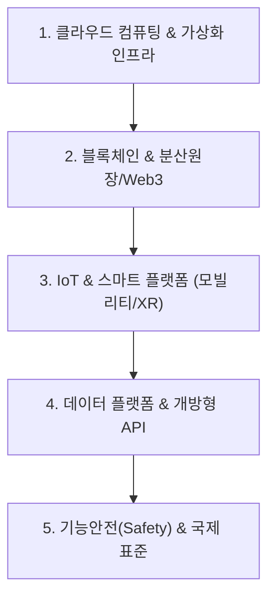

# 🚀 디지털서비스 MOC (Map of Content)

> **상위 허브**: [[00_02_IT_Tech_MOC|🏠 IT & 테크 마스터 MOC]] | **소속 토픽 수**: **53개**  
> 클라우드 컴퓨팅, 가상화/컨테이너, 블록체인 및 Web3, 사물인터넷(IoT), 스마트 인프라, 플랫폼 및 기능안전 표준을 포괄하는 신기술 지식 지도입니다.

---

## 🗺️ 지식 도메인 로드맵

---

## 📑 핵심 분류 체계 및 토픽 목록

### 1. 클라우드 컴퓨팅 & 가상화 인프라 (19)

> IaaS, PaaS, SaaS, XaaS, 퍼블릭/프라이빗/하이브리드 배치 모델, 하이퍼바이저, HPA 및 오토스케일링

- [[가상화|가상화]]
- [[도커|도커 (Docker)]]
- [[마이크로 서비스 아키텍쳐|마이크로 서비스 아키텍쳐]]
- [[멀티클라우드|멀티클라우드 (Multi-Cloud)]]
- [[오픈 스택 프로젝트|오픈 스택 프로젝트]]
- [[컨테이너|컨테이너 (Container)]]
- [[쿠버네티스|쿠버네티스(Kubernates)]]
- [[클라우드 네이티브|클라우드 네이티브]]
- [[클라우드 컴퓨팅|클라우드 컴퓨팅 (Cloud Computing)]]
- [[클라우드 컴퓨팅의 배치 모델 유형|클라우드 컴퓨팅의 배치 모델(Deployment Model) 유형 (PublicPrivateHybrid)]]
- [[포그 컴퓨팅|포그 컴퓨팅 (Fog Computing)]]
- [[Auto Scale Up Auto Scale Out|Auto Scale Up Auto Scale Out]]
- [[CSP|CSP (Cloud Service Provider)]]
- [[Digital Transformation|Digital Transformation]]
- [[HPA (Horizontal Pod Autoscaler)|HPA (Horizontal Pod Autoscaler)]]
- [[Hypervisor (VMM)|Hypervisor (VMM)]]
- [[PaaS|PaaS (Platform as a Service)]]
- [[Public Cloud 배치 분류별 3가지|Public Cloud 배치 분류별 3가지]]
- [[XaaS|XaaS(Everything as a Service)]]

### 2. 블록체인 & 분산원장 · Web3 (6)

> 블록체인 분산합의 알고리즘, 스마트 컨트랙트, 대체불가토큰(NFT), 중앙은행 디지털화폐(CBDC), Web 4.0/5.0

- [[01_IT Tech/블록체인|블록체인 (Block Chain)]]
- [[합의 알고리즘|합의 알고리즘 (Consensus Algorithm)]]
- [[CBDC|CBDC]]
- [[NFT (Non Fungible Token)|NFT (Non Fungible Token)]]
- [[Web 3.0|Web 3.0]]
- [[Web 4.0, 5.0|Web 4.0 5.0]]

### 3. 사물인터넷 (IoT) & 스마트 플랫폼 · 메타버스 (18)

> IoT 아키텍처, CPS, 스마트시티, 스마트팩토리, 자율주행(C-ITS), 확장현실(XR/VR/AR), SCADA 제어

- [[드론|드론 (Drone; 무인기)]]
- [[디지털 역기능|디지털 역기능 (Digital Dysfunction)]]
- [[디지털 트윈|디지털 트윈 (Digital Twin)]]
- [[메타버스|메타버스 (Metaverse)]]
- [[물리적 AI|물리적 AI]]
- [[인더스트리 4.0 5.0|인더스트리 4.0 5.0 (Industry 4.0 5.0)]]
- [[인터미턴트 컴퓨팅|인터미턴트 컴퓨팅 (intermittent computing)]]
- [[측위기술|측위기술 (LDT Location Determination Technology)]]
- [[ASIL|ASIL (Automotive Safety Integrity Level)]]
- [[C-ITS|C-ITS (Cooperative-Intelligent Transport Systems)]]
- [[CPS|CPS]]
- [[ISO 26262|ISO 26262]]
- [[SCADA (Supervisory Control and Data Acquisition)|SCADA (Supervisory Control and Data Acquisition)]]
- [[Smart Car(자율주행)|Smart Car(자율주행)]]
- [[Smart Factory|Smart Factory/스마트 팩토리(공장)]]
- [[u-Health Smart Health|u-Health Smart Health]]
- [[UAM|UAM (Urban Air Mobility)]]
- [[XR 유형|XR(eXtended Reality) 유형]]

### 4. 데이터 플랫폼 & 개방형 API 생태계 (7)

> Open API, 분산 데이터 처리 플랫폼(Hadoop), 링크드 오픈 데이터(LOD), 공공/마이데이터 생태계

- [[가상물리시스템|가상물리시스템]]
- [[개방형 연결 데이터|개방형 연결 데이터 (LOD Linked Open Data)]]
- [[모노리식 아키텍처|모노리식 아키텍처(Monolithic Architecture)]]
- [[전자 서명|전자 서명 (Digital Signature)]]
- [[하둡|하둡]]
- [[Open API 및 API|Open API API]]
- [[REST RESTful API 설계 6원칙|REST RESTful API 설계 6원칙]]

### 5. 기능안전 (Functional Safety) & 신뢰성 표준 (3)

> ISO 26262(자동차 기능안전), IEC 61508(전기전자 기능안전), ASIL 위험 등급 산정

- [[앰비언트 컴퓨팅|앰비언트 컴퓨팅 (Ambient Computing)]]
- [[양자컴퓨터|양자컴퓨터]]
- [[IEC 61508|IEC 61508]]

---

## 🧭 빠른 이동 및 관련 도메인
- [[00_02_IT_Tech_MOC|🏠 IT & 테크 마스터 MOC로 돌아가기]]
- [[content/index|🌐 Supreme Note 디지털 가든 홈]]
