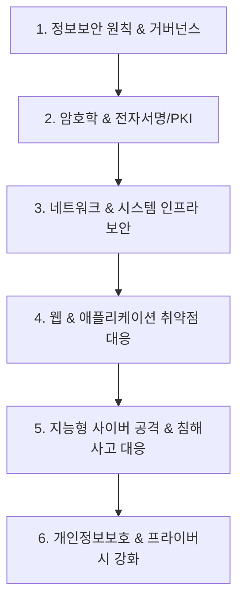

# 🛡️ 보안 MOC (Map of Content)

> **상위 허브**: [[00_02_IT_Tech_MOC|🏠 IT & 테크 마스터 MOC]] | **소속 토픽 수**: **184개**  
> 정보보안 원칙, 암호학, 네트워크·인프라 보안, 웹·애플리케이션 취약점 분석, 사이버 공격 대응 및 프라이버시 보호를 포괄하는 종합 보안 지식 지도입니다.

---

## 🗺️ 지식 도메인 로드맵

---

## 📑 핵심 분류 체계 및 토픽 목록

### 1. 정보보안 원칙 & 거버넌스 · 인증 (51)

> CIA 3요소, 접근통제(DAC, MAC, RBAC), 제로트러스트(ZTNA), ISMS-P, CSAP 및 보안 관리체계

- [[가용성|가용성]]
- [[개인정보 안심구역|개인정보 안심구역]]
- [[기밀성|기밀성]]
- [[다중서명|다중서명]]
- [[대칭키 암호화|대칭키 암호화]]
- [[데이터 3법|데이터 3법 (Data 3 Acts)]]
- [[디스크 이미징|디스크 이미징 (Disk Imaging)]]
- [[디지털 워터마킹|디지털 워터마킹(Digital Watermarking)]]
- [[디지털 트윈의 보안 취약점 및 대응방안|디지털 트윈(Digital Twin)의 보안 취약점 및 대응방안]]
- [[디지털 포렌식|디지털 포렌식(Digital Forensic)]]
- [[블록 암호화|블록 암호화 (Block Cipher)]]
- [[비대칭키 암호화|비대칭키 암호화]]
- [[비밀키 암호화와 비대칭키 암호화 비교|비밀키 암호화(Symmetric)와 비대칭키 암호화(Asymmetric) 비교]]
- [[서버 접근 통제|서버 접근 통제]]
- [[쇼어 & 그루버 알고리즘|쇼어 & 그루버 알고리즘]]
- [[스니핑, 스푸핑|스니핑(Sniffing) & 스푸핑(Spoofing)]]
- [[스마트팩토리 보안취약점 및 대응방안|스마트팩토리 보안취약점 및 대응방안]]
- [[암호 알고리즘|암호 알고리즘]]
- [[암호화|암호화 (Encryption)]]
- [[일방향 암호화 방식|일방향 암호화 방식]]
- [[자율주행 자동차 보안취약점 및 대응방안|자율주행 자동차 보안취약점 및 대응방안]]
- [[전자봉투|전자봉투(Digital Envelope)]]
- [[접근 제어 접근 통제|접근 제어/접근 통제(Access Control)]]
- [[접근 통제 모델|접근 통제 모델]]
- [[정보보안 부서의 신설과 정보보안 체계|정보보안 부서의 신설과 정보보안 체계]]
- [[정보보호 및 개인정보보호 관리체계 인증|정보보호 및 개인정보보호 관리체계 인증(ISMS-P)]]
- [[제로 트러스트 보안모델|제로 트러스트 (Zero Trust) 보안모델]]
- [[제로트러스트 가이드라인 2.0|제로트러스트 가이드라인 2.0]]
- [[해시 함수의 안전성|해시 함수의 안전성]]
- [[해시함수|해시함수(알고리즘 측면)]]
- [[CSAP|CSAP, CSAP(Cloud Security Assurance Program)]]
- [[CWPP & CSPM|CWPP(Cloud Workload Protection Platform) & CSPM(Cloud Security Posture Management)]]
- [[DAC|DAC]]
- [[DDOS|DDOS]]
- [[DES|DES]]
- [[DNSSEC(Domain Name System Security Extension)|DNSSEC(Domain Name System Security Extension)]]
- [[DoS (Denial of Service)|DoS (Denial of Service)]]
- [[DRDOS|DRDOS]]
- [[DSA|DSA]]
- [[HMAC|HMAC (Hash-based Message Authentication Code)]]
- [[IP Sec|IP Sec]]
- [[ISMS-P|ISMS-P]]
- [[ISO 27701|ISO 27701]]
- [[MAC|MAC]]
- [[MDC|MDC]]
- [[RBAC|RBAC]]
- [[SSL-TLS|SSL-TLS]]
- [[SW난독화|SW난독화]]
- [[TPM|TPM (Trusted Platform Module)]]
- [[UAM 취약점 및 대응방안|UAM 취약점 및 대응방안]]
- [[VPN|VPN(Virtual Private Network)]]

### 2. 현대 암호학 & 키 관리 · 전자서명 (63)

> 대칭키(AES, DES, SEED), 공개키(RSA, ECC), 해시함수, 전자서명(DSA), PKI 및 블록 암호

- [[가명처리 기법|가명처리(Pseudonymization) 기법]]
- [[간편인증 인터페이스 가이드라인|간편인증 인터페이스 가이드라인]]
- [[개인정보 영향평가|개인정보 영향평가(Privacy Impact Assessment)]]
- [[개인정보 프라이버시 8원칙|개인정보 프라이버시 8원칙]]
- [[개인정보보호 중심 설계|개인정보보호 중심 설계(Privacy by Design)]]
- [[동형 암호|동형 암호 (Homomorphic Encryption)]]
- [[디피-헬만 알고리즘|디피-헬만 알고리즘(Diffie-Hellman Algorithm)]]
- [[딥러닝 취약점|딥러닝 취약점 (Adversarial Attack)]]
- [[랜섬웨어|랜섬웨어]]
- [[부채널 공격|부채널 공격(Side Channel Attack)]]
- [[블록체인 플랫폼|블록체인 (Block Chain) 플랫폼]]
- [[블록체인 암호기술 가이드라인|블록체인 암호기술 가이드라인]]
- [[사이트간 위조공격|사이트간 위조공격]]
- [[생체 인증|생체 인증(텔레바이오 인증)]]
- [[시그니처 탐지기법|시그니처 탐지기법 (Signature-based Detection)]]
- [[안티 포렌식|안티 포렌식(Anti-forensic)]]
- [[암호 분석 공격 기법|암호 분석 공격(Cryptanalysis Attacks) 기법]]
- [[암호문 공격 기법|암호문 공격 기법 (Ciphertext Attack)]]
- [[암호학적 보안 강도|암호학적 보안 강도(Security Strength)]]
- [[양자 암호|양자 암호(Quantum Cryptography)]]
- [[양자내성암호|양자내성암호]]
- [[영지식증명|영지식증명(Zero Knowledge Proof)]]
- [[이중서명|이중서명 (Dual Signature)]]
- [[적대적 공격|적대적 공격]]
- [[제1 역상 저항성|제1 역상 저항성]]
- [[제2 역상 저항성|제2 역상 저항성]]
- [[차세대 SIEM|차세대 SIEM(Security Information and Event Management)]]
- [[크로스 사이트 스크립팅|크로스 사이트 스크립팅]]
- [[타원곡선 암호|타원곡선 (Elliptic Curve Cryptography)]]
- [[패스키|패스키(Passkey)]]
- [[포스트 양자 암호|포스트 양자 암호(Post-Quantum Cryptography)]]
- [[하이브리드 양자암호통신|하이브리드 양자암호통신]]
- [[해시 솔트와 키 스트레칭|해시 솔트(Salt)와 키 스트레칭(Key Stretching)]]
- [[AES|AES]]
- [[C2PA|C2PA]]
- [[CSRF|CSRF]]
- [[CTAP|CTAP]]
- [[CWE|CWE]]
- [[Diffie-Hellman 키 교환 (Diffie-Hellman Key Exchange)|Diffie-Hellman 키 교환 (Diffie-Hellman Key Exchange)]]
- [[DNS 싱크홀(Sinkhole)|DNS 싱크홀(Sinkhole)]]
- [[ECC|ECC(Elliptic Curve Cryptography)]]
- [[ECDHE|ECDHE]]
- [[Elgamel|Elgamel]]
- [[FIDO|FIDO]]
- [[FIDO 1.0 (Fast IDentity Online 1.0)|FIDO 1.0 (Fast IDentity Online 1.0)]]
- [[FIDO 2.0 (Fast IDentity Online 2.0)|FIDO 2.0 (Fast IDentity Online 2.0)]]
- [[FIPS (Federal Information Processing Standards)|FIPS (Federal Information Processing Standards)]]
- [[IAM|IAM]]
- [[IoT 보안 위협|IoT 보안 위협]]
- [[Land Attack|Land Attack]]
- [[MITRE ATT&CK (Adversarial Tactics, Techniques & Common Knowledge)|MITRE ATT&CK (Adversarial Tactics, Techniques & Common Knowledge)]]
- [[OWASP Top 10 2025|OWASP Top 10 2025]]
- [[PbD 인증제도|PbD(Privacy by Design) 인증제도]]
- [[PEC(Privacy-Enhancing Computation)|PEC(Privacy-Enhancing Computation)]]
- [[RaaS(Ransomware as a Service)|RaaS(Ransomware as a Service)]]
- [[RSA (Rivest Shamir Adleman)|RSA (Rivest Shamir Adleman)]]
- [[SASE(Secure Access Service Edge)|SASE(Secure Access Service Edge)]]
- [[SDP(Software Defined Perimeter)|SDP(Software Defined Perimeter)]]
- [[Shannon의 암호 설계 원칙|Shannon의 암호 설계 원칙]]
- [[SSRF(Server-Side Request Forgery)|SSRF(Server-Side Request Forgery)]]
- [[STRIDE|STRIDE]]
- [[XDR|XDR(eXtended Detection Response)]]
- [[XSS|XSS]]

### 3. 네트워크 & 엔드포인트 · 인프라 보안 (20)

> SSL/TLS, IPSec VPN, 방화벽/IPS, SIEM/SOAR, CTI, TPM/TEE, SASE 및 클라우드 보안

- [[기밀컴퓨팅|기밀컴퓨팅(Confidential Computing)]]
- [[방화벽|방화벽]]
- [[샌드박스|샌드박스 (Sandbox)]]
- [[위협 헌팅|위협 헌팅(Threat Hunting)]]
- [[큐싱|큐싱 (Qshing)]]
- [[클라우드 컴퓨팅 취약점 및 대응기술|클라우드 컴퓨팅 취약점 및 대응기술]]
- [[행위기반 탐지기법|행위기반 탐지기법 (Behavior-based Detection)]]
- [[휴리스틱 탐지기법|휴리스틱 탐지기법 (Heuristic Detection)]]
- [[APT(Advanced Persistent Threat) 공격|APT(Advanced Persistent Threat) 공격]]
- [[BPF(Berkeley Packet Filter) Door|BPF(Berkeley Packet Filter) Door]]
- [[CTI|CTI]]
- [[CVE|CVE]]
- [[DLP|DLP]]
- [[EDR(Endpoint Detection and Response)|EDR(Endpoint Detection and Response)]]
- [[SecaaS (Security as a Service)|SecaaS (Security as a Service)]]
- [[Secure Software Development Framework(SSDF)|Secure Software Development Framework(SSDF)]]
- [[SIEM|SIEM]]
- [[SOAR (Security Orchestration, Automation and Response)|SOAR (Security Orchestration, Automation and Response)]]
- [[SQL Injection|SQL Injection]]
- [[WAAP|WAAP(Web Application and API Protection)]]

### 4. 웹 & 애플리케이션 보안 · 취약점 점검 (16)

> OWASP Top 10(XSS, CSRF, SSRF, SQLi), CVE/CVSS/CWE, 모의해킹(DAST, SAST), FIDO2 및 SSDF

- [[공급망 공격|공급망 공격(Supply Chain Attack)]]
- [[국가 망 보안체계|국가 망 보안체계(N2SF)]]
- [[드라이브 바이 다운로드|드라이브 바이 다운로드(Drive By Download)]]
- [[드론 취약점 및 대응|드론 취약점 및 대응]]
- [[버퍼 오버 플로우|버퍼 오버 플로우]]
- [[사이버 보안 성숙도 모델 인증|사이버 보안 성숙도 모델 인증(CMMC, Cybersecurity Maturity Model Certification)]]
- [[스마트시티 보안취약점 및 대응방안|스마트시티 보안취약점 및 대응방안]]
- [[스마트카 보안 취약점 및 대응방안|스마트카 보안 취약점 및 대응방안 (Smart Car Security)]]
- [[시큐어코딩|시큐어코딩]]
- [[위협 모델링|위협 모델링(Threat Modeling) - Secure SDLC]]
- [[지속적인 위협 노출 관리|지속적인 위협 노출 관리(CTEM)]]
- [[차량 사이버 보안 국제 표준(ISO 21434)|차량 사이버 보안 국제 표준(ISO 21434)]]
- [[CVSS|CVSS]]
- [[DAST|DAST]]
- [[Exploit|Exploit]]
- [[OWASP Top 10 for LLM Application 2025|OWASP Top 10 for LLM Application 2025]]

### 5. 사이버 공격 기법 & 침해사고 대응 (13)

> APT 공격, 랜섬웨어, DDoS/DoS, 악성코드, C2 서버, 피싱, 스푸핑, 공격 탐지 및 디지털 포렌식

- [[공격 표면 관리|공격 표면 관리(Attack Surface Management)]]
- [[딥보이스 피싱|딥보이스(Deep Voice) 피싱]]
- [[루트킷|루트킷(Rootkit)]]
- [[사이버 게놈|사이버 게놈(Cyber genome)]]
- [[사이버 디셉션|사이버 디셉션(Cyber Deception)]]
- [[사이버 레질리언스|사이버 레질리언스(Cyber Resilience)]]
- [[사이버 킬 체인|사이버 킬 체인 (Cyber Kill Chain)]]
- [[사이버전|사이버전(Cyber Warfare)]]
- [[전자기파 이용 공격|전자기파 이용 공격 (EMP & TEMPEST)]]
- [[차분 프라이버시|차분 프라이버시]]
- [[클라우드 포렌식|클라우드 포렌식(Cloud Forensic)]]
- [[C2|C2]]
- [[DMARC(Domain-based Message Authentication, Reporting and Conformance)|DMARC(Domain-based Message Authentication, Reporting and Conformance)]]

### 6. 개인정보보호 & 프라이버시 강화 기술 (21)

> 개인정보 비식별 조치(가명화, 익명화), 동형암호, 차분 프라이버시, C2PA 및 글로벌 프라이버시 규제(CBPR)

- [[가명정보 처리 가이드라인|가명정보 처리 가이드라인]]
- [[개인정보 보호기술|개인정보 보호기술]]
- [[개인정보보호법|개인정보보호법]]
- [[데이터 안심구역|데이터 안심구역 (Data Safety Zone)]]
- [[데이터 전송요구권|데이터 전송요구권 (Right to Request Data Transmission)]]
- [[디지털 면역 시스템|디지털 면역 시스템(DIS, Digital Immune System)]]
- [[비식별화|비식별화]]
- [[생체정보 보호 안내서(24.12)|생체정보 보호 안내서(24.12)]]
- [[위험분석 방법론|위험분석 방법론 (ISO/IEC 1335-1, 위험분석 전략/평가)]]
- [[전자증거개시제도|전자증거개시제도(e-Discovery)]]
- [[정보보호 공시제도|정보보호 공시제도]]
- [[정보보호제품 평가·인증 제도|정보보호제품 평가·인증(CC 평가·인증) 제도]]
- [[핑거프린팅|핑거프린팅(Fingerprinting)]]
- [[CBPR|CBPR (국경 간 프라이버시 규칙) 개인정보 전송 관련 최신 글로벌 이슈]]
- [[DevSecOps|DevSecOps]]
- [[DRM(Digital Right Management)|DRM(Digital Right Management)]]
- [[IEC 62443|IEC 62443]]
- [[ISO 27017|ISO 27017]]
- [[ISO 27018|ISO 27018]]
- [[ISO IEC 20889|ISO/IEC 20889]]
- [[OAuth(Open Authorize) 2.0|OAuth(Open Authorize) 2.0]]

---

## 🧭 빠른 이동 및 관련 도메인
- [[00_02_IT_Tech_MOC|🏠 IT & 테크 마스터 MOC로 돌아가기]]
- [[content/index|🌐 Supreme Note 디지털 가든 홈]]
