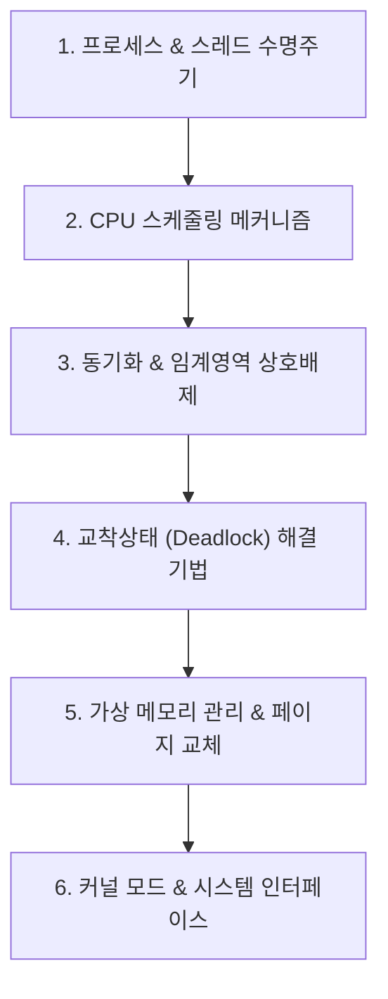

# ⚙️ 운영체제 MOC (Map of Content)

> **상위 허브**: [[00_02_IT_Tech_MOC|🏠 IT & 테크 마스터 MOC]] | **소속 토픽 수**: **56개**  
> 프로세스·스레드 수명주기, CPU 스케줄링, 임계영역 동기화, 교착상태(Deadlock), 가상 메모리 관리(페이징/세그멘테이션) 및 커널 아키텍처를 총괄하는 OS 지식 지도입니다.

---

## 🗺️ 지식 도메인 로드맵

---

## 📑 핵심 분류 체계 및 토픽 목록

### 1. 프로세스 & 스레드 관리 (37)

> 프로세스 상태 전이, PCB, 문맥 교환(Context Switching), 스레드 모델, 커널/유저 스레드, Ring Level 보호

- [[가상메모리 관리기법|가상메모리 관리기법]]
- [[교착상태|교착상태 (Deadlock)]]
- [[기아|기아(Starvation)]]
- [[논리 주소|논리 주소]]
- [[디스패치|디스패치]]
- [[멀티 쓰레드|멀티 쓰레드(Multi-Thread)]]
- [[모니터 동기화|모니터/Monitor 동기화]]
- [[문맥 교환|문맥 교환 (Context Switching)]]
- [[물리 주소|물리 주소]]
- [[비선점방식 유형|비선점방식 유형]]
- [[선점 스케줄링|선점 방식(선비)]]
- [[스레싱|스레싱 (Thrashing)]]
- [[스케줄러|스케줄러 (Scheduler)]]
- [[스케줄링|스케줄링]]
- [[스핀락|스핀락 (Spin Lock)]]
- [[쓰레드|쓰레드]]
- [[쓰레드와 프로세스 비교|쓰레드(Thread)와 프로세스(Process) 비교]]
- [[운영체제|운영체제 (Operating System)]]
- [[운영체제 특권레벨|운영체제 특권레벨 (Privilege Levels)]]
- [[인터럽트|인터럽트 (Interrupt)]]
- [[입출력발생|입출력발생]]
- [[자원할당 그래프|자원할당 그래프(Resource Allocation Graph)]]
- [[작업|작업]]
- [[처리량|처리량]]
- [[커널|커널(Kernel)]]
- [[프로세스|프로세스]]
- [[프로세스 관리|프로세스 관리]]
- [[프로세스 상태 전이도|프로세스 상태 전이도]]
- [[프로세스 제어 블록|프로세스 제어 블록]]
- [[프로세스와 스레드 비교|프로세스(Process)와 스레드(Thread) 비교]]
- [[프로세스간 통신|프로세스간 통신(IPC, Inter Process Communication)]]
- [[Belady's Anomaly|Belady's Anomaly]]
- [[CPU Ring Level|CPU Ring Level]]
- [[CPU Scheduling|CPU Scheduling]]
- [[FIFO|FIFO]]
- [[OS(운영체제)|OS(운영체제)]]
- [[PCB(Process Control Block)|PCB(Process Control Block)]]

### 2. CPU 스케줄링 알고리즘 (3)

> 단기/중기/장기 스케줄러, FCFS, SJF, Round Robin, 다단계 피드백 큐, 처리량/응답시간 성능 척도

- [[기한부 스케줄링|기한부(Deadline) 스케줄링]]
- [[디스크 스케줄링|디스크 스케줄링(Disk Scheduling)]]
- [[자원사용율|자원사용율]]

### 3. 프로세스 동기화 & 임계영역 상호배제 (2)

> 경쟁 조건(Race Condition), 임계영역(Critical Section), 상호배제, 세마포어(Semaphore), 뮤텍스(Mutex), 모니터

- [[경쟁조건 해결 방안|경쟁조건 해결 방안]]
- [[은행가 알고리즘|Banker's 알고리즘(은행가 알고리즘)]]

### 4. 교착상태 (Deadlock) 방지 및 해결 (1)

> 교착상태 4가지 필요조건, 예방(Prevention), 회피(Avoidance; 은행원 알고리즘), 탐지 및 회복, Wait-Die / Wound-Wait

- [[Wait-Die와 Wound-Wait|Wait-Die와 Wound-Wait]]

### 5. 가상 메모리 관리 & 페이지 교체 알고리즘 (8)

> 페이징, 세그멘테이션, 내부/외부 단편화, 요구 페이징, 페이지 교체(FIFO, LRU, LFU, NUR, OPT), Belady의 모순

- [[가상메모리의 페이징과 세그멘테이션|가상메모리의 페이징과 세그멘테이션]]
- [[단편화|단편화]]
- [[직접 사상과 연관 사상 페이징 기법|직접 사상과 연관 사상 페이징 기법]]
- [[유닉스 파일 시스템|파일 시스템(유닉스 파일시스템)]]
- [[LFU|LFU]]
- [[LRU|LRU]]
- [[NUR|NUR]]
- [[OPT|OPT]]

### 6. 커널 아키텍처 & 입출력 시스템 (5)

> OS 인터페이스, 시스템 콜, I/O 인터럽트 처리, 입출력 블로킹 메커니즘, eBPF 확장 기술

- [[기억장치 계층 구조|기억장치 계층 구조 (Memory Hierarchy)]]
- [[바이너리 런타임|바이너리 런타임]]
- [[병행 제어|병행 제어 (Concurrency control)]]
- [[유닉스의 inode|유닉스의 inode]]
- [[지역성|지역성(Locality)]]

---

## 🧭 빠른 이동 및 관련 도메인
- [[00_02_IT_Tech_MOC|🏠 IT & 테크 마스터 MOC로 돌아가기]]
- [[content/index|🌐 Supreme Note 디지털 가든 홈]]
