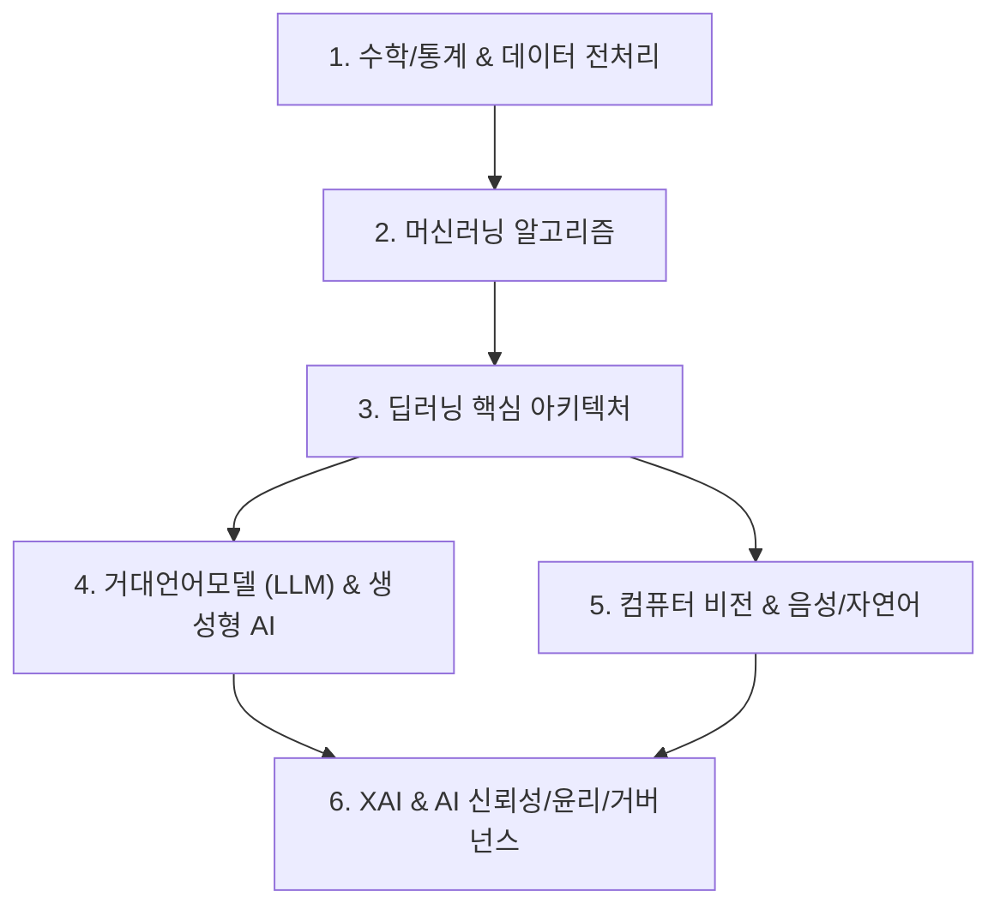

# 🤖 인공지능 MOC (Map of Content)

> **상위 허브**: [[00_02_IT_Tech_MOC|🏠 IT & 테크 마스터 MOC]] | **소속 토픽 수**: **212개**  
> 수학·통계학 이론부터 머신러닝, 딥러닝, 거대언어모델(LLM), 생성형 AI, 컴퓨터 비전, XAI 및 AI 윤리/거버넌스까지 인공지능 전 영역을 아우르는 지식 지도입니다.

---

## 🗺️ 지식 도메인 로드맵

---

## 📑 핵심 분류 체계 및 토픽 목록

### 1. 수학 · 통계학 & 데이터 전처리 (81)

> 확률분포, 가설검정, 상관/회귀분석, 차원축소 및 데이터 정제 기법

- [[가설 검정|가설 검정]]
- [[거리 공식|거리 공식(Distance Formula)]]
- [[거리함수|거리함수]]
- [[결측치|결측치]]
- [[관계검정|관계검정 (Relationship Test)]]
- [[기술 통계|기술 통계(Descriptive statistics)]]
- [[기하 분포|기하 분포 (Geometric Distribution)]]
- [[다중공선성|다중공선성 (Multicolinearity)]]
- [[대형개념모델|대형개념모델(LCM Large Concept Models)]]
- [[데이터 유형|데이터 유형]]
- [[등분산성|등분산성 (Homoscedasticity)]]
- [[로지스틱회귀분석|로지스틱회귀분석]]
- [[모델 드리프트 컨셉 드리프트 & 데이터 드리프트|모델 드리프트 컨셉 드리프트 & 데이터 드리프트]]
- [[모델 프리|모델 프리]]
- [[밀도기반 클러스터링|밀도기반 클러스터링(DBSCAN)]]
- [[베르누이 분포|베르누이 분포 (Bernoulli distribution)]]
- [[베이즈 정리|베이즈 정리 (이론)]]
- [[베이즈 추론|베이즈 추론]]
- [[베이지안 딥러닝|베이지안 딥러닝]]
- [[베이지안 모델|베이지안 모델]]
- [[벡터 데이터베이스|벡터 데이터베이스(Vector Database)]]
- [[불편추정량|불편추정량 (Unbiased Estimator)]]
- [[비심볼릭 추론|비심볼릭 추론]]
- [[비지도 학습|비지도 학습]]
- [[빔 탐색|빔 탐색 (Beam Search)]]
- [[상관 관계 분석|상관 관계 분석 (Correlation Analysis)]]
- [[서포트 벡터 머신|서포트 벡터 머신 SVM(Support Vector Machine)]]
- [[소프트맥스 정규화|소프트맥스 정규화]]
- [[손실함수|손실함수]]
- [[시계열분석|시계열분석]]
- [[심화강화학습|심화강화학습]]
- [[왜도 & 첨도|왜도(skewness) & 첨도(kurtosis)]]
- [[유사도|유사도(Similarity)]]
- [[유의확률|유의확률 (p-value)]]
- [[의사결정나무|의사결정나무]]
- [[이상 감지|이상 감지]]
- [[이상치|이상치]]
- [[이항분포|이항분포 (Binomial Distribution)]]
- [[자연어처리|자연어처리 (NLP)]]
- [[정규분포|정규분포(Normal Distribution)]]
- [[정량적 데이터|정량적 데이터]]
- [[준지도학습|준지도학습]]
- [[중심극한정리|중심극한정리 (Central Limit Theorem)]]
- [[차원 축소|차원 축소(Dimensionality Reduction)]]
- [[추론 통계|추론 통계(Inferential Statistics)]]
- [[추정 이론|추정 이론(Estimation Theory)]]
- [[추정통계|추정통계 (Estimation Statistics)]]
- [[클래스 불균형|클래스 불균형(Class Imbalance)]]
- [[통계 데이터 마이닝|통계데이터마이닝 (연관규칙 & 베이즈)]]
- [[통계적 가설검정|통계적 가설검정 (Hypothesis Testing)]]
- [[포아송 분포|포아송 분포 (Poisson Distribution)]]
- [[표본 추출|표본 추출]]
- [[표현 학습|표현 학습]]
- [[할루시네이션|할루시네이션(Hallucination)]]
- [[합성 데이터|합성 데이터(Synthetic Data)]]
- [[확률분포|확률분포]]
- [[확률분포와 확률 밀도 함수|확률분포와 확률 밀도 함수]]
- [[회귀분석|회귀분석(Regression Analysis)]]
- [[AI 시스템 테스트|AI 시스템 테스트]]
- [[AIC(Akaike information Criterion) & BIC(Bayesian information Criterion)|AIC(Akaike information Criterion) & BIC(Bayesian information Criterion)]]
- [[ANOVA(Analysis of variance)|ANOVA(Analysis of variance)]]
- [[CNN|CNN (Convolutional Neural Network)]]
- [[Compound Scaling|Compound Scaling]]
- [[DBSCAN(밀도 기반 클러스터링)|DBSCAN(밀도 기반 클러스터링)]]
- [[Defense GAN|Defense GAN]]
- [[Diffusion 모델|Diffusion 모델]]
- [[Dropout|Dropout]]
- [[GAN (Generative Adversarial Network)|GAN (Generative Adversarial Network)]]
- [[K-평균 알고리즘|K-평균 알고리즘]]
- [[KNN 알고리즘|KNN 알고리즘]]
- [[LoRA(Low-rank adaptation)|LoRA(Low-rank adaptation)]]
- [[MLOps|MLOps]]
- [[Network Dessection|Network Dessection]]
- [[Optimization Algorithm|Optimization Algorithm]]
- [[PCA(Principal Component Analysis)|PCA(Principal Component Analysis)]]
- [[ROC 곡선|ROC 곡선]]
- [[SVD(Singular Value Decomposition)|SVD(Singular Value Decomposition)]]
- [[t-검정 (t-test)|t-검정 (t-test)]]
- [[TF-IDF (Term Frequency - Inverse Document Frequency)|TF-IDF (Term Frequency - Inverse Document Frequency)]]
- [[VAE|VAE(Variational Autoencoder)]]
- [[Z-검정|Z-검정 (Z-test)]]

### 2. 머신러닝 기초 & 핵심 알고리즘 (25)

> 지도/비지도/강화학습, 의사결정나무, 군집화, 앙상블 및 모델 평가 지표

- [[강화학습|강화학습]]
- [[경사하강법|경사하강법 (Gradient Descent Algorithm)]]
- [[딥뷰|딥뷰 (DeepView)]]
- [[랜덤 포레스트|랜덤 포레스트 (Random Forest)]]
- [[마르코프 결정 프로세스|마르코프 결정 프로세스]]
- [[머신러닝 학습과정에서의 적대적 공격|머신러닝 학습과정에서의 적대적 공격]]
- [[멀티에이전트 강화학습|멀티에이전트 강화학습]]
- [[모방 강화학습|모방 강화학습]]
- [[앙상블 학습|앙상블 학습(Ensemble Learning)]]
- [[에이전틱 AI|에이전틱 AI(Agentic AI)]]
- [[역전파|역전파(Backpropagation)]]
- [[이미지넷|이미지넷]]
- [[인공지능 감리|인공지능 감리 (AI Audit)]]
- [[인공지능 적대적 공격|인공지능 적대적 공격]]
- [[자기 지도 증강|자기 지도 증강]]
- [[자기지도학습|자기지도학습]]
- [[전용 인공지능|전용 인공지능]]
- [[지도학습|지도학습]]
- [[퓨샷러닝|퓨샷러닝]]
- [[혼동행렬|혼동행렬 (Confusion Matrix)]]
- [[Active Learning|Active Learning]]
- [[AI 거버넌스|AI 거버넌스 (AI Governance)]]
- [[CRISP-DM|CRISP-DM(Cross Industry Standard Process for Data Mining)]]
- [[MNIST|MNIST]]
- [[Q러닝|Q러닝]]

### 3. 딥러닝 핵심 아키텍처 & 신경망 (28)

> 인공신경망, CNN, RNN/LSTM, Transformer, Attention 메커니즘, 최적화 및 활성화 함수

- [[과적합 문제|과적합 (overfitting)문제]]
- [[광학문자인식|광학문자인식]]
- [[기울기 소실과 기울기 폭주|기울기 소실과 기울기 폭주]]
- [[딥러닝|딥러닝]]
- [[딥페이크|딥페이크(Deepfake)]]
- [[모델 구조|모델 구조]]
- [[범용 인공지능|범용 인공지능]]
- [[어텐션 매커니즘|어텐션 매커니즘]]
- [[어텐션 메커니즘|어텐션 메커니즘(Attention Mechanism)]]
- [[인공지능|인공지능]]
- [[자기 집중|자기 집중]]
- [[정규화, 규제화, 표준화|정규화, 규제화, 표준화]]
- [[초거대 언어 모델|초거대 언어 모델(Large Language Model)]]
- [[컨텍스트 엔지니어링|컨텍스트 엔지니어링(Context Engineering)]]
- [[트랜스포머|트랜스포머(Transformer)]]
- [[활성화함수|활성화함수(Activation Function)]]
- [[Atros Convolution|Atros Convolution]]
- [[BERT|BERT]]
- [[DCGAN|DCGAN]]
- [[GradCAM|GradCAM]]
- [[LAS|LAS]]
- [[LRP|LRP]]
- [[LSTM (Long Short-Term Memory)|LSTM (Long Short-Term Memory)]]
- [[MOE(Mixture of Experts)|MOE(Mixture of Experts)]]
- [[RNN (Recurrent Neural Network)|RNN (Recurrent Neural Network)]]
- [[RNN-T|RNN-T]]
- [[RPN|RPN]]
- [[seq2seq|seq2seq]]

### 4. 거대언어모델 (LLM) & 생성형 AI (47)

> Foundation Model, BERT/GPT, RAG, 프롬프트 엔지니어링, 파인튜닝(PEFT), 경량화

- [[공공부문 초거대AI 도입, 활용 가이드라인 2.0(2025.04)|공공부문 초거대AI 도입, 활용 가이드라인 2.0(2025.04)]]
- [[대규모 언어 모델 성능 향상 기술|대규모 언어 모델(LLM) 성능 향상 기술]]
- [[랭체인|랭체인(LangChain)]]
- [[머신러닝 옵티마이저|머신러닝 옵티마이저]]
- [[머신러닝 학습방법|머신러닝 학습방법]]
- [[메타학습|메타학습]]
- [[바이브코딩|바이브코딩(Vibe Coding)]]
- [[블랙박스 모델|블랙박스 모델]]
- [[생성형 인공지능 서비스 이용자 보호 가이드라인|생성형 인공지능 서비스 이용자 보호 가이드라인]]
- [[생성형 인공지능 저작권|생성형 인공지능 저작권]]
- [[생성형 인공지능 저작권 이슈 및 대응방안|생성형 인공지능(Generative AI) 저작권 이슈 및 대응방안]]
- [[생성형 AI 위협 및 대응방안|생성형 AI 위협 및 대응방안]]
- [[생성형AI 데이터 품질관리 가이드 v2.0|생성형AI 데이터 품질관리 가이드 v2.0]]
- [[심볼릭 추론|심볼릭 추론]]
- [[인공지능 학습용 데이터 품질관리 가이드라인 v3.1|인공지능 학습용 데이터 품질관리 가이드라인 v3.1]]
- [[전이학습|전이학습 (Transfer Learning)]]
- [[지식 증류|지식 증류 (Knowledge Distillation)]]
- [[테스트 타임 스케일링|테스트 타임 스케일링(Test-Time Scaling, TTS)]]
- [[파운데이션 모델|파운데이션 모델(Foundation Model)]]
- [[파인 튜닝|파인 튜닝(Fine-tuning)]]
- [[프롬프트 엔지니어링|프롬프트 엔지니어링(Prompt Engineering)]]
- [[프롬프트 인젝션|프롬프트 인젝션(Prompt Injection)]]
- [[프롬프트 튜닝|프롬프트 튜닝(Prompt Tuning)]]
- [[AGI|AGI (Artificial General Intelligence)]]
- [[AI 레드팀(Red team) 테스트|AI 레드팀(Red team) 테스트]]
- [[AI 윤리|AI 윤리]]
- [[AI Agent|AI Agent]]
- [[AI Ready Data|AI Ready Data]]
- [[AI TRiSM|AI TRiSM(AI Trust Risk and Security Management)]]
- [[AX (AI Transformation)|AX (AI Transformation)]]
- [[BrainBody LLM|BrainBody LLM]]
- [[COT|COT(Chain of Thought)]]
- [[Downstream Task|Downstream Task]]
- [[Episodic Memory|Episodic Memory]]
- [[Fine-Tuning|Fine-Tuning]]
- [[Graph of Thought (GoT)|got Graph of thought]]
- [[GraphRAG (Graph Retrieval-Augmented Generation)|GraphRAG (Graph Retrieval-Augmented Generation)]]
- [[LAM(Large Action Model)|LAM(Large Action Model)]]
- [[LangGraph|LangGraph]]
- [[LLMOps|LLMOps]]
- [[MAS (Multi Agent System)|MAS (Multi Agent System)]]
- [[MCP 보안취약점 및 대응방안|MCP 보안취약점 및 대응방안]]
- [[PEFT|PEFT(Parameter-Efficient Fine-Tuning)]]
- [[RAG (Retrieval Augmented Generation) 검색 증강 생성 AI|RAG (Retrieval Augmented Generation)  검색 증강 생성 AI]]
- [[RIG(Retrieval Interleaved Generation)|RIG(Retrieval Interleaved Generation)]]
- [[sLLM (Smaller Large Language Model)|sLLM (Smaller Large Language Model)]]
- [[ToT|tot Tree of thought]]

### 5. 컴퓨터 비전 · 음성 & 에이전트 (9)

> 객체 검출(YOLO, RPN), 이미지넷, OCR, 음성인식(LAS), 자율 에이전트(Agent)

- [[데이터 라벨링과 어노테이션|데이터 라벨링과 어노테이션]]
- [[멀티모달 AI|멀티모달(Multimodal) AI]]
- [[인공지능 생성물 워터마크 적용 기술|인공지능 생성물 워터마크 적용 기술]]
- [[장면 그래프|장면 그래프]]
- [[AEI|AEI(Artificial Emotional Intelligence)]]
- [[AutoML (Automated Machine Learning)|AutoML (Automated Machine Learning)]]
- [[Feature Pyramid Network|Feature Pyramid Network]]
- [[LDA(Linear Discriminant Analysis)|LDA(Linear Discriminant Analysis)]]
- [[MCP|MCP (Model Context Protocol)]]

### 6. 설명가능한 AI (XAI) & AI 윤리 · 거버넌스 (22)

> XAI 해석 기법(LIME, LRP, Grad-CAM), AI 윤리/안전, 소버린 AI, AI 기본법 및 AGI

- [[머신 언러닝|머신 언러닝(Machine Unlearning)]]
- [[배치 정규화|배치 정규화]]
- [[버티컬 AI|버티컬 AI(Vertical AI)]]
- [[범용 인공지능 위험관리 프레임워크|범용 인공지능 위험관리 프레임워크]]
- [[소버린 AI|소버린 AI(Artificial Intelligence)]]
- [[연합 학습|연합 학습]]
- [[온디바이스 AI|온디바이스 AI]]
- [[유전 알고리즘|유전 알고리즘 (Genetic Algorithm)]]
- [[인공지능 도입 사업비 산정 절차|인공지능 (AI) 도입 사업비 산정 절차]]
- [[인공지능 경영시스템|인공지능 경영시스템(ISO 42001:2023)]]
- [[지식그래프|지식그래프]]
- [[지지도|지지도]]
- [[초대규모 AI 모델|초대규모 AI 모델 (Hyperscale AI Model)]]
- [[편향|편향]]
- [[AI 기본법|AI 기본법]]
- [[AI 신뢰성 인증|AI 신뢰성 인증]]
- [[ISO IEC TS 42119-2|ISO/IEC TS 42119-2]]
- [[LIME|LIME]]
- [[MLPerf|MLPerf]]
- [[Physical AI|Physical AI]]
- [[Sovereign AI (소버린 AI)|Sovereign AI (소버린 AI)]]
- [[XAI|XAI]]

---

## 🧭 빠른 이동 및 관련 도메인
- [[00_02_IT_Tech_MOC|🏠 IT & 테크 마스터 MOC로 돌아가기]]
- [[content/index|🌐 Supreme Note 디지털 가든 홈]]
