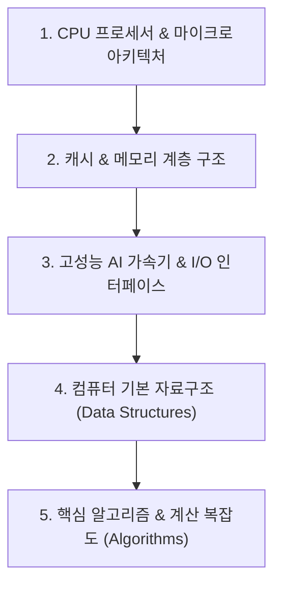

# 💻 컴퓨터구조 MOC (Map of Content)

> **상위 허브**: [[00_02_IT_Tech_MOC|🏠 IT & 테크 마스터 MOC]] | **소속 토픽 수**: **90개**  
> CPU 아키텍처, 파이프라인, 캐시·메모리 계층, 고성능 AI 가속기 하드웨어, 기본 자료구조 및 알고리즘을 아우르는 컴퓨터 시스템 구조 지도입니다.

---

## 🗺️ 지식 도메인 로드맵

---

## 📑 핵심 분류 체계 및 토픽 목록

### 1. CPU 프로세서 & 마이크로아키텍처 (26)

> CPU 구조, 명령어 세트(ISA), RISC vs CISC, 명령어 파이프라인 및 해저드(Hazard), 레지스터, 카르노 맵

- [[뉴로모픽 칩|뉴로모픽 칩 (Neuromorphic Chip)]]
- [[메모리 인터리빙|메모리 인터리빙(Interleaving)]]
- [[명령문|명령문]]
- [[방향성 비순환 그래프|방향성 비순환 그래프(DAG, Directed Acyclic Graph)]]
- [[비메모리 반도체|비메모리 반도체 (Non-Memory Chip System Semiconductor)]]
- [[사상 기법|사상 기법]]
- [[시스톨릭 어레이|시스톨릭 어레이]]
- [[알고리즘|알고리즘]]
- [[중앙처리장치|중앙처리장치 (CPU Central Processing Unit)]]
- [[지능형 반도체|지능형 반도체]]
- [[카르노 맵|카르노 맵 (Karnaugh Map)]]
- [[캐시 메모리|캐시 메모리]]
- [[캐시 일관성|캐시 일관성(Cache Coherence)]]
- [[캐시 일관성 유지 기법|캐시 일관성(Cache Coherence) 유지 기법]]
- [[캐시 메모리의 쓰기 정책|캐시메모리의 쓰기정책(Write Policy)]]
- [[CPU|CPU]]
- [[CPU 처리과정|CPU 처리과정]]
- [[CXL|CXL (Compute Express Link)]]
- [[DMA(Direct Memory Access)|DMA(Direct Memory Access)]]
- [[GPU|GPU]]
- [[MESI 프로토콜|MESI 프로토콜 (MESI Protocol)]]
- [[MMU(Memory Management Unit)|MMU(Memory Management Unit)]]
- [[NPU|NPU(Neural Processing Unit)]]
- [[PE|PE(Processing Element)]]
- [[Pipeline Hazard|Pipeline Hazard]]
- [[TPU (Tensor Processing Unit)|TPU (Tensor Processing Unit)]]

### 2. 캐시 & 메모리 계층 구조 · 스토리지 (37)

> 기억장치 계층, 캐시 메모리 매핑, 캐시 일관성(MESI), DRAM/SRAM, HBM, CXL, 플래시 메모리, 액침냉각(데이터센터)

- [[가상 메모리|가상 메모리]]
- [[가상 메모리 관리 정책|가상 메모리 관리 정책]]
- [[링크드 리스트|링크드 리스트(Linked List)]]
- [[메모리 관리|메모리 관리]]
- [[메모리 관리 정책|메모리 관리 정책]]
- [[메모리 단편화|메모리 단편화 (Fragmentation)]]
- [[메모리 반도체|메모리 반도체 (Memory Semiconductor)]]
- [[멤리스터|멤리스터]]
- [[변수|변수]]
- [[빅오 표기법|빅오 표기법 (O-Notation)]]
- [[삽입 정렬|삽입 정렬 (Insertion Sort)]]
- [[선형 자료구조와 비선형 자료구조|선형 자료구조와 비선형 자료구조]]
- [[세그멘테이션|세그멘테이션 (Segmentation, 가변분할)]]
- [[스토리지 유형|스토리지 유형 (블록, 파일, 오브젝트 스토리지)]]
- [[알고리즘 성능평가|알고리즘 성능평가]]
- [[이레이저 코딩|이레이저 코딩(erasure coding)]]
- [[캐시 플러시|캐시 플러시(Cache Flush)]]
- [[캐시 메모리의 사상 방식|캐시(Cache) 메모리의 사상 방식(Mapping Scheme)]]
- [[퀵 정렬|퀵 정렬 (Quick Sort)]]
- [[페이지 교체 알고리즘|페이지 교체 알고리즘 (Paging Replacement Algorithm)]]
- [[해시 테이블|해시 테이블]]
- [[해싱과 충돌해결방법|해싱과 충돌해결방법]]
- [[Char Type|Char Type]]
- [[Data Type|Data Type]]
- [[Flash Memory(NOR, NAND)|Flash Memory(NOR, NAND)]]
- [[Green Data Center (액침 냉각; Immersion Cooling)|Green Data Center (액침 냉각; Immersion Cooling)]]
- [[HA(High Availability)|HA(High Availability)]]
- [[HBM|HBM (High Bandwidth Memory)]]
- [[I2C(Inter Integrated Circuit)와 SPI(Serial Peripheral Interface)|I2C(Inter Integrated Circuit)와 SPI(Serial Peripheral Interface)]]
- [[Int Type|Int Type]]
- [[MAC 배열|MAC 배열]]
- [[NAS|NAS]]
- [[O-Notation (O-표기법)|O-Notation (O-표기법)]]
- [[PIM|PIM(Processing-In-Memory)]]
- [[RAID|RAID]]
- [[Stack|Stack]]
- [[String Type|String Type]]

### 3. 고성능 AI 가속기 & 입출력 시스템 (12)

> GPU, NPU, TPU, PIM(Processing-In-Memory), DMA, 인터럽트 제어, 버스 아키텍처, 칩렛(Chiplet), 고가용성(HA)

- [[그래프 순회|그래프 순회 (Graph Traversal)]]
- [[그리디 알고리즘|그리디 (탐욕) 알고리즘]]
- [[세마포어|세마포어(Semaphore)]]
- [[연산자|연산자]]
- [[워치독 타이머|워치독 타이머(WDT, Watchdog timer)]]
- [[칩렛|칩렛 (Chiplet)]]
- [[허프만 코딩|허프만 (Huffman) 코딩]]
- [[Balanced Tree B-Tree|Balanced Tree B-Tree (비트리)]]
- [[Boolean Type|Boolean Type]]
- [[EDGE|edge]]
- [[Float Type|Float Type]]
- [[PCI Express (Peripheral Component Interconnect Express)|PCI Express (Peripheral Component Interconnect Express)]]

### 4. 기본 자료구조 (Data Structures) (10)

> 스택, 큐, 연결 리스트, 트리(이진트리, AVL, B-Tree), 힙, 그래프, 원시/복합 자료형(Int, Float, String, Boolean)

- [[다익스트라 알고리즘|다익스트라 (Dijkstra) 알고리즘]]
- [[배열|배열]]
- [[버블 정렬|버블 정렬 (Bubble Sort)]]
- [[병합 정렬|병합 정렬 (Merge Sort)]]
- [[이진 탐색 트리|이진 탐색 트리(Binary Search Tree)]]
- [[최소 신장 트리|최소 신장 트리 (MST, Minimum Spanning Tree)]]
- [[트리 순회|트리 순회 (Tree Traversal)]]
- [[힙|힙 (Heap)]]
- [[AVL 트리|AVL 트리]]
- [[Queue|Queue]]

### 5. 핵심 알고리즘 & 계산 복잡도 (Algorithms) (5)

> 빅오 표기법(O-Notation), 정렬(퀵, 병합, 버블, 삽입), 탐색, 최단경로(다익스트라), 그리디, 동적 계획법(DP), 해싱

- [[결함허용 컴퓨터|결함허용 컴퓨터(FTS)]]
- [[동적 계획법|동적 계획법 (Dynamic Programming)]]
- [[런랭스 코딩|런랭스 (Run Length) 코딩]]
- [[우선순위 역전현상|우선순위 역전현상]]
- [[최적화 알고리즘|최적화 알고리즘 (Optimization Algorithm)]]

---

## 🧭 빠른 이동 및 관련 도메인
- [[00_02_IT_Tech_MOC|🏠 IT & 테크 마스터 MOC로 돌아가기]]
- [[content/index|🌐 Supreme Note 디지털 가든 홈]]
