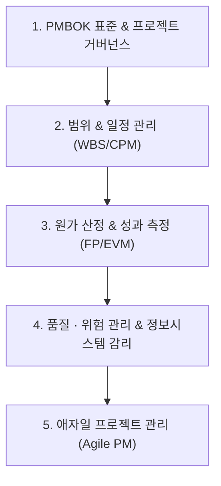

# 📋 프로젝트관리 MOC (Map of Content)

> **상위 허브**: [[00_02_IT_Tech_MOC|🏠 IT & 테크 마스터 MOC]] | **소속 토픽 수**: **54개**  
> PMBOK 표준, 프로젝트 통합·범위·일정·원가·품질 관리, 위험 관리, 정보시스템 감리 및 애자일 프로젝트 관리를 아우르는 프로젝트 관리 지식 지도입니다.

---

## 🗺️ 지식 도메인 로드맵

---

## 📑 핵심 분류 체계 및 토픽 목록

### 1. PMBOK 표준 & 프로젝트 거버넌스 (22)

> PMBOK 7판 12원칙 및 8대 성과영역, 5대 프로세스 그룹, PMO, RACI 매트릭스, 이해관계자 관리

- [[PMO|(E)PMO]]
- [[갈등관리|갈등관리]]
- [[애자일 12개 원칙|애자일 12개 원칙]]
- [[애자일 선언문|애자일 선언문]]
- [[연동계획|연동계획 (Rolling Wave Planning)]]
- [[요구사항 수집기법|요구사항 수집기법]]
- [[웹 접근성(WA) 및 전자정부 웹사이트 품질관리 지침|웹 접근성(WA) 및 전자정부 웹사이트 품질관리 지침]]
- [[일정단축 기법|일정단축 기법]]
- [[정보시스템 감리 절차|정보시스템 감리 절차 (Information System Audit Process)]]
- [[프로젝트 관리 계획서|프로젝트 관리 계획서]]
- [[프로젝트 품질관리|프로젝트 품질관리 (Project Quality Management)]]
- [[활동기간 산정기법|활동기간 산정기법]]
- [[Agile 선언문과 12개 원칙|Agile 선언문과 12개 원칙]]
- [[CCM|CCM (Critical Chain Management)]]
- [[EVM(Earned Value Management, 획득 가치 관리)|EVM(Earned Value Management, 획득 가치 관리)]]
- [[ISO 21500|ISO 21500]]
- [[PMBOK 7판 (Project Management Body of Knowledge 7th Ed.)|PMBOK 7판 (Project Management Body of Knowledge 7th Ed.)]]
- [[PMBOK 8개 성과 영역 및 프로젝트 관리 12원칙(PMBOK 7판)|PMBOK 8개 성과 영역 및 프로젝트 관리 12원칙(PMBOK 7판)]]
- [[PMBOK 프로세스 그룹 (5단계)|PMBOK 프로세스 그룹 (5단계)]]
- [[RACI 매트릭스|RACI 매트릭스]]
- [[Scope Creep vs Gold-Plating|Scope Creep vs Gold-Plating]]
- [[SCRUM|SCRUM]]

### 2. 프로젝트 범위 & 일정 관리 (Scope & Schedule) (8)

> WBS, 일정 네트워크(CPM, PERT), Critical Chain Method(CCM), 크래싱/패스트트래킹, Scope Creep vs Gold-Plating

- [[3점 산정|3점 산정]]
- [[범위관리|범위관리]]
- [[비용산정 일정관리 모델|비용산정 일정관리 모델]]
- [[자원 최적화|자원 최적화]]
- [[프로젝트 위험관리|프로젝트 위험관리]]
- [[프로젝트 일정관리|프로젝트 일정관리(Project Schedule Management)에 대하여 설명하시오]]
- [[CPM|CPM (Critical Path Management)]]
- [[WBS|WBS (Work Breakdown Structure)]]

### 3. 소프트웨어 원가 산정 & 성과 관리 (Cost & EVM) (6)

> 3점 산정, 기능점수(FP), COCOMO 모델, EVM(획득가치관리, CPI/SPI), 소프트웨어 사업대가 기준

- [[경제성 분석 기법|경제성 분석 기법]]
- [[소프트웨어 기술자 등급제와 IT직무제|소프트웨어 기술자 등급제와 IT직무제]]
- [[페어 프로그래밍|페어 프로그래밍 (Pair Programming)]]
- [[품질관리|품질관리]]
- [[01_IT Tech/MVP|MVP]]
- [[SW 품질비용|SW 품질비용]]

### 4. 품질 보증 · 위험 관리 & 정보시스템 감리 (6)

> 품질계획/통제, 정성적/정량적 위험 분석, 공공 정보화 사업 감리 프레임워크 및 실무 가이드, 감리 절차

- [[위험 대응|위험 대응]]
- [[정보시스템 감리 프레임워크|정보시스템 감리 프레임워크 (Information System Audit Framework)]]
- [[정보시스템 감리수행 가이드 v2.1|정보시스템 감리수행 가이드 v2.1 (NIA)]]
- [[클라우드 감리|클라우드 감리 (Cloud Audit)]]
- [[품질통제도구|품질통제도구, QC 7]]
- [[XP|XP (eXtreme Programming)]]

### 5. 애자일 프로젝트 관리 & 개발 운영 (Agile PM) (12)

> 애자일 선언문, 칸반(Kanban), 스크럼 스프린트 운영, 최소 기능 제품(MVP), 백로그 관리

- [[그레이 존|그레이 존 (Gray Zone)]]
- [[동기부여 이론|동기부여 이론]]
- [[린 방법론|린 (Lean) 방법론]]
- [[몬테카를로 시뮬레이션|몬테카를로 시뮬레이션]]
- [[번다운차트|번다운차트 (Burn Down Chart)]]
- [[스크럼|스크럼 (SCRUM)]]
- [[요구사항 명세서|요구사항 명세서 SRS]]
- [[터크만 팀 개발 5단계|터크만 팀 개발 5단계]]
- [[프로젝트 관리 지식 영역|프로젝트 관리 지식 영역 (Knowledge Area)]]
- [[프로젝트 관리의 일반적 특징|프로젝트 관리의 일반적 특징]]
- [[Kanban (development) 프로세스|Kanban (development) 프로세스]]
- [[SAST|SAST]]

---

## 🧭 빠른 이동 및 관련 도메인
- [[00_02_IT_Tech_MOC|🏠 IT & 테크 마스터 MOC로 돌아가기]]
- [[content/index|🌐 Supreme Note 디지털 가든 홈]]
