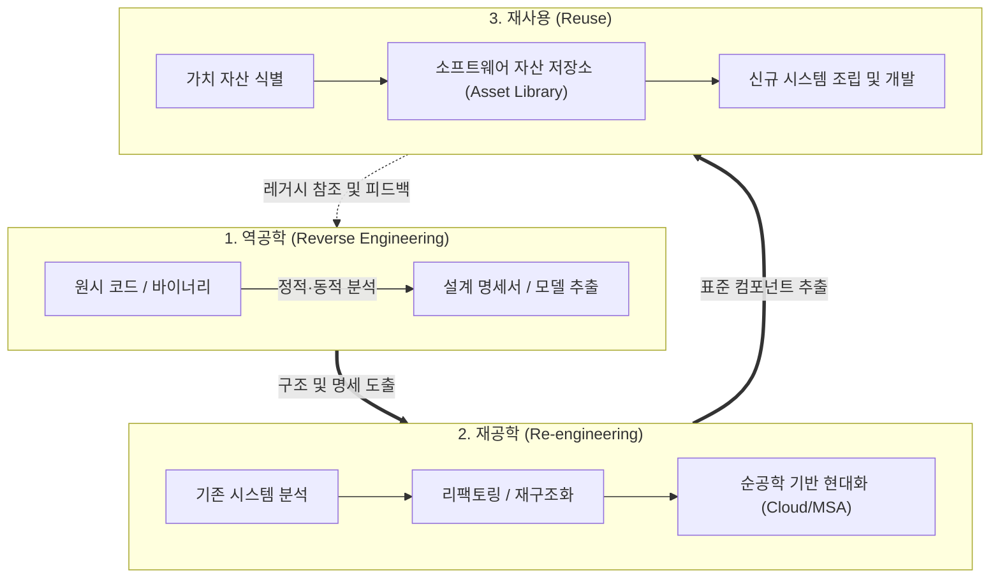

# 3R
## I. 레거시 현대화 및 소프트웨어 재산권 극복, 3R의 개요
- **정의**: 기존 소프트웨어 자산의 가치를 극대화하고 유지보수성 향상을 위해 소프트웨어를 분석(역공학), 개선(재공학), 재활용([[재사용]])하는 소프트웨어 공학 [[유지보수]] 및 현대화 기법
- **필요성 및 배경**: 소프트웨어 노후화(Software Aging) 및 스파게티 코드화 해결, 유지보수 비용(전체 라이프사이클의 70~80%) 절감, [[클라우드 네이티브]] 및 [[MSA (Micro Service Architecture)|MSA]](Microservices Architecture) 전환 가속화
---
## II. 3R의 프레임워크 및 핵심 기술 요소
### 가. 3R의 개념도 및 유기적 연계 메커니즘

- 레거시 구현체에서 역공학을 통해 설계 사양을 복원하고, 재공학을 통해 아키텍처를 개선하며, 추출된 표준 모듈을 자산 저장소에 축적하여 신규 시스템에 재사용하는 선순환 메커니즘임
### 나. 3R의 핵심 구성 요소 및 세부 기술

| **구분**  | **핵심 기술(키워드)**            | **세부 설명**                                                    |
| ------- | ------------------------- | ------------------------------------------------------------ |
| **역공학** | 정적 분석 (Static Analysis)   | 소스 코드 실행 없이 파싱, AST(Abstract Syntax Tree), 제어 흐름 그래프(CFG) 생성 |
| **역공학** | 동적 분석 (Dynamic Analysis)  | 런타임 프로파일링, 메모리 덤프, API 트레이싱을 통한 런타임 행위 및 의존성 추출              |
| **역공학** | 모델 추출 (Model Extraction)  | [[데이터베이스]] [[스키마]] 역공학([[DDL]] 분석), 레거시 비즈니스 룰 및 ERD/[[UML]] 복원              |
| **재공학** | 코드 리팩토링 (Refactoring)     | 외적 행위(동작) 변경 없이 코드 가독성 증대, 코드 스멜 제거, [[디자인 패턴]] 적용               |
| **재공학** | 아키텍처 재구조화 (Restructuring) | 모놀리식 코드를 [[DDD (Domain Driven Design)|DDD]](도메인 주도 설계) 기반 Bounded Context 도출 및 모듈 분리        |
| **재공학** | 데이터 재공학 (Data Migration)  | 비정규화 데이터 정제, RDB에서 [[NoSQL (CAP 이론 BASE 속성)|NoSQL]]/분산 DB로의 ETL 및 스키마 변환                |
| **재사용** | 생성 중심 (Generation-based)  | 도메인 모델 기반 코드 자동 생성, 패턴 및 템플릿(DSL, 로우코드/노코드) 활용               |
| **재사용** | 합성 중심 (Composition-based) | CBD(컴포넌트 기반 개발), 오픈소스 라이브러리 조합, API/마이크로서비스 기반 결합            |

---
## III. 전통적 3R vs AI 기반 현대적 3R 비교 및 발전 전망
### 가. 전통적 3R vs 생성형 AI 기반 3R(AI-Augmented 3R) 비교

| **비교 항목**  | **전통적 3R (Conventional)** | **생성형 AI 기반 3R (Modern / AI-Driven)**                |
| ---------- | ------------------------- | ---------------------------------------------------- |
| **역공학 방식** | 정적 룰 파서 기반, 수작업 분석 병행     | [[초거대 언어 모델|LLM]] 기반 레거시(COBOL, Fortran 등) 다국어 코드 문맥 해석 및 자동 문서화   |
| **재공학 수준** | 단순 문법 변환, 수작업 리팩토링        | AI 코딩 에이전트 기반 자동 리팩토링 및 타깃 언어(Java, Python, Rust) 전환 |
| **재사용 모델** | 정적 컴포넌트 저장소, 라이브러리 종속     | RAG(검색증강생성) 기반 엔터프라이즈 코드베이스 검색 및 문맥 적응형 코드 합성        |
| **전환 타깃**  | 분산 환경, [[객체지향]](OOP) 전환       | 클라우드 네이티브(Container, Serverless), MSA 기반 API 오케스트레이션 |
### 나. 발전 전망 및 도입 시 고려사항
- **[[SBOM]] 및 보안 거버넌스 연계**: 컴포넌트 재사용 가속화에 따른 공급망 보안 취약점 예방을 위해 SBOM(Software Bill of Materials) 자동 생성 체계 결합 필수
- **AI 기반 레거시 현대화 표준 수립**: 금융·공공 등 미션 크리티컬 시스템의 대규모 차세대 전환 시 LLM 환각(Hallucination) 검증을 위한 테스트 자동화([[리그레션 테스트|회귀 테스트]] 파이프라인) 병행 필요

---

소프트웨어 재공학의 3R

| **요소** | **영문 명칭** | **핵심 설명** |
| --- | --- | --- |
| **리팩토링** | **Refactoring** | 결과의 변경 없이 코드의 내부 구조를 개선하여 가독성을 높이고 복잡도를 낮추는 활동입니다. |
| **역공학** | **Reverse Engineering** | 대상 시스템을 분석하여 소스 코드로부터 설계도나 사양서 등의 상위 단계 산출물을 추출하는 과정입니다. |
| **재공학** | **Re-engineering** | 기존 시스템을 분석하여(역공학) 수정 및 보완한 후, 새로운 형태의 시스템으로 다시 구축(순공학)하는 전체 과정입니다. |

---

### 🔗 연관 토픽

- **소속 도메인**: [[00_소프트웨어공학_MOC|🏗️ 소프트웨어공학]]
- **세부 분류**: `4. 아키텍처 스타일 & 객체지향 설계 원리`
- **핵심 연관 토픽**:
  - [[MSA (Micro Service Architecture)]]
  - [[재사용]]
  - [[디자인 패턴|디자인 패턴 (Design Pattern)]]
  - [[DDD (Domain Driven Design)]]
  - [[객체지향]]
