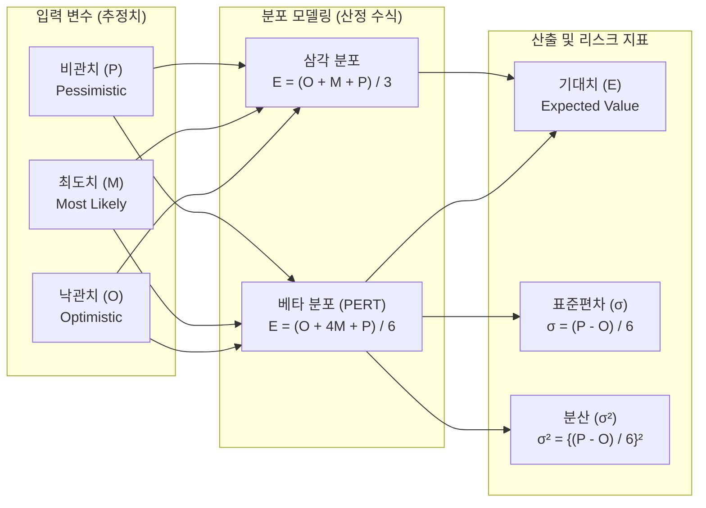

# 3점 산정

---
## I. 불확실성 극복을 위한 일정 및 원가 추정 기법, 3점 산정의 개요

- 정의: 프로젝트 일정 및 원가 산정 시 단일 추정치의 불확실성을 줄이기 위해 낙관치(O), 최도치(M), 비관치(P) 3가지 추정치를 산출하고 가중 평균하여 기대치를 구하는 정량적 추정 기법

- 필요성 및 특징: 단일 점 추정(Single-point estimation)의 한계 및 리스크 극복, PERT(Program Evaluation and Review Technique) 기법 기반의 통계적 신뢰도 향상, 정량적 리스크 분석 모델의 기초 데이터 제공

	---
## II. 3점 산정의 아키텍처 및 핵심 구성요소
### 가. 3점 산정의 개념도 및 산출 프로세스

- 전문가 판단 및 과거 데이터를 통해 3가지 추정치를 도출하고, 확률 분포 특성(베타, 삼각)에 따라 가중 평균하여 최종 기대치(E)와 리스크 지표(표준편차, 분산)를 산출함

### 나. 3점 산정의 핵심 구성 요소

|구분|핵심 기술(키워드)|세부 설명|
|---|---|---|
|입력 요소|낙관치 (Optimistic, O)|모든 조건이 가장 유리하게 형성될 때 소요되는 최단 기간 또는 최소 비용|
|입력 요소|최도치 (Most Likely, M)|정상적이고 일반적인 조건 하에서 발생할 가능성이 가장 높은 기간/비용|
|입력 요소|비관치 (Pessimistic, P)|리스크 발생 등 가장 불리한 조건 하에서 소요되는 최장 기간 또는 최대 비용|
|산정 모델|베타 분포 (Beta / PERT)|최도치(M)에 높은 가중치(4)를 부여하여 현실적 중심경향성을 강조한 통계 산식|
|산정 모델|삼각 분포 (Triangular)|세 가지 추정치(O, M, P)가 발생할 확률을 동일하게 간주하여 단순 평균하는 방식|
|리스크 지표|표준편차 (σ)|추정치의 불확실성 정도 및 분포의 흩어짐을 나타내는 지표 (산식: (P - O) / 6)|
|리스크 지표|분산 (σ²)|프로젝트 전체 주공정(Critical Path)의 편차를 합산하기 위해 활용되는 편차의 제곱|
|신뢰도 평가|[[정규분포]](6 시그마) 확률|도출된 기대치(E)를 기준으로 ±1σ(68.26%), ±2σ(95.44%), ±3σ(99.73%)의 신뢰 구간 제시|

---
## III. 3점 산정과 타 산정 기법 비교 및 활용 동향

### 가. 3점 산정 vs 유사/모수 산정 기법 비교

|비교 항목|3점 산정 (Three-Point)|유사 산정 (Analogous)|모수 산정 (Parametric)|
|---|---|---|---|
|산정 방식|3가지 추정치(O, M, P)의 통계적 평균|과거 유사 프로젝트의 실적치 기반 추정|과거 데이터와 변수 간 통계적 상관관계 활용|
|정확도|높음 (개별 활동의 불확실성 반영)|낮음 (하향식, 거시적 관점 추정)|매우 높음 (정교한 정량적 모델 확보 시)|
|소요 시간/비용|높음 (모든 활동별 3개 값 추정 필요)|낮음 (프로젝트 초기 신속한 추정 가능)|중간 (수리적 모델 구축 및 데이터 확보 필요)|
|주요 적용 시기|[[WBS]] 구체화 및 상세 계획 수립 시점|프로젝트 초기 (상세 정보 및 데이터 부족 시)|상세 데이터 확보 및 [[알고리즘]] 적용 가능 시점|

- 활용 동향 및 전망: 3점 산정을 통해 도출된 불확실성 데이터(분포도)는 정량적 리스크 분석 도구인 [[몬테카를로 시뮬레이션]](Monte Carlo Simulation)의 핵심 입력 확률밀도함수로 광범위하게 활용되며, 최근 애자일([[Agile]]) 환경에서도 불확실성이 큰 에픽(Epic)이나 스파이크(Spike) 스토리 포인트 추정 시 결합 적용되어 계획의 신뢰성을 높이는 데 기여함

---

### 🔗 연관 토픽

- **소속 도메인**: [[00_프로젝트관리_MOC|📋 프로젝트관리]]
- **세부 분류**: `2. 프로젝트 범위 & 일정 관리 (Scope & Schedule)`
- **핵심 연관 토픽**:
  - [[WBS|WBS (Work Breakdown Structure)]]
  - [[프로젝트 일정관리|프로젝트 일정관리(Project Schedule Management)에 대하여 설명하시오]]
  - [[몬테카를로 시뮬레이션]]
  - [[범위관리]]
  - [[프로젝트 위험관리]]
