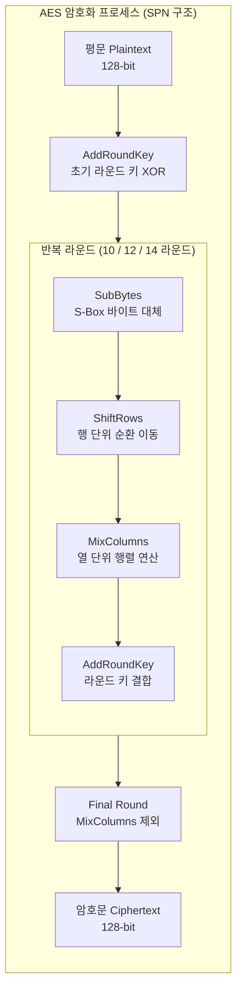

# AES (Advanced Encryption Standard)

---

## I. 현대 대칭키 블록 암호 표준, AES의 개요

* **정의**: 미국 NIST(국립표준기술연구소)가 기존 [[DES]]의 취약점을 보완하기 위해 제정한 블록 암호 표준으로, 벨기에 암호학자 본 멘과 라이멘이 개발한 **Rijndael(라인달)** [[알고리즘]] 기반의 대칭키 암호 시스템
* **등장배경**: 컴퓨팅 파워의 발달로 기존 DES의 56비트 키 길이가 브루트 포스(전수조사) 공격에 무력화됨에 따라, 더 긴 키 길이와 높은 성능을 제공하는 차세대 표준 [[암호 알고리즘]] 필요
* **특징**: 128비트 고정 블록 크기, 128/192/256비트의 가변 키 길이 지원, Feistel 구조가 아닌 **SPN(Substitution-Permutation Network)** 구조 채택, 뛰어난 소프트웨어 및 하드웨어 구현 효율성

---

## II. AES의 개념도 및 핵심 기술 요소

### 가. AES의 암호화 라운드 구조 및 동작 원리

* 평문을 4x4 바이트 행렬로 변환한 후, 대체(Substitution)와 치환(Permutation) 연산을 반복 수행하는 SPN 구조를 기반으로 매 라운드마다 확장된 키(Round Key)를 결합하여 혼란과 확산 극대화

### 나. AES의 핵심 구성 요소

| 구분 | 요소기술(키워드) | 세부 설명 |
| --- | --- | --- |
| 비선형 변환 | **SubBytes (바이트 대체)** | S-Box를 이용하여 각 바이트를 비선형적으로 치환하여 암호의 **혼란(Confusion)** 제공 |
| 위치 변환 | **ShiftRows (행 이동)** | 행렬의 각 행을 정해진 규칙에 따라 왼쪽으로 순환 시프트하여 **확산(Diffusion)** 제공 |
| 데이터 혼합 | **MixColumns (열 혼합)** | 열 단위로 갈루아 체(GF(2^8)) 상의 행렬 곱셈을 수행하여 바이트 간 종속성 강화 |
| 키 결합 | **AddRoundKey (라운드 키)** | 데이터 행렬과 해당 라운드 키 간의 비트단위 XOR 연산 수행 |
| 키 생성 | **Key Expansion (키 확장)** | 1개의 마스터 키로부터 일정 알고리즘(Rijndael Key Schedule)을 통해 각 라운드 키 생성 |
| 블록 크기 | **128-bit Fixed Block** | 입력 데이터를 항상 128비트(16바이트) 단위의 블록으로 분할하여 처리 |
| 키 길이 | **128 / 192 / 256-bit** | 보안 강도와 성능 요구사항에 따라 선택 가능한 가변 키 길이 지원 |
| 하드웨어 가속 | **AES-NI** | [[CPU]] 명령어 세트 수준에서 AES 연산을 하드웨어로 가속 처리하여 성능 극대화 |

---

## III. AES와 DES 비교 및 최신 동향

### 가. AES와 전세대 표준 DES 비교

| 비교 항목 | AES (Advanced Encryption Standard) | DES (Data Encryption Standard) |
| --- | --- | --- |
| **블록 크기** | 128 비트 | 64 비트 |
| **키 길이** | 128, 192, 256 비트 (가변) | 56 비트 (+ 8비트 패리티) |
| **암호 구조** | SPN (Substitution-Permutation Network) | Feistel 구조 |
| **보안성** | 현재 전 세계 표준으로 브루트 포스에 안전함 | 키가 짧아 전수조사 공격에 취약하여 폐기됨 |
| **라운드 수** | 키 길에 따라 10, 12, 14 라운드 | 16 라운드 |
| **구현 성능** | 하드웨어 및 소프트웨어 모두에서 고속 처리 가능 | 상대적으로 연산 속도가 느림 |

### 나. AES의 최신 동향 및 실무 활용 전략

* **하드웨어 내장 가속화(AES-NI) 보편화**: 인텔, AMD 및 모바일 프로세서(ARM) 전반에 AES 전용 하드웨어 명령어가 기본 탑재되어 대용량 트래픽 [[암호화]] 시 성능 저하 최소화
* **포스트 퀀텀 시대의 대칭키 생존력**: 양자 컴퓨터의 그로버(Grover) 알고리즘에 대응할 때 AES-128은 키 길이가 반으로 줄어드는 효과가 있으나, **AES-256**은 여전히 128비트 수준의 보안을 유지하므로 양자 시대에도 안전한 대칭키 표준으로 지속 활용 전망

---

### 🔗 연관 토픽

- **소속 도메인**: [[00_보안_MOC|🛡️ 보안]]
- **세부 분류**: `2. 현대 암호학 & 키 관리 · 전자서명`
- **핵심 연관 토픽**:
  - [[암호화|암호화 (Encryption)]]
  - [[DES]]
  - [[암호 알고리즘]]
  - [[RSA (Rivest Shamir Adleman)]]
  - [[FIPS (Federal Information Processing Standards)]]
