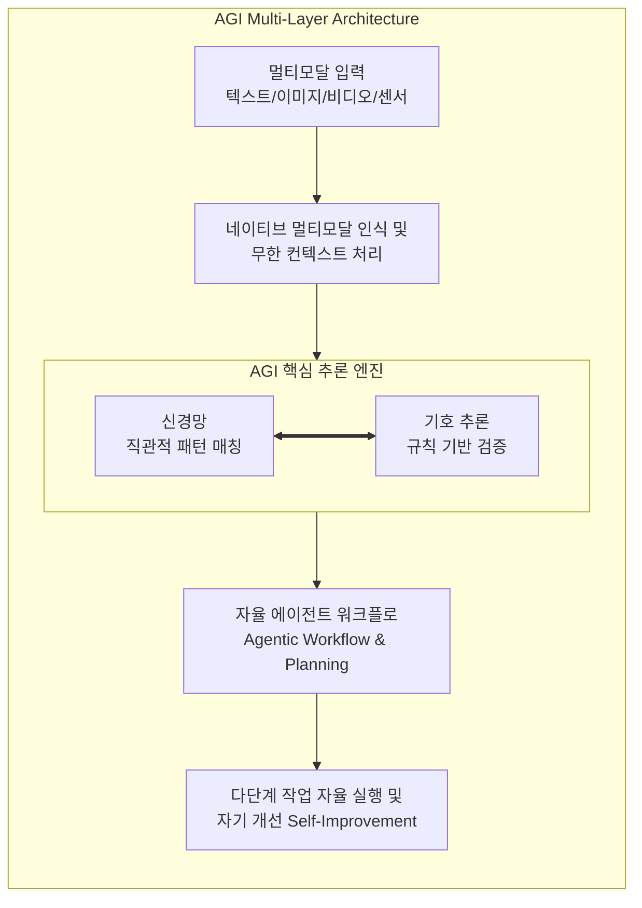

# AGI (Artificial General Intelligence)

---

## I. 인간 수준의 범용적 문제 해결 역량을 갖춘, AGI의 개요

* **정의**: 특정 도메인에 국한된 협소한 [[인공지능]](Narrow AI)을 넘어, 인간이 수행할 수 있는 모든 지적 업무를 이해하고 학습하며 스스로 해결할 수 있는 [[범용 인공지능]] 시스템
* **등장배경**: 기존 생성형 AI의 단순 패턴 매칭 및 환각(Hallucination) 현상 극복, 복잡한 다단계 비즈니스 워크플로우를 자율적으로 수행하는 에이전틱(Agentic) AI 및 범용 추론 능력 요구 증대
* **특징**: 자율 에이전트 워크플로, 신경-기호 추론(Neuro-symbolic AI) 융합, 무한 컨텍스트 및 네이티브 멀티모달리티 통합을 통한 인간 유사 인지 구현

---

## II. AGI의 아키텍처 및 핵심 기술 요소

### 가. AGI의 구현 아키텍처 및 동작 원리

* 방대한 멀티모달 데이터 입력을 기반으로, 딥러닝의 패턴 인식 능력과 기호 추론(Symbolic Reasoning)을 결합하여 자율적으로 계획을 수립하고 실행하는 구조

### 나. AGI의 핵심 구성 요소

| 구분 | 요소기술(키워드) | 세부 설명 |
| --- | --- | --- |
| 추론 및 학습 | **신경-기호 AI (Neuro-Symbolic)** | 통계적 패턴 인식과 엄격한 논리적 기호 추론을 융합하여 논리 오류 및 환각 최소화 |
| 자율성 | **에이전트 워크플로 (Agentic)** | 단순 답변을 넘어 상위 목표를 하위 작업으로 분해하고 소프트웨어 환경을 자율 조작 |
| 확장성 | **네이티브 멀티모달리티** | 텍스트, 비디오, 오디오 등 이질적 데이터를 단일 모델 내에서 유기적으로 통합 처리 |
| 메모리 | **무한 컨텍스트 (Infinite Context)** | 수백만 토큰 이상의 방대한 정보를 장기 기억처럼 유지하여 고도화된 문맥 이해 수행 |
| 효율성 | **1비트 [[초거대 언어 모델|LLM]] / 경량화** | 가중치 압축을 통해 엣지 디바이스에서도 고성능 추론이 가능하도록 에너지 효율성 극대화 |
| 적응성 | **자기 개선 (Self-Improvement)** | 실행 결과에 대한 피드백을 통해 모델이 스스로 학습하고 진화하는 지속적 학습 체계 |
| [[신뢰성]] | **안전성 및 가버넌스 (Alignment)** | AGI 도래에 따른 윤리적 위험 방지, 프라이버시 보호 및 제어 가능성 확보 |
| 하드웨어 | **AI 가속기 및 인프라** | 대규모 연산 처리를 위한 차세대 [[NPU]], 고대역폭 메모리([[HBM]]) 및 랙 스케일 클러스터 구축 |

---

## III. 전통적 생성형 AI와 AGI의 비교 및 발전 전망

### 가. 생성형 AI(Narrow AI)와 AGI의 비교

| 비교 항목 | 전통적 생성형 AI (Narrow AI) | 범용 인공지능 (AGI) |
| --- | --- | --- |
| **적용 범위** | 특정 도메인 및 정형화된 작업 수행에 특화 | 인간이 수행하는 모든 지적 업무의 범용적 수행 |
| **추론 방식** | 확률적 토큰 예측 (통계적 패턴 매칭 중심) | 신경망 직관 + 기호 추론 결합의 결정론적 검증 |
| **자율성 수준** | 프롬프트 기반 수동적 응답 생성 (Chatbot) | 상위 목표 부여 시 자율 계획 및 다단계 실행 (Agent) |
| **한계점** | [[할루시네이션|환각 현상]](Hallucination), 미지의 복잡한 추론 취약 | 고도의 연산 자원 요구, 안전성 및 통제(Alignment) 과제 |

### 나. AGI의 실현 전망 및 실무 활용 전략

* **에이전틱 DX([[Digital Transformation]]) 가속화**: 단순 챗봇 도입을 넘어, 전사 시스템과 연동되어 자율적으로 비즈니스 프로세스를 수행하는 에이전트 기반 워크플로로의 전환 필수
* **기술 윤리 및 가버넌스 수립**: AGI 발전 속도에 발맞추어 AI의 통제력(Alignment)을 확보하고, 기업 데이터 보안과 규제 준수를 위한 엄격한 내부 컴플라이언스 체계 구축 선행 필요

---

### 🔗 연관 토픽

- **소속 도메인**: [[00_인공지능_MOC|🤖 인공지능]]
- **세부 분류**: `4. 거대언어모델 (LLM) & 생성형 AI`
- **핵심 연관 토픽**:
  - [[인공지능]]
  - [[범용 인공지능]]
  - [[심볼릭 추론]]
  - [[sLLM (Smaller Large Language Model)]]
  - [[딥러닝]]
