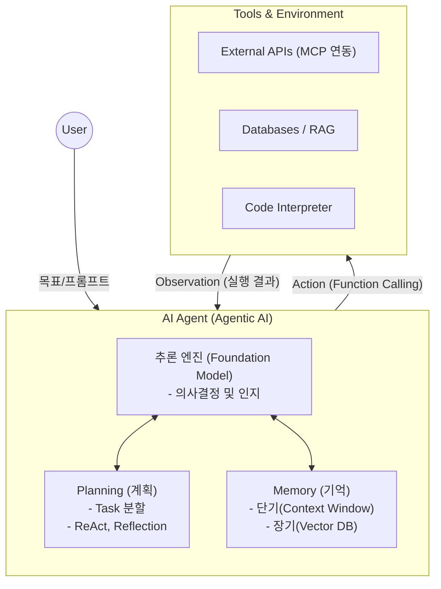

# AI Agent

---

## I. 자율적 목표 달성, AI Agent의 개요

* **정의**: 거대언어모델([[초거대 언어 모델|LLM]])을 추론 엔진으로 삼아, 주어진 목표를 달성하기 위해 스스로 계획하고 외부 도구를 활용하여 자율적으로 행동하는 [[인공지능]] 시스템
* **필요성**: 기존 단순 질의응답 및 수동적 챗봇의 한계를 넘어, 복잡한 다단계 업무의 자율적 수행 및 [[신뢰성]](환각 완화) 확보 요구 증가
* **특징**: LLM 기반 동적 의사결정, 주변 환경과의 상호작용(도구 호출), 과거 경험 학습(기억), 자기 성찰을 통한 자가 교정

---

## II. AI Agent의 아키텍처 및 핵심 기술 요소

### 가. AI Agent의 아키텍처 및 동작 원리

* 사용자 목표 달성을 위해 ReAct(Reasoning + Acting) 패턴 기반 추론, 행동, 관찰의 피드백 루프를 반복 수행함
* Memory로 작업 맥락을 유지하고, 함수 호출 및 MCP([[MCP|Model Context Protocol]])를 통해 외부 시스템(Tools)과 능동적 상호작용 구현

### 나. AI Agent의 핵심 기술 요소

| 구분 | 핵심 기술 요소 | 세부 설명 |
| --- | --- | --- |
| **인지/브레인** | Foundation Model | 상황을 인지하고 의사결정과 행동을 지시하는 에이전트의 두뇌(LLM/LMM) |
| **계획 (Planning)** | ReAct 기법 | 생각(Thought), 행동(Action), 관찰(Observation)을 교차 반복하여 목표 달성 |
| **계획 (Planning)** | Reflection (자기성찰) | 스스로 실행 결과를 평가하고 오류를 인지하여 교정하는 자가 복원 기법 |
| **기억 (Memory)** | Short/Long-term Memory | 작업 맥락(단기 기억) 및 과거 경험/지식 벡터 임베딩(장기 기억) 축적 |
| **도구 (Tool Use)** | Function Calling | 외부 도구/API 호출을 위해 LLM이 인자를 포함한 구조화된 데이터([[JSON]]) 출력 |
| **도구 (Tool Use)** | MCP | 에이전트와 다양한 데이터 소스, 도구를 느슨하게 결합하는 개방형 표준 규약 |
| **생태계** | Multi-Agent 협업 | 태스크별 전문 에이전트(리서처, 코더, 리뷰어 등) 간 역할 분담 및 조율(Orchestration) |
| **보안/통제** | HITL (Human-in-the-loop) | 고위험 의사결정 시 승인 게이트를 두어 자율성과 통제권의 균형을 유지하는 보안 체계 |

---

## III. AI Agent와 기존 챗봇 및 RPA 비교

### 가. AI Agent와 챗봇, 정적 워크플로우(RPA)의 비교

| 비교 항목 | 기존 챗봇 (Chatbot) | 정적 워크플로우 (RPA) | AI 에이전트 (AI Agent) |
| --- | --- | --- | --- |
| **의사결정 주체** | 사용자 입력에 수동적 반응 | 개발자가 정의한 고정 규칙/경로 | LLM 기반 상황 맞춤형 자율/동적 판단 |
| **목표 수행 범위** | 단순 질의응답, 제한적 검색 | 단일/반복적 UI 및 API 조작 | 복잡한 다단계 문제의 스스로 분할 및 해결 |
| **환경 상호작용** | 도구 사용 불가 또는 제한적 | 사전에 정의된 환경 내에서만 동작 | 주어진 상황에 맞춰 다양한 도구 능동적 호출 |
| **발전 과제/전망** | 개인화 AI 비서, RAG 고도화 | AI 융합(Hyper Automation) | 다중 에이전트 생태계 구축 및 보안 거버넌스 내재화 |

* 최근 AI 에이전트는 단일 에이전트의 도구 연동을 넘어, 다중 에이전트(Multi-Agent) 협업 아키텍처 및 엔터프라이즈 권한 제어(Security by Design)를 내재화하는 방향으로 진화 중임

---

### 🔗 연관 토픽

- **소속 도메인**: [[00_인공지능_MOC|🤖 인공지능]]
- **세부 분류**: `4. 거대언어모델 (LLM) & 생성형 AI`
- **핵심 연관 토픽**:
  - [[AX (AI Transformation)]]
  - [[인공지능]]
  - [[MCP|MCP (Model Context Protocol)]]
  - [[버티컬 AI|버티컬 AI(Vertical AI)]]
  - [[AGI|AGI (Artificial General Intelligence)]]
