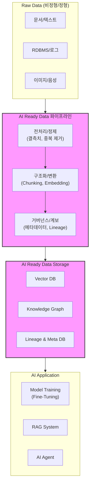

# AI Ready Data

---

## I. 신뢰할 수 있는 AI의 기반, AI Ready Data의 개요

* **정의**: 특정 AI 사용 목적(모델 학습, RAG, 에이전트)에 맞게 정확성·완전성을 넘어 대표성을 갖추고, 출처와 변환 이력(계보)이 추적되며, 거버넌스가 관리되는 상태로 최적화된 데이터
* **등장배경/필요성**: [[초거대 언어 모델|LLM]]의 편향성 및 환각(Hallucination) 오류 심화, EU AI Act 등 데이터 출처·투명성 규제 강화, RAG 및 Multi-Agent 환경 도입에 따른 기계 가독성(Machine-readability) 요구 증가
* **특징**: 다차원적 품질 지표(대표성, 적시성), 데이터 계보(Lineage) 확보, 의미 기반 구조화(청킹, 임베딩), 엄격한 접근 권한 및 거버넌스 통제

---

## II. AI Ready Data의 개념도 및 핵심 구성 요소

### 가. AI Ready Data의 개념도 및 프로세스

* 단순 정제를 넘어 모델이 이해할 수 있도록 구조화(임베딩, 지식 그래프)하고, 생성 및 소비 전 과정의 출처 이력을 메타데이터로 저장함

### 나. AI Ready Data의 핵심 구성 요소

| 구분 | 요소기술(키워드) | 세부 설명 |
| --- | --- | --- |
| **품질 (Quality)** | 대표성 (Representativeness) | 특정 편향에 치우치지 않고 실제 환경의 데이터 분포를 균형 있게 반영 |
| **품질 (Quality)** | 정확성 및 적시성 | 값의 사실 여부 검증 및 최신 사건·문맥을 반영하여 환각(Hallucination) 방지 |
| **구조화 (Structure)** | Chunking & Embedding | RAG 및 시맨틱 검색을 위해 문서를 의미 단위로 분할하고 다차원 벡터로 변환 |
| **구조화 (Structure)** | Knowledge Graph (Ontology) | [[엔티티|엔티티(Entity)]] 간의 관계를 온톨로지 기반 지식망으로 연결하여 추론 성능 강화 |
| **추적 (Traceability)** | Metadata Management | 데이터 출처, 수집 목적, 소유자, 보존 기간 등 데이터에 관한 속성 정보 정의 |
| **추적 (Traceability)** | Data Lineage (계보) | 데이터의 생성부터 가공, 최종 AI 모델 주입까지의 이동 경로 및 변환 이력 시각화 |
| **거버넌스 (Governance)** | 접근 통제 (Access Control) | AI 에이전트의 데이터 쿼리 범위 및 권한을 제어하여 기밀 정보 유출 차단 |
| **거버넌스 (Governance)** | 프라이버시 마스킹 | 개인정보 및 민감정보(PII)의 [[비식별화]] 처리를 통한 규제(EU AI Act 등) 준수 |

---

## III. AI Ready Data와 전통적 깨끗한 데이터(Clean Data) 비교 및 향후 전망

### 가. 전통적 Clean Data와 AI Ready Data 비교

| 비교 항목 | 전통적 Clean Data | AI Ready Data |
| --- | --- | --- |
| **주요 목적** | 사람의 가독성 향상 및 대시보드(BI) 분석 | AI 모델의 기계 가독성, 자율적 추론 및 학습 효율성 |
| **핵심 품질 지표** | 정확성, 완전성, 일관성 중심 | 기존 지표 + **대표성, 유효성, 적시성** |
| **데이터 형태** | RDBMS 기반 정형 테이블, 스프레드시트 | 텍스트, 멀티모달, 벡터 임베딩, 그래프(Graph) |
| **추적 및 통제** | 시스템 중심의 단순 접근 제어 | **Data Lineage** 기반 이력 추적 및 [[AI 윤리]]([[편향]]) 관리 |
| **주요 활용처** | 통계 분석, 데이터 웨어하우스(DW) | LLM 파인튜닝, RAG 아키텍처, AI 에이전트 생태계 |

### 나. AI Ready Data의 향후 전망 및 시사점

* **규제 대응 필수 인프라화**: EU AI Act의 본격 시행(2026년 이후)에 따라, 학습 데이터의 출처 증명과 저작권 및 편향성 검증 체계가 기업의 필수 요건으로 자리 잡음
* **DataOps와 [[MLOps]]의 통합 (Data-centric AI)**: 모델 아키텍처 개선보다 고품질 데이터 확보가 성능에 직결됨에 따라, 지속적인 데이터 품질 모니터링과 회귀 테스트를 자동화하는 파이프라인 고도화가 핵심 경쟁력으로 대두됨

---

### 🔗 연관 토픽

- **소속 도메인**: [[00_인공지능_MOC|🤖 인공지능]]
- **세부 분류**: `4. 거대언어모델 (LLM) & 생성형 AI`
- **핵심 연관 토픽**:
  - [[AI TRiSM|AI TRiSM(AI Trust Risk and Security Management)]]
  - [[AI 윤리]]
  - [[편향]]
  - [[공공부문 초거대AI 도입, 활용 가이드라인 2.0(2025.04)]]
  - [[생성형AI 데이터 품질관리 가이드 v2.0]]
