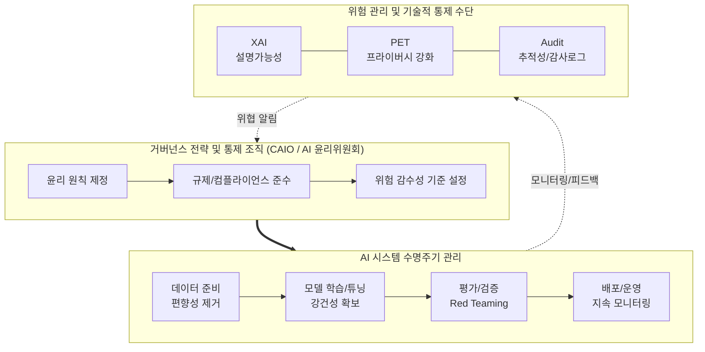

# AI 거버넌스 (AI Governance)

---

## I. 신뢰할 수 있는 AI 구현을 위한, AI 거버넌스의 개요

* **정의**: AI 기술의 기획, 개발, 배포, 운영 등 수명주기 전 과정에서 투명성, 공정성, 안전성을 보장하고 윤리적/법적 리스크를 통제하기 위한 전사적 정책, [[프로세스]] 및 조직 체계
* **필요성 및 등장배경**:
* **위해성 및 역기능 증가**: [[딥페이크]], 환각(Hallucination), 편향된 의사결정, 프라이버시 침해 리스크 증대
* **글로벌 규제 강화**: EU AI Act(인공지능법), 미국 AI 행정명령 등 법적 컴플라이언스 준수 의무화
* **[[신뢰성]](Trustworthy) 확보**: 투명성 및 설명가능성 기반의 책임 있는 AI(Responsible AI) 실현 및 비즈니스 연속성 보장

* **특징**: 다학제적 접근(법률, 기술, 윤리 결합), 위험 기반 접근법(Risk-based Approach) 채택, 거버넌스 자동화 도구 연계

---

## II. AI 거버넌스 프레임워크 개념도 및 핵심 구성 요소

### 가. AI 거버넌스 프레임워크 개념도

* 전사적 윤리 정책 및 규제를 바탕으로 AI 수명주기 전반에 기술적 통제([[XAI]], PET 등)를 결합하여 위험을 지속 식별, 평가, 완화하는 폐쇄루프(Closed-Loop) 관리 구조임.

### 나. AI 거버넌스의 핵심 구성 요소

| 구분 | 요소기술(키워드) | 세부 설명 |
| --- | --- | --- |
| **조직/거버넌스** | CAIO (최고 AI 책임자) | 전사 [[AI 거버넌스]] 전략 수립, 도입 및 컴플라이언스 이행 총괄 임원 |
| **조직/거버넌스** | AI 윤리위원회 | AI 모델의 윤리적 쟁점 심의, 전사 가이드라인 제정 및 감독 의결 기구 |
| **프로세스** | 위험 기반 접근 (Risk-based) | 시스템 위해도(수용불가/고위험/제한적/최소)에 따른 차등적 통제 체계 |
| **프로세스** | 레드티밍 (Red Teaming) | 의도적 공격 프롬프트 등을 통해 AI 시스템의 취약점, 편향성 사전 검증 |
| **지원 기술** | XAI (설명가능한 AI) | AI 모델의 의사결정 과정을 시각화하여 사용자가 해석 가능하도록 제공 (SHAP 등) |
| **지원 기술** | PET (프라이버시 강화 기술) | 학습/추론 과정에서 개인정보 유출을 차단하는 기술 (동형암호, 차분프라이버시 등) |
| **표준/규제** | ISO/IEC 42001 | 조직이 AI 시스템을 책임감 있게 개발 및 사용할 수 있도록 돕는 글로벌 AI 경영시스템 표준 |
| **표준/규제** | EU AI Act (유럽 AI 법) | 고위험 AI에 대한 엄격한 의무 부과 및 위반 시 전 세계 매출의 최대 7% 과징금 부과 |

---

## III. AI 거버넌스의 최근 동향 및 향후 전망

* **컴플라이언스 내재화 확산**: 2024년 하반기 EU AI Act 본격 발효 및 국내 'AI 기본법' 제정 추진에 따라, 기업의 AI 서비스 기획 단계부터 법적 규제를 내재화하는 Compliance by Design 필수화
* **[[AI TRiSM]] 아키텍처 도입**: 가트너(Gartner)가 제시한 'AI 신뢰, 리스크 및 보안 관리(TRiSM)' 체계가 주요 엔터프라이즈 플랫폼에 자동화된 도구([[MLOps]] 연계) 형태로 통합되는 추세
* **AI 경영 인증(ISO 42001) 활성화**: 기업의 [[ESG 경영]] 및 신뢰성 입증의 핵심 지표로 ISO/IEC 42001 인증 획득이 B2B 사업 참여 및 공공 사업 수주의 필수 요건으로 자리 잡을 전망
* **주권 AI([[Sovereign AI (소버린 AI)|Sovereign AI]])와 연계**: 데이터 주권 확보 및 정보 유출 방지를 위해 국가 및 거대 기업 단위의 독자적 [[sLLM (Smaller Large Language Model)|sLLM]] 구축과 맞춤형 보안 거버넌스(On-Premise AI) 체계 도입 가속화

---

### 🔗 연관 토픽

- **소속 도메인**: [[00_인공지능_MOC|🤖 인공지능]]
- **세부 분류**: `6. 설명가능한 AI (XAI) & AI 윤리 · 거버넌스`
- **핵심 연관 토픽**:
  - [[AI 거버넌스|AI 거버넌스 (AI Governance)]]
  - [[Sovereign AI (소버린 AI)]]
  - [[AI 신뢰성 인증]]
  - [[XAI]]
  - [[범용 인공지능 위험관리 프레임워크]]
