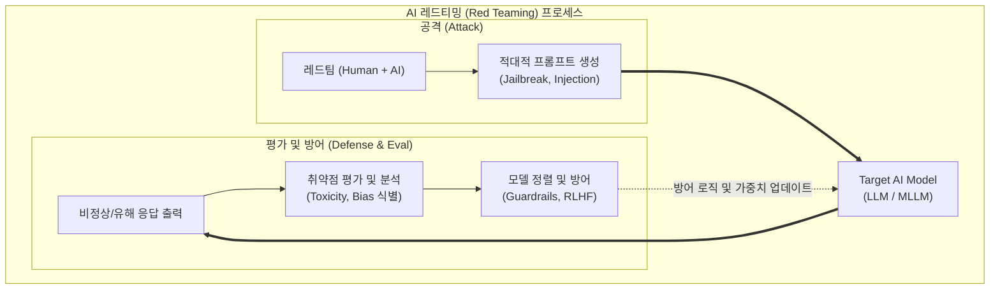

# AI 레드팀 (AI Red Team) 테스트

---

## I. 안전하고 신뢰할 수 있는 AI 구현의 핵심, AI 레드팀 테스트의 개요

* **정의**: 생성형 AI 모델의 취약점, 편향성, 유해성, 보안 결함을 식별하기 위해 방어 시스템을 우회하는 의도적인 [[적대적 공격]](Adversarial Attack)을 수행하여 잠재적 위험을 사전 검증하는 방법론
* **등장 배경**: [[초거대 언어 모델|LLM]](대형언어모델) 확산에 따른 [[프롬프트 인젝션]], 환각(Hallucination), [[딥페이크]] 악용 등 역기능 심화, EU AI Act 및 미국 행정명령 등 안전한 AI에 대한 글로벌 규제 강화
* **특징**: 사회-기술적(Socio-Technical) 관점의 다각도 검증, 사람과 AI(자동화 도구)의 협업 기반 테스트, 모델 배포 전후 지속적 피드백 및 정렬(Alignment) 강화

---

## II. AI 레드팀 테스트의 동작 프로세스 및 핵심 기술 요소

### 가. AI 레드팀 테스트 프로세스 및 개념도

* 전문가 및 자동화 봇(Bot)이 타겟 모델에 우회 기법(Jailbreak 등)을 적용하여 공격을 수행하고, 도출된 편향적/악의적 응답을 분석하여 모델 가드레일 및 RLHF(인간 피드백 기반 [[강화학습]])에 반영하는 지속적 폐쇄루프(Closed-Loop) 과정임.

### 나. AI 레드팀 테스트의 핵심 기술/구성 요소

| 구분 | 요소기술(키워드) | 세부 설명 |
| --- | --- | --- |
| **공격 기법** | 프롬프트 인젝션 (Prompt Injection) | 악의적인 텍스트를 삽입하여 AI 모델의 원래 지침(System Prompt)을 무력화하고 공격자의 의도대로 동작하게 만드는 기법 |
| **공격 기법** | 탈옥 (Jailbreaking) | 역할 놀이(Role-playing), 가상 시나리오 등을 통해 모델에 내장된 안전 필터 및 윤리적 제약을 우회하는 공격 |
| **공격 기법** | 데이터 오염 (Data Poisoning) | 학습 단계의 데이터셋에 악성 데이터나 편향된 정보를 주입하여 모델의 출력 결과를 조작하는 기법 |
| **자동화** | 자동화 레드티밍 (Automated) | AI(Red LLM)가 다른 AI(Target LLM)를 공격하는 프롬프트를 자동으로 대량 생성하고 테스트하는 기법 |
| **자동화** | LLM-as-a-Judge | 인간을 대신하여 공격이 성공했는지(유해성, 편향성 노출 여부)를 또 다른 LLM이 평가하는 메커니즘 |
| **평가 지표** | 유해성(Toxicity) 및 편향성 측정 | 폭력성, 혐오 표현, 성차별, 인종차별 등 불법적이고 비윤리적인 콘텐츠 생성 여부 정량화 |
| **대응 기술** | 가드레일 (Guardrails) | 입력(사용자 프롬프트) 및 출력(AI 응답) 단계에서 유해 콘텐츠를 실시간으로 필터링하는 안전망 |
| **대응 기술** | 적대적 훈련 (Adversarial Training) | 레드팀 테스트에서 발견된 악성 프롬프트와 올바른 거절(Refusal) 응답을 데이터셋에 포함하여 모델 재학습 |

---

## III. AI 레드팀과 전통적 사이버 레드팀 비교 및 향후 전망

### 가. 전통적 보안 레드팀과의 비교

| 비교 항목 | AI 레드팀 (AI Red Teaming) | 전통적 사이버 레드팀 (IT Security Red Teaming) |
| --- | --- | --- |
| **보호 대상** | AI 모델, 학습 데이터 세트, AI 앱 | 기업 IT 인프라, 네트워크, 서버, 웹 애플리케이션 |
| **주요 공격 벡터** | 프롬프트 텍스트, 환각 유도, 악의적 데이터 주입 | 악성코드(Malware), [[DDOS|DDoS]], 사회공학(피싱), 권한 탈취 |
| **발생 결과물** | 편향적 응답, 유해 콘텐츠 생성, 모델 오작동 | 데이터 유출, 시스템 파괴, [[랜섬웨어]] 감염, 서비스 마비 |
| **방어 및 완화** | 가드레일 적용, RLHF/DPO 기반 파인튜닝 | [[방화벽]](WAF/IPS) 룰 설정, 보안 패치 적용, 접근 통제 |

### 나. 전망 및 동향

* **[[AI TRiSM]]과 연계**: 가트너가 제시한 AI 신뢰, 리스크 및 보안 관리(TRiSM) 프레임워크의 핵심 활동으로 레드티밍이 포함되며, 모델 배포 전 필수 컴플라이언스 절차로 제도화
* **[[LLMOps]] 파이프라인 내재화**: 일회성 테스트가 아닌, 지속적 통합/배포(CI/CD) 파이프라인 내에 자동화된 레드티밍 도구(예: Giskard, NVIDIA NeMo Guardrails)를 내재화하여 상시 위험 모니터링 체계 구축
* **보안 인증 지표화**: ISO/IEC 42001(AI 경영시스템) 및 주요 국가의 AI 안전 연구소(AI Safety Institute) 가이드라인을 충족하기 위한 필수 검증 활동으로 시장 수요 급증

---

### 🔗 연관 토픽

- **소속 도메인**: [[00_인공지능_MOC|🤖 인공지능]]
- **세부 분류**: `4. 거대언어모델 (LLM) & 생성형 AI`
- **핵심 연관 토픽**:
  - [[프롬프트 인젝션|프롬프트 인젝션(Prompt Injection)]]
  - [[AI TRiSM|AI TRiSM(AI Trust Risk and Security Management)]]
  - [[LLMOps]]
  - [[초거대 언어 모델|초거대 언어 모델(Large Language Model)]]
  - [[강화학습]]
