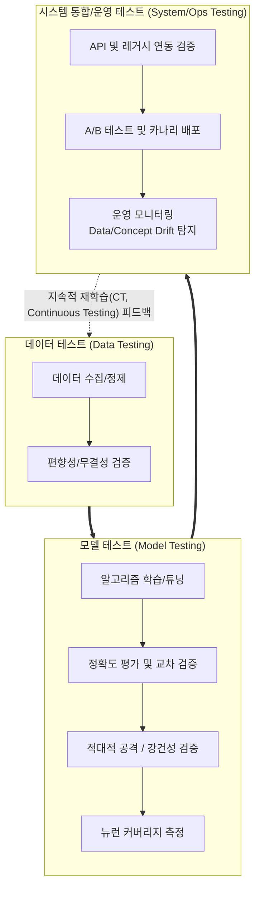

# AI 시스템 테스트 (AI System Testing)

---

## I. 신뢰성 및 안전성 확보를 위한, AI 시스템 테스트의 개요

* **정의**: 데이터 학습을 통해 확률론적(Probabilistic) 결과를 도출하는 AI 시스템의 성능, 강건성, 공정성, 설명가능성을 검증하여 [[신뢰성]](Trustworthy)을 확보하는 일련의 품질 보증(QA) 활동
* **등장 배경**: 명확한 정답이 없는 비결정적(Non-deterministic) 특성으로 인한 기존 [[테스트 오라클]](Test Oracle) 문제 발생, 블랙박스 모델의 불확실성(편향성, [[할루시네이션|환각 현상]]) 증가, EU AI Act 등 글로벌 AI 안전 규제 강화
* **특징**: 데이터 중심(Data-driven) 검증, 확률적 결과 기반의 평가 지표(Accuracy, F1-Score 등) 활용, 메타모픽(Metamorphic) 및 적대적(Adversarial) 테스트 등 AI 특화 기법 적용

---

## II. AI 시스템 테스트 수명주기 개념도 및 핵심 기술 요소

### 가. AI 시스템 테스트 수명주기(Lifecycle) 개념도

* AI 시스템 테스트는 단일 단계가 아닌 데이터 준비, 모델 학습, 시스템 통합 및 운영 전반에 걸친 [[MLOps]]/[[LLMOps]] 기반의 지속적이고 반복적인 검증 프로세스임.

### 나. AI 시스템 테스트의 핵심 기술/구성 요소

| 구분 | 요소기술(키워드) | 세부 설명 |
| --- | --- | --- |
| **특화 테스트** | 메타모픽 테스트 (Metamorphic) | 입력값의 변화에 따른 출력값의 예측 가능한 변화 관계(Metamorphic Relation)를 정의하여 오라클 문제(정답 부재) 해결 |
| **특화 테스트** | 적대적 테스트 (Adversarial) | 의도적인 노이즈나 조작된 입력(Adversarial Example)을 주입하여 모델의 강건성(Robustness) 및 보안성 평가 |
| **화이트박스** | 뉴런 커버리지 (Neuron Coverage) | [[딥러닝]] 내부 신경망 노드의 활성화 비율을 측정하여 테스트의 충분성을 평가하는 [[화이트박스 테스트]] 기법 |
| **데이터 검증** | 편향성 및 불균형 검증 | 훈련/테스트 데이터셋의 통계적 분포 차이, 라벨링 오류, 인구통계학적 편향성(Bias) 진단 |
| **성능 평가** | 혼동 행렬 (Confusion Matrix) | 참/거짓 예측 결과에 기반한 정밀도(Precision), 재현율(Recall), F1-Score 등 정량적 분류 성능 측정 |
| **통합/배포** | 섀도우 테스트 (Shadow Test) | 실제 운영 환경의 트래픽을 기존 시스템과 신규 AI 모델에 동시 전달하여 서비스 영향도 없이 성능 비교 |
| **비기능 검증** | 공정성 및 설명가능성 ([[XAI]]) | 성별/인종 등에 대한 차별적 출력 여부 점검 및 SHAP/[[LIME]] 등을 활용한 AI 의사결정 근거의 해석성 검증 |
| **운영 모니터링** | 드리프트(Drift) 탐지 | 실시간 운영 환경에서 데이터 패턴 변화(Data Drift) 및 모델 성능 저하(Concept Drift) 지속 추적 및 알림 |

---

## III. 전통적 SW 테스트와 AI 시스템 테스트 비교 및 향후 전망

### 가. 전통적 SW 테스트와 AI 시스템 테스트 비교

| 비교 항목 | 전통적 SW 테스트 (Traditional SW Testing) | AI [[시스템 테스트]] (AI System Testing) |
| --- | --- | --- |
| **동작 패러다임** | 연역적, 규칙 및 코드 기반 (Rule/Code-driven) | 귀납적, 데이터 및 모델 기반 (Data/Model-driven) |
| **결과 특성** | 결정론적 (Deterministic / 항상 같은 결과) | 비결정론적, 확률적 (Probabilistic / 매번 다를 수 있음) |
| **테스트 오라클** | 명확한 참/거짓 정답 존재 (Oracle 존재) | 정확한 정답 도출 곤란 (Oracle 문제 발생) |
| **주요 품질 속성** | 기능 정확성, 예외 처리, 성능, 보안 | 강건성(Robustness), 공정성, 설명가능성, 재현성 |
| **대표 기법** | [[단위 테스트]], [[통합 테스트]], 경계값 분석 | 메타모픽 테스트, 적대적 테스트, 뉴런 커버리지 |
| **적용 표준** | ISO/IEC/IEEE 29119 (일반 SW 테스팅) | ISO/IEC/IEEE 29119-11 (AI 시스템 테스팅) |

### 나. 향후 전망 및 동향

* **테스트 자동화 및 [[초거대 언어 모델|LLM]]-as-a-Judge 도입**: 초거대 AI 모델의 검증을 위해 사람이 직접 테스트하는 한계를 극복하고자, 또 다른 AI 모델이 평가 기준을 바탕으로 결과를 채점하는 자동화 기법 확산
* **글로벌 표준 기반의 인증 활성화**: ISO/IEC 29119-11(AI 테스팅 표준) 및 ISO/IEC 42001(AI 경영시스템) 표준을 기반으로 한 공인 시험인증(KOLAS 등) 의무화 및 규제 컴플라이언스 체계 정착 전망

---

### 🔗 연관 토픽

- **소속 도메인**: [[00_인공지능_MOC|🤖 인공지능]]
- **세부 분류**: `1. 수학 · 통계학 & 데이터 전처리`
- **핵심 연관 토픽**:
  - [[MLOps]]
  - [[할루시네이션|할루시네이션(Hallucination)]]
  - [[딥러닝]]
  - [[XAI]]
  - [[LIME]]
