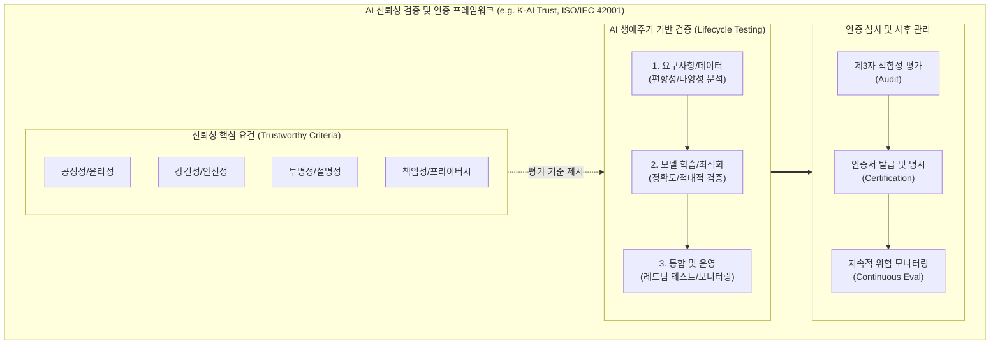

# AI 신뢰성 인증 (Trustworthy AI Certification)

---

## I. 안전하고 책임 있는 AI 생태계 조성을 위한, AI 신뢰성 인증의 개요

* **정의**: AI 시스템이 기획, 개발, 운영 전 과정에서 투명성, 안전성, 공정성 등의 품질 기준을 충족하여 잠재적 위험을 통제하고 있음을 공인된 제3자 기관이 객관적으로 검증하여 부여하는 인증 제도
* **등장 배경**: 환각(Hallucination), [[딥페이크]] 악용, 데이터 편향성 등 AI 역기능 피해 심화, EU AI Act 발효 및 국내 '[[인공지능]] 산업 육성 및 신뢰 기반 조성에 관한 법률([[AI 기본법]])' 제정 등 글로벌 규제 환경 강화
* **특징**: 다차원 검증(데이터 [[무결성]], [[알고리즘]] 강건성, 시스템 보안), 위험 기반(Risk-based) 평가 모델 적용, 개발부터 폐기까지 생애주기 전반(Lifecycle)의 거버넌스 확립

---

## II. AI 신뢰성 인증 검증 체계 개념도 및 핵심 평가 요소

### 가. AI 신뢰성 인증 생애주기 검증 개념도

* AI [[신뢰성]] 핵심 요건을 바탕으로 데이터 구축부터 운영까지 단계별로 검증을 수행하며, 제3자 기관(TTA 등)의 적합성 평가를 통해 최종 인증을 부여함.

### 나. AI 신뢰성 인증의 핵심 기술 및 구성 요소

| 구분 | 요소기술(키워드) | 세부 설명 |
| --- | --- | --- |
| **핵심 요건** | 공정성 (Fairness) | 학습 데이터의 편향을 식별·제거하여 특정 성별, 인종 등에 대한 차별적 의사결정 방지 |
| **핵심 요건** | 강건성 (Robustness) | [[적대적 공격]](Adversarial Attack)이나 예상치 못한 노이즈 입력 환경에서도 정상적인 출력 유지 |
| **핵심 요건** | 투명성 (Transparency) | 의사결정 과정에 대한 추적성(Traceability) 확보 및 설명 가능한 AI([[XAI]]) 기술 적용 여부 점검 |
| **핵심 요건** | 프라이버시 보호 | [[비식별화]], 가명화, [[차분 프라이버시]](Differential Privacy) 등 개인정보 침해 방지 대책 검증 |
| **평가 기법** | 적대적 레드티밍 | 보안 전문가와 평가 AI([[초거대 언어 모델|LLM]]-as-a-Judge)를 활용해 시스템의 윤리적 제약 우회(Jailbreak) 시도 및 방어력 측정 |
| **평가 기법** | 데이터 품질 검증 | 훈련/검증 데이터셋의 통계적 분포, 라벨링 오류율, 다양성 지표 산출을 통한 데이터 무결성 검사 |
| **인증 체계** | 제품/서비스 인증 | TTA(한국정보통신기술협회)의 K-AI Trust 등 개별 AI 솔루션 및 서비스의 품질과 신뢰성을 보증하는 민간/공공 인증 |
| **인증 체계** | 경영 시스템 인증 | ISO/IEC 42001 기반으로 조직 차원의 AI 리스크 관리, 윤리 위원회 운영 등 거버넌스 체계 전반 인증 |

---

## III. AI 신뢰성 인증의 글로벌 동향 및 향후 전망

* **법제화 기반의 의무 인증 확산**: EU AI Act의 전면 시행(2024~2026년 단계적 발효)에 따라 의료, 교통, 금융, 채용 등 고위험(High-Risk) AI 시스템에 대한 적합성 평가(CE 마크 획득) 및 신뢰성 인증 의무화 규제 본격화
* **생성형 AI 전용 인증 지표 고도화**: LLM/[[sLLM (Smaller Large Language Model)|sLLM]]의 보급으로 정답이 없는 생성형 텍스트/이미지의 특성을 반영하여, 환각(Hallucination), 저작권 침해 요소, 딥페이크 워터마크 부착 여부를 중점 평가하는 특화 인증 기준 신설 추세
* **지속적 인증(Continuous Certification) 생태계**: AI 모델이 재학습 및 파인튜닝을 통해 끊임없이 진화함에 따라 일회성 인증을 넘어, [[MLOps]]와 연계하여 데이터 드리프트(Data Drift) 및 성능 저하를 실시간 모니터링하는 동적 인증 체계로 진화 중

---

### 🔗 연관 토픽

- **소속 도메인**: [[00_인공지능_MOC|🤖 인공지능]]
- **세부 분류**: `6. 설명가능한 AI (XAI) & AI 윤리 · 거버넌스`
- **핵심 연관 토픽**:
  - [[XAI]]
  - [[AI 기본법]]
  - [[인공지능]]
  - [[MLOps]]
  - [[AI 거버넌스|AI 거버넌스 (AI Governance)]]
