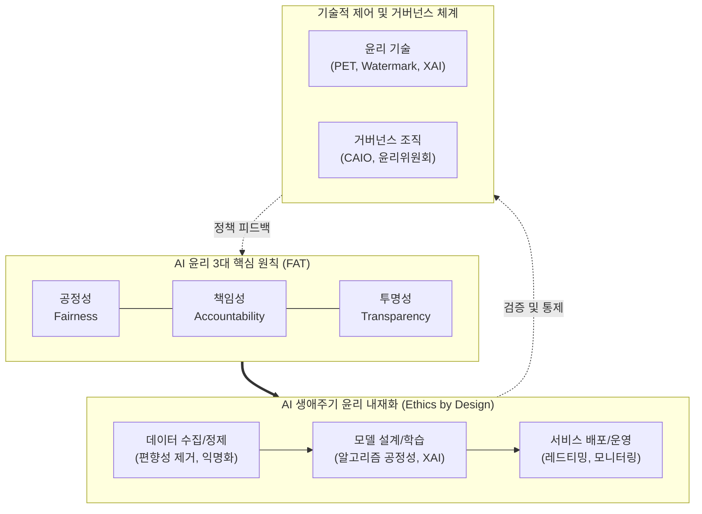

# AI 윤리 (AI Ethics)

---

## I. 인류의 보편적 가치 수호를 위한, AI 윤리의 개요

* **정의**: [[인공지능]] 기술의 기획, 개발, 운영 전 과정에서 발생할 수 있는 편향성, 프라이버시 침해, 위해성 등의 도덕적·사회적 문제를 예방하고 인류에게 유익하게 동작하도록 통제하는 가치 규범 및 실천 기술
* **필요성/등장배경**: 생성형 AI의 확산에 따른 [[딥페이크]], 환각(Hallucination), 저작권 무단 도용 등 사회적 부작용 심화, [[Smart Car(자율주행)|자율주행]] 등 생명과 직결된 시스템의 트롤리 딜레마(Trolley Dilemma) 발생
* **특징**: FAT(공정성, 투명성, 책임성) 원칙 기반, 선언적 규범에서 법적 구속력을 지닌 규제(EU AI Act 등)로의 진화, 기술적 통제([[XAI]], PET)와 거버넌스의 결합

---

## II. AI 윤리의 프레임워크 개념도 및 핵심 기술 요소

### 가. AI 윤리 프레임워크 및 실천 개념도

* AI 윤리는 공정성, 책임성, 투명성(FAT)의 핵심 가치를 기반으로 하여 데이터 구축부터 서비스 운영까지 전 생애주기에 걸쳐 기술적 수단과 거버넌스를 통해 내재화(Ethics by Design)됨.

### 나. AI 윤리의 핵심 구성 요소 및 기술

| 구분 | 요소기술(키워드) | 세부 설명 |
| --- | --- | --- |
| **핵심 가치** | 공정성 (Fairness) | 데이터 및 알고리즘의 [[편향]](Bias)을 제거하여 특정 인종, 성별, 연령에 대한 차별적 결과 방지 |
| **핵심 가치** | 투명성 (Transparency) | AI의 의사결정 과정을 사용자가 이해하고 검증할 수 있도록 블랙박스 구조 해석 가능성 제공 |
| **핵심 가치** | 책임성 (Accountability) | AI 시스템 오작동 또는 피해 발생 시 법적, 윤리적 귀책 사유 및 추적성(Traceability) 명확화 |
| **구현 기술** | XAI (설명가능한 AI) | [[LIME]], SHAP 등의 기술을 활용하여 [[딥러닝]] 모델의 결과 도출 근거를 인간이 이해할 수 있게 시각화 |
| **구현 기술** | PET (프라이버시 보호) | 동형암호, [[차분 프라이버시]](Differential Privacy), 연합학습을 통해 원본 데이터 노출 없이 AI 학습 |
| **검증 기술** | AI 레드티밍 (Red Teaming) | 의도적인 [[적대적 공격]]([[프롬프트 인젝션]], 탈옥 등)을 통해 모델의 유해성 및 윤리적 제약 우회 사전 점검 |
| **검증 기술** | 워터마킹 (Watermarking) | 생성형 AI가 만든 이미지, 텍스트 등에 식별 가능한 표식을 삽입하여 딥페이크 악용 및 저작권 침해 방지 |
| **거버넌스** | AI 윤리 위원회 및 CAIO | 기업 내 전사적 AI 윤리 가이드라인 제정 및 심의를 총괄하는 최고 AI 책임자 및 전담 기구 |

---

## III. AI 윤리의 최근 동향 및 향후 전망

* **선언적 준칙에서 강제적 법제화로 진화**: 과거 '아실로마 AI 원칙', 'OECD AI 권고안' 등 연성 규범(Soft Law) 중심에서, 위반 시 천문학적 벌금을 부과하는 'EU AI Act(인공지능법)' 및 국내 '[[AI 기본법]]' 등 경성 규범(Hard Law)으로 전환 본격화
* **[[AI TRiSM]] 기반 리스크 관리 내재화**: 가트너가 제시한 AI 신뢰, 리스크 및 보안 관리(TRiSM) 프레임워크가 주요 [[MLOps]] 플랫폼에 통합되어, 개발 단계부터 실시간으로 편향성과 위험을 자동 차단하는 환경 구축
* **글로벌 경영 표준(ISO 42001) 인증 확산**: AI 윤리 및 [[신뢰성]] 확보가 기업의 [[ESG 경영]] 핵심 지표로 부상함에 따라, 무역 장벽 극복 및 공공/B2B 사업 수주를 위한 ISO/IEC 42001(AI 경영시스템) 인증 의무화 추세 확산

---

### 🔗 연관 토픽

- **소속 도메인**: [[00_인공지능_MOC|🤖 인공지능]]
- **세부 분류**: `4. 거대언어모델 (LLM) & 생성형 AI`
- **핵심 연관 토픽**:
  - [[AI TRiSM|AI TRiSM(AI Trust Risk and Security Management)]]
  - [[AI Ready Data]]
  - [[공공부문 초거대AI 도입, 활용 가이드라인 2.0(2025.04)]]
  - [[인공지능]]
  - [[편향]]
