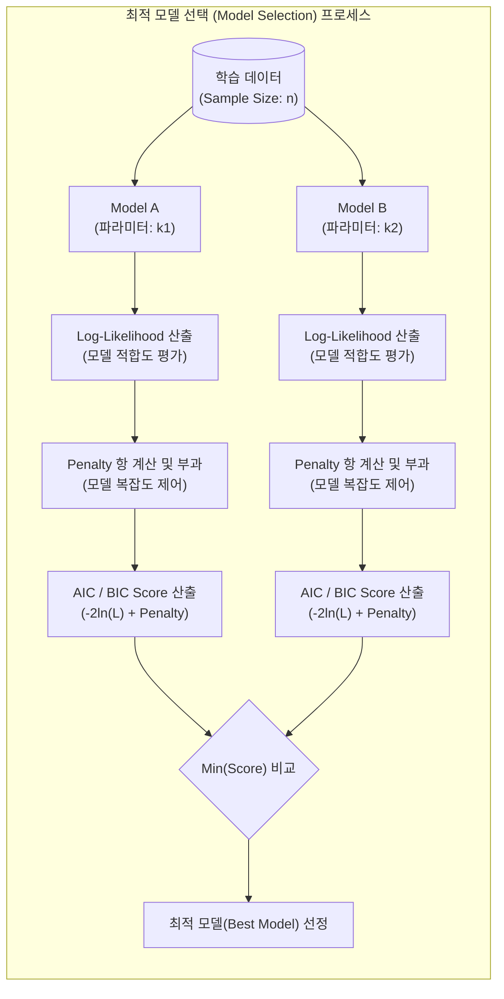

# AIC(Akaike Information Criterion) & BIC(Bayesian Information Criterion)

---

## I. 과적합 방지를 위한 최적의 모델 선택 기준, AIC와 BIC의 개요

* **정의**: 통계 및 머신러닝 모델 평가 시 모델의 설명력(우도, Likelihood)과 복잡도(매개변수 수)를 동시에 고려하여, 과적합(Overfitting)을 방지하고 최적의 모델을 선택하는 정보 이론 및 통계 기반의 평가지표
* **필요성**: 단순히 모델의 오차를 줄이거나 우도(Likelihood)를 최대화하면 불필요한 매개변수가 증가하여 새로운 데이터에 대한 예측력이 떨어지는 과적합 문제가 발생함
* **특징**:
* **Occam's Razor 원칙**: 불필요하게 복잡한 모델에 페널티(Penalty)를 부여하여 간결성을 지향함
* **상대적 평가**: 절대적인 점수가 아니며, 여러 후보 모델 중 AIC/BIC 값이 **가장 작은 모델**을 최적 모형으로 채택함

---

## II. AIC와 BIC의 개념도 및 핵심 구성 요소

### 가. AIC와 BIC 기반의 모델 선택(Model Selection) 개념도

* 동일한 학습 데이터에 대해 후보 모델들의 데이터 적합도(Likelihood)를 측정하고, 파라미터 수($k$)와 표본 크기($n$)에 따른 페널티를 부과하여 최소값을 가진 모델을 최종 선정함

### 나. AIC와 BIC의 핵심 기술 및 구성 요소

| 분류 | 요소기술(키워드) | 세부 설명 |
| --- | --- | --- |
| **적합도 지표** | 최대 우도 (Max Likelihood, $L$) | 모델이 주어진 데이터를 얼마나 잘 설명하는지를 나타내는 확률 척도 (값이 클수록 적합도 우수) |
| **적합도 지표** | 로그 우도 (Log-Likelihood) | 계산의 편의성 및 언더플로우 방지를 위해 우도에 자연로그($\ln$)를 취한 값 |
| **복잡도 지표** | 매개변수 수 ($k$) | 모델에 포함된 독립 변수 또는 추정해야 할 파라미터의 총 개수 (복잡성 증가 요인) |
| **복잡도 지표** | 표본 크기 ($n$) | 관측된 데이터의 총 개수로, BIC의 페널티 산정 시 파라미터의 가중치로 작용 |
| **이론적 배경** | KL 발산 (KL Divergence) | 실제 데이터의 확률분포와 모델의 [[확률분포]] 간의 정보 손실량을 측정하는 AIC의 수학적 근거 |
| **이론적 배경** | 베이즈 요인 (Bayes Factor) | 사후 확률(Posterior)을 최대화하는 과정에서 근사화를 통해 BIC 식을 도출하는 근거 |
| **핵심 기제** | 규제화 (Regularization) | 파라미터가 추가될 때마다 우도가 증가하는 현상을 상쇄하기 위해 수식적으로 부과하는 패널티 항 |

---

## III. AIC와 BIC의 비교 및 실무 활용 방안

### 가. AIC와 BIC의 상세 비교

| 비교 항목 | AIC (Akaike Information Criterion) | BIC (Bayesian Information Criterion) |
| --- | --- | --- |
| **핵심 수식** | $AIC = -2\ln(L) + 2k$ | $BIC = -2\ln(L) + k\ln(n)$ |
| **페널티(Penalty) 항** | $2k$ (매개변수 수에만 비례) | $k\ln(n)$ (매개변수 수와 데이터 크기 동시 고려) |
| **이론적 기반** | 정보 이론 (Information Theory) | 베이지안 통계학 (Bayesian Statistics) |
| **표본 크기(n)의 영향** | 데이터 수($n$)가 커져도 페널티 강도 일정 | $n \ge 8$일 때 $\ln(n) > 2$가 되어 페널티가 더 커짐 |
| **모델 선택 성향** | 성능 최적화 중심 (상대적으로 다소 복잡한 모델 선택 경향) | 과적합 억제 중심 (상대적으로 더 단순하고 엄격한 모델 선택 경향) |

### 나. 실무 활용 방안 및 전망

* **시계열 예측 모델 최적화**: ARIMA 모델 구축 시 ACF/PACF 차트와 더불어 최적의 차수($p, d, q$)를 자동 탐색(Auto-ARIMA)하는 핵심 목적 함수로 활용
* **머신러닝 변수 선택(Feature Selection)**: 다중 회귀 분석 등에서 단계적 선택법(Stepwise Selection), 전진 선택법(Forward Selection) 진행 시 변수 추가/제거의 성능 평가 기준으로 활용
* **상호 보완적 활용(Cross-Validation 병행)**: 실무에서는 AIC와 BIC 중 단일 지표에만 의존하지 않고, 모델의 목적(예측력 vs 설명력)에 따라 K-Fold 교차 검증 등과 결합하여 최종 하이퍼파라미터를 튜닝하는 앙상블적 접근이 권장됨

---

### 🔗 연관 토픽

- **소속 도메인**: [[00_인공지능_MOC|🤖 인공지능]]
- **세부 분류**: `1. 수학 · 통계학 & 데이터 전처리`
- **핵심 연관 토픽**:
  - [[확률분포]]
  - [[중심극한정리|중심극한정리 (Central Limit Theorem)]]
  - [[손실함수]]
  - [[이항분포|이항분포 (Binomial Distribution)]]
  - [[확률분포와 확률 밀도 함수]]
