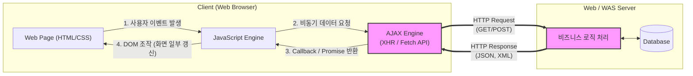

# AJAX (Asynchronous JavaScript and XML)

---

## I. 비동기 웹 통신의 표준, AJAX의 개요

* **정의**: 웹 페이지의 전체 새로고침 없이, 브라우저와 웹 서버 간 백그라운드 비동기 통신을 통해 화면의 일부분만 동적으로 갱신하는 웹 개발 기술
* **등장배경**: 전통적인 동기식 웹 요청(Page Reload)으로 인한 화면 깜빡임 현상, 불필요한 중복 데이터 전송에 따른 네트워크 대역폭 낭비 및 사용자 경험(UX) 저하 문제 해결 필요
* **특징**:
* 비동기성(Asynchrony): 서버 응답을 기다리는 동안에도 사용자는 웹 페이지와 상호작용 가능
* 경량화: HTML 전체가 아닌 필요한 데이터(주로 [[JSON]], [[XML]])만 교환하여 트래픽 최소화
* 표준 기술의 조합: JavaScript, DOM, Fetch API 등 기존 웹 표준 기술들의 융합

---

## II. AJAX의 개념도 및 핵심 기술 요소

### 가. AJAX의 아키텍처 및 동작 원리

* 사용자 이벤트 발생 시 JavaScript가 AJAX 엔진(Fetch API 등)을 호출하고, 백그라운드에서 서버와 통신 후 반환된 데이터(JSON 등)를 이용해 DOM을 조작하여 화면을 갱신함

### 나. AJAX의 핵심 기술 및 구성 요소

| 구분 | 요소기술(키워드) | 세부 설명 |
| --- | --- | --- |
| **통신 객체** | XMLHttpRequest (XHR) | AJAX 초기에 사용된 전통적인 브라우저 내장 비동기 통신 API |
| **통신 객체** | Fetch API | XHR을 대체하는 최신 웹 표준, Promise 기반으로 가독성 및 사용성 향상 |
| **데이터 포맷** | JSON (JavaScript Object Notation) | XML을 대체하여 현재 AJAX 통신에서 가장 널리 쓰이는 경량 데이터 교환 형식 |
| **화면 제어** | DOM (Document Object Model) | 수신된 데이터를 바탕으로 웹 페이지의 요소와 스타일을 동적으로 변경하는 인터페이스 |
| **비동기 처리** | Callback Function | 비동기 요청 완료 후 실행될 함수로, 초기 AJAX의 결과 처리 방식 (콜백 지옥 유발) |
| **비동기 처리** | Promise / async-await | 콜백 지옥을 해결하고 비동기 코드를 동기식처럼 직관적으로 작성하게 해주는 ES6+ 문법 |
| **외부 라이브러리** | Axios | Fetch API를 보완하여 요청 취소, JSON 자동 변환 등을 제공하는 인기 HTTP 클라이언트 |
| **보안 메커니즘** | CORS (Cross-Origin Resource Sharing) | 다른 도메인의 자원을 안전하게 요청하기 위해 브라우저가 준수하는 교차 출처 정책 |

---

## III. 전통적 웹 모델과의 비교 및 향후 활용 전망

### 가. 동기식(Traditional) 통신과 비동기식(AJAX) 통신 비교

| 비교 항목 | 전통적 웹 (Synchronous) | AJAX 기반 웹 (Asynchronous) |
| --- | --- | --- |
| **화면 갱신 방식** | 페이지 전체 새로고침 (Full Reload) | 필요한 부분만 부분 갱신 (Partial Update) |
| **서버 대기 시간** | 서버 처리 중 클라이언트 화면 멈춤(블로킹) | 서버 처리 중에도 다른 작업 가능(논블로킹) |
| **데이터 전송량** | 불필요한 UI(HTML/CSS)까지 매번 재전송 | 순수 데이터(JSON/XML)만 전송하여 가벼움 |
| **사용자 경험(UX)** | 화면 깜빡임 발생, 반응 속도 느림 | 네이티브 앱(App)과 유사한 매끄러운 반응성 |

### 나. AJAX의 발전 동향 및 향후 전망

* **SPA(Single Page Application)의 기반 기술**: React, Vue, Angular와 같은 프론트엔드 프레임워크의 발전과 함께, 초기 1회 HTML 로드 후 모든 뷰 교체를 AJAX(Fetch/Axios)로 처리하는 SPA 아키텍처의 핵심 원동력으로 자리 잡음
* **실시간 웹(Real-time Web)으로의 확장**: 단순한 단방향 AJAX 요청을 넘어, WebSocket, SSE(Server-Sent Events) 등과 결합하여 주식 거래, 실시간 채팅 등 실시간 양방향 통신이 가능한 웹 생태계로 진화 중임

---

### 🔗 연관 토픽

- **소속 도메인**: [[00_소프트웨어공학_MOC|🏗️ 소프트웨어공학]]
- **세부 분류**: `6. 소프트웨어 테스팅 & 품질 보증 (QA/QC)`
- **핵심 연관 토픽**:
  - [[XML]]
  - [[JSON]]
  - [[SBOM]]
  - [[Annotation]]
  - [[퍼징 테스트|퍼징 테스트 (Fuzzing Test)]]
