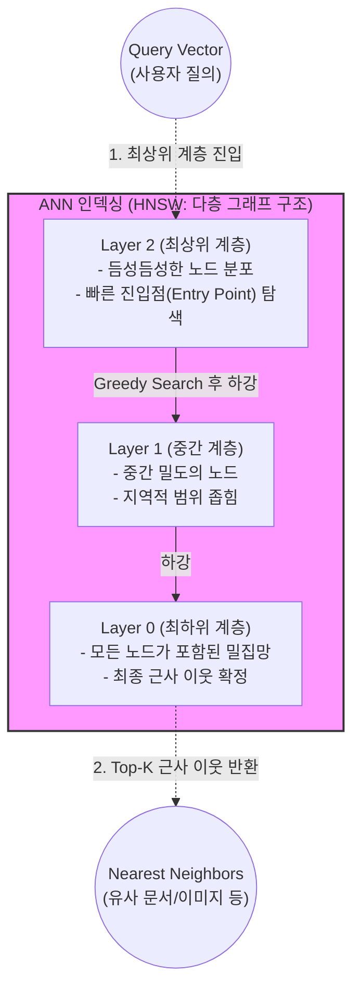

# ANN(Approximate Nearest Neighbor) 알고리즘

---

## I. 대규모 벡터 검색의 핵심 가속 기술, ANN 알고리즘의 개요

* **정의**: 고차원 벡터 공간에서 쿼리 데이터와 가장 유사한 이웃을 찾을 때, 100%의 정확도(Exact)를 일부 양보하는 대신 탐색 속도를 획기적으로 향상시키는 근사 최근접 이웃 탐색 [[알고리즘]]
* **필요성/등장배경**: 기존 KNN(K-Nearest Neighbor) 알고리즘은 데이터셋 크기에 비례하는 O(N)의 시간 복잡도를 가져 대용량 처리에 한계가 있으며, [[초거대 언어 모델|LLM]]의 RAG(검색 증강 생성) 및 추천 시스템 도입으로 초고속 벡터 검색 수요가 급증함
* **특징**: 검색 속도와 정확도(Recall) 간의 트레이드오프(Trade-off) 허용, 사전 인덱싱(Indexing)을 통한 탐색 공간 축소, 메모리 압축(Quantization) 기법 병행 사용

---

## II. ANN 알고리즘의 개념도 및 핵심 기술 요소

### 가. ANN 알고리즘의 개념도 (HNSW 구조 기반)

* 입력된 쿼리 벡터는 다층으로 구성된 사전 인덱스를 통해 탐색 범위를 단계적으로 좁혀가며(Greedy Search), 전체 데이터를 계산하지 않고 상위 K개의 유사한 결과를 초고속으로 반환함

### 나. ANN 알고리즘의 핵심 기술 요소

| 분류 | 요소기술(키워드) | 세부 설명 |
| --- | --- | --- |
| **그래프 기반 (Graph)** | HNSW (Hierarchical Navigable Small World) | 다층 구조의 '작은 세상 네트워크'를 구축하여 검색 속도와 정확도(Recall)가 가장 우수한 SOTA 알고리즘 |
| **트리 기반 (Tree)** | Annoy / KD-Tree | 고차원 공간을 랜덤 하이퍼플레인으로 분할하여 이진 트리를 구성하고 근접 영역을 탐색 |
| **해싱 기반 (Hashing)** | LSH (Locality Sensitive Hashing) | 유사한 벡터들이 동일한 해시 버킷(Bucket)에 매핑될 확률을 높여 탐색 범위를 해시 충돌 영역으로 제한 |
| **군집화 기반 (Cluster)** | IVF (Inverted File [[RDBMS 인덱스(index)|Index]]) | 전체 벡터를 K-means 등으로 군집화(Voronoi Cell)한 후, 쿼리와 가장 가까운 군집 내에서만 역색인 검색 |
| **양자화 기반 (Quantization)** | PQ (Product Quantization) | 고차원 벡터를 여러 서브 벡터로 쪼개어 군집화하고 짧은 코드북으로 압축하여 메모리 사용량을 최소화 |
| **복합 인덱스 (Hybrid)** | IVF-PQ | 대용량 데이터 환경에서 탐색 속도(IVF)와 메모리 효율성(PQ)을 동시에 달성하기 위한 결합 기법 |
| **거리 측정 (Metric)** | Cosine Similarity / L2 Distance | 벡터 간의 유사도를 판별하기 위한 수학적 거리 측정 기준 (코사인 [[유사도]], 유클리디안 거리 등) |
| **평가 지표 (Evaluation)** | Recall@K / QPS | 정답 이웃이 상위 K개 결과에 포함될 확률(Recall) 및 초당 쿼리 [[처리량]](Queries Per Second) |

---

## III. Exact NN과의 비교 및 ANN 활용 전망

### 가. Exact NN(KNN)과 Approximate NN(ANN)의 비교

| 비교 항목 | Exact NN (전수 탐색 / KNN) | Approximate NN (ANN) |
| --- | --- | --- |
| **탐색 방식** | 쿼리와 모든 데이터 간의 거리 계산 (선형 탐색) | 클러스터/그래프/해싱을 통한 탐색 공간 사전 축소 |
| **시간 복잡도** | $O(N)$ (데이터 크기에 비례하여 증가) | $O(\log N)$ 또는 $O(1)$ (초고속) |
| **정확도** | 100% 정답 보장 (Ground Truth) | 허용 오차 범위 내의 근사치 (일반적으로 90~99%) |
| **인덱싱(사전 작업)** | 인덱싱 불필요 (데이터 삽입 즉시 반영 가능) | 데이터 변경 시 인덱스 리빌딩 및 업데이트 비용 발생 |
| **주요 활용처** | 소규모 데이터셋, 완벽한 정확도가 필수인 분석 | 대용량 Vector DB (Milvus, Pinecone 등), RAG, 추천 시스템 |

### 나. ANN의 활용 사례 및 향후 전망

* **생성형 AI의 RAG(Retrieval-Augmented Generation) 필수 인프라**: LLM의 환각을 방지하기 위해 기업 내부의 방대한 문서(PDF, 텍스트)를 벡터화하여 저장 및 실시간 검색하는 Vector Database의 코어 엔진으로 활발히 도입됨
* **하드웨어 가속([[GPU]]-based ANN)의 진화**: 엔비디아의 RAFT 라이브러리 및 CAGRA(그래프 기반 GPU ANN) 알고리즘 적용을 통해, 수십억 건의 벡터 탐색 시 병목 현상을 해소하고 지연 시간(Latency)을 마이크로초 수준으로 단축하는 방향으로 발전 중임

---

### 🔗 연관 토픽

- **소속 도메인**: [[00_데이터베이스_MOC|🗄️ 데이터베이스]]
- **세부 분류**: `6. SQL 표준 문법 & 쿼리 성능 튜닝`
- **핵심 연관 토픽**:
  - [[초거대 언어 모델|초거대 언어 모델(Large Language Model)]]
  - [[GPU]]
  - [[처리량]]
  - [[유사도|유사도(Similarity)]]
  - [[분류화]]
