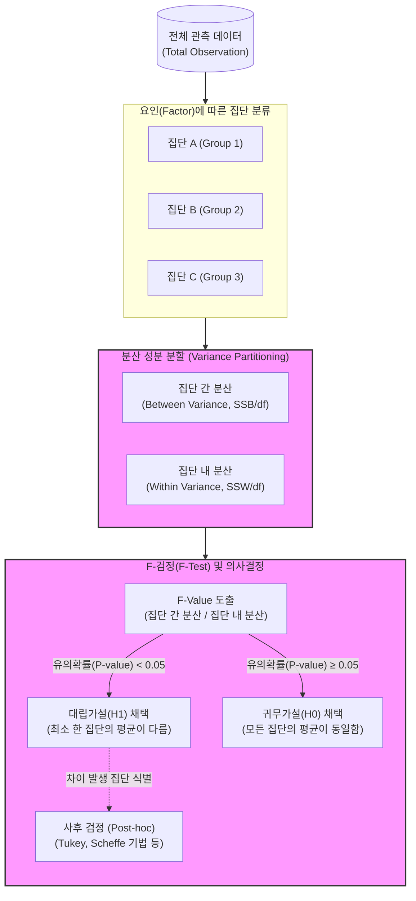

# ANOVA (Analysis of Variance)

---

## I. 세 개 이상 집단 간 평균 차이 검정, ANOVA의 개요

* **정의**: 3개 이상의 다중 집단 간 평균의 차이가 통계적으로 유의미한지 검증하기 위해, 집단 간 분산(Between Variance)과 집단 내 분산(Within Variance)의 비율인 F-값을 분석하는 통계적 [[가설 검정]] 기법
* **필요성 및 등장배경**: 두 집단 비교용인 [[t-검정 (t-test)|t-test]]를 3개 이상의 집단에 반복 적용할 경우, 제1종 오류(Type I Error, 알파 인플레이션)가 급격히 증가하는 문제를 해결하기 위해 도입됨
* **특징**:
* **분산을 통한 평균 검정**: 데이터의 [[변동성]](Variance)을 분할하여 집단 간 모평균의 차이를 추론함
* **사후검정(Post-hoc) 수반**: 결과가 유의미할 경우, 구체적으로 어느 집단 간에 차이가 있는지 식별하기 위한 추가 검정이 필수적임

---

## II. ANOVA의 개념도 및 핵심 통계 요소

### 가. ANOVA의 분석 프로세스 및 개념도

* 전체 데이터의 변동을 '집단 간 분산'과 '집단 내 분산'으로 분할하고, 두 분산의 비율(F-Value)을 구하여 모평균의 차이 존재 여부를 통계적으로 검증함

### 나. ANOVA의 핵심 통계/기술 요소

| 구분 | 요소기술(키워드) | 세부 설명 |
| --- | --- | --- |
| **검정 지표** | F-통계량 (F-Value) | 집단 간 분산을 집단 내 분산으로 나눈 비율 (값이 클수록 집단 간 평균 차이가 확실함을 의미) |
| **가설 설정** | 귀무가설 ($H_0$) | "모든 집단의 모평균은 동일하다" ($\mu_1 = \mu_2 = \mu_3 = \dots = \mu_k$) |
| **가설 설정** | 대립가설 ($H_1$) | "적어도 하나의 집단 모평균은 다른 집단과 다르다" |
| **분산 성분** | 집단 간 분산 (SSB) | 전체 평균과 각 집단 평균 간의 차이 (처리 효과나 요인에 의한 의미 있는 변동) |
| **분산 성분** | 집단 내 분산 (SSW) | 각 집단 내 개별 데이터와 해당 집단 평균 간의 차이 (통제 불가능한 오차 변동) |
| **기본 가정** | 정규성 / [[등분산성]] / 독립성 | 표본은 정규분포를 따르며, 집단 간 분산이 동일하고, 표본은 상호 독립적으로 추출되어야 함 |
| **분석 유형** | One-way / Two-way ANOVA | 독립변수(요인, Factor)의 개수가 1개(일원배치)인지 2개(이원배치)인지에 따른 분류 방식 |
| **후속 처리** | 사후 검정 (Post-hoc) | $H_1$ 채택 시, 정확히 어느 집단 간에 차이가 나는지 확인하는 다중비교 기법 (Tukey, Duncan 등) |

---

## III. ANOVA와 t-test 비교 및 최신 데이터 분석 활용

### 가. ANOVA와 t-test (Two-sample) 비교

| 비교 항목 | ANOVA (분산 분석) | t-test (T-검정) |
| --- | --- | --- |
| **비교 대상(집단 수)** | **3개 이상**의 다중 집단 | **2개 이하**의 집단 |
| **검정 통계량** | F-분포 기반 (F-Value) | t-분포 기반 (t-Value) |
| **결과 해석** | 어느 집단이 다른지 알 수 없음 (사후검정 필수) | 두 집단 간의 명확한 대소 및 차이 파악 가능 |
| **1종 오류 통제** | 다중 비교 시에도 1종 오류(알파) 증가 억제 | 3개 이상 집단에 반복 적용 시 1종 오류 급증 |
| **주요 목적** | 여러 집단이나 범주에 따른 처리 효과(Effect) 분석 | 두 집단 간의 단순 평균 차이 유무 검증 |

### 나. 데이터 사이언스 환경에서의 활용 및 시사점

* **다변량 A/B 테스트 (A/B/C/n 테스트)**: 웹/앱 서비스 UI/UX 개편 시, 3가지 이상의 대안 디자인 성과(전환율, 체류시간 등)를 동시에 검증하는 마케팅 통계 기법으로 활용
* **머신러닝 Feature Selection**: 분류(Classification) 모델에서 타겟 변수(연속형)와 독립 변수(범주형) 간의 통계적 유의성을 평가하여, 모델 학습에 유의미한 변수(Feature)만을 추출하는 전처리 필터링 기법으로 적극 활용됨

---

### 🔗 연관 토픽

- **소속 도메인**: [[00_인공지능_MOC|🤖 인공지능]]
- **세부 분류**: `1. 수학 · 통계학 & 데이터 전처리`
- **핵심 연관 토픽**:
  - [[t-검정 (t-test)]]
  - [[등분산성|등분산성 (Homoscedasticity)]]
  - [[가설 검정]]
  - [[기술 통계|기술 통계(Descriptive statistics)]]
  - [[관계검정|관계검정 (Relationship Test)]]
