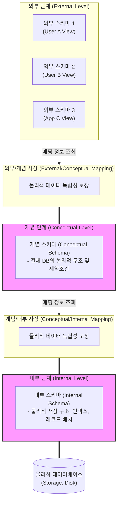

# ANSI/SPARC 모델 및 데이터 독립성

---

## I. 데이터 독립성 보장의 핵심, ANSI/SPARC 3단계 모델의 개요

* **정의**: 데이터베이스의 복잡도를 낮추고 데이터 독립성을 보장하기 위해, [[데이터베이스]] 구조를 사용자 관점(외부), 조직 관점(개념), 시스템 관점(내부)의 3단계 스키마로 분리한 표준 아키텍처 모델
* **필요성/특징**:
* **데이터 종속성 배제**: 응용 프로그램과 데이터의 물리적 저장 구조를 분리하여 유지보수성 향상
* **독립성 확보**: [[스키마]] 간 사상(Mapping)을 통해 논리적 및 물리적 데이터 독립성 동시 보장
* **다중 뷰 지원**: 단일 물리 데이터베이스 위에서 다수 사용자 및 애플리케이션의 다양한 요구사항(View) 수용

---

## II. ANSI/SPARC 3단계 구조 개념도 및 핵심 구성 요소

### 가. 3단계 스키마 구조 및 데이터 독립성 개념도

* [[DBMS]]는 각 스키마 간의 사상(Mapping) 정보를 참조하여 사용자 요청을 물리적 저장소의 데이터 접근으로 변환하며, 이 매핑 계층이 변경의 파급을 차단하여 독립성을 제공함

### 나. ANSI/SPARC 모델의 핵심 기술 및 구성 요소

| 구분 | 요소기술(키워드) | 세부 설명 |
| --- | --- | --- |
| **스키마 구조** | 외부 스키마 (External Schema) | 개별 사용자나 응용 프로그래머 관점에서 필요한 데이터베이스의 논리적 부분 구조 (서브 스키마, 뷰) |
| **스키마 구조** | 개념 스키마 (Conceptual Schema) | 조직 전체 관점의 통합된 논리적 구조, 데이터 간의 관계 및 [[무결성]] 제약조건 정의 (DBA가 관리) |
| **스키마 구조** | 내부 스키마 (Internal Schema) | 시스템/저장장치 관점의 물리적 데이터 구조, 레코드 형식, 저장 경로 및 인덱스 정의 |
| **독립성 원리** | 논리적 데이터 독립성 | 개념 스키마가 변경(새로운 속성 추가 등)되어도 기존 외부 스키마나 응용 프로그램에 영향을 주지 않는 성질 |
| **독립성 원리** | 물리적 데이터 독립성 | 내부 스키마(저장장치 교체, 인덱스 추가 등)가 변경되어도 개념 스키마 및 외부 스키마에 영향을 주지 않는 성질 |
| **사상 (Mapping)** | 외부/개념 사상 | 외부 스키마와 개념 스키마 간의 대응 관계를 정의하여 **논리적 독립성**을 구현하는 응용 인터페이스 |
| **사상 (Mapping)** | 개념/내부 사상 | 개념 스키마와 내부 스키마 간의 대응 관계를 정의하여 **물리적 독립성**을 구현하는 저장 인터페이스 |
| **관리/참조** | 데이터 사전 (Data Dictionary) | 3단계 스키마 구조의 메타데이터와 사상(Mapping) 규칙을 저장하여 DBMS가 동적으로 참조하는 [[시스템 카탈로그]] |

---

## III. 논리적/물리적 데이터 독립성 비교 및 현대적 시사점

### 가. 논리적 데이터 독립성 vs 물리적 데이터 독립성 비교

| 비교 항목 | 논리적 데이터 독립성 (Logical Independence) | 물리적 데이터 독립성 (Physical Independence) |
| --- | --- | --- |
| **보장 계층** | 외부 스키마 $\leftrightarrow$ 개념 스키마 | 개념 스키마 $\leftrightarrow$ 내부 스키마 |
| **보호 대상** | 응용 프로그램 (Application) | DB의 논리적 구조 (Conceptual Design) |
| **주요 변경 사유** | 새로운 업무 요건 추가, 테이블 통합/분리, 데이터 타입 변경 | 디스크 스토리지 교체, 파일 구조 변경, 성능 튜닝(인덱스, [[파티셔닝]]) |
| **구현 난이도** | 어려움 (업무 로직과 밀접하게 연관됨) | 상대적으로 쉬움 (DBMS 엔진 레벨에서 자동 지원) |

### 나. 현대 데이터 아키텍처에서의 ANSI/SPARC 모델 시사점

* **컴퓨팅과 스토리지의 분리 철학**: [[클라우드 네이티브]] 기반의 현대적 데이터 웨어하우스(Snowflake, BigQuery 등) 및 데이터 레이크하우스는 ANSI/SPARC의 물리적/논리적 분리 철학을 아키텍처 수준(컴퓨팅 노드와 오브젝트 스토리지의 분리)으로 극대화한 형태임
* **데이터 [[가상화]](Data Virtualization)로의 진화**: 물리적으로 산재된 이기종 데이터 소스들을 하나의 개념적 스키마(Logical Data Warehouse)로 통합하여 제공하는 데이터 패브릭(Data Fabric) 기술 역시 외부/개념 사상 원리의 현대적 확장 응용 사례임

---

### 🔗 연관 토픽

- **소속 도메인**: [[00_데이터베이스_MOC|🗄️ 데이터베이스]]
- **세부 분류**: `1. 데이터 모델링 & 관계형 DB 설계`
- **핵심 연관 토픽**:
  - [[데이터베이스]]
  - [[스키마]]
  - [[DBMS]]
  - [[시스템 카탈로그|시스템 카탈로그 (System Catalog)]]
  - [[무결성]]
