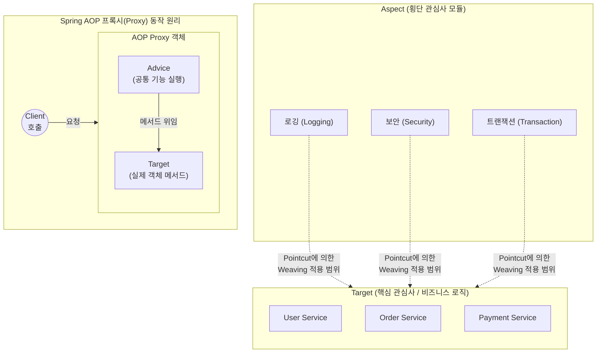

# AOP (Aspect Oriented Programming)

---

## I. 핵심 비즈니스 로직과 횡단 관심사의 완벽한 분리, AOP의 개요

* **정의**: 애플리케이션의 핵심 비즈니스 로직과 시스템 공통으로 사용되는 부가적인 기능(로깅, 보안, [[트랜잭션]] 등)을 분리하여 모듈화하는 관점 지향 프로그래밍 패러다임
* **필요성/특징**:
* **OOP의 한계 극복**: 객체 지향 프로그래밍(OOP)만으로는 여러 모듈에 흩어지는 공통 로직(코드 흩어짐 및 얽힘 현상)을 완벽히 모듈화하기 어려움
* **관심사 분리(SoC)**: 핵심 관심사(Core Concern)와 횡단 관심사(Cross-cutting Concern)를 분리하여 코드의 응집도를 높이고 결합도를 낮춤
* **재사용성 및 유지보수성**: 공통 로직을 한 곳(Aspect)에서 관리하므로 중복 코드가 제거되고, 비즈니스 로직 변경 없이 부가 기능의 유연한 탈부착이 가능함

---

## II. AOP의 아키텍처 및 핵심 구성요소

### 가. AOP의 개념도 및 동작 원리

* 여러 비즈니스 모듈에 걸쳐 나타나는 횡단 관심사를 Aspect로 분리하고, 런타임 시 프록시(Proxy) 객체를 생성하여 타겟(Target) 객체의 메서드 실행 전후에 공통 기능(Advice)을 동적으로 삽입(Weaving)함

### 나. AOP의 핵심 기술 및 구성 요소

| 분류 | 요소기술(키워드) | 세부 설명 |
| --- | --- | --- |
| **관심사 [[모듈화]]** | Aspect (관점) | 부가 기능(Advice)과 이를 적용할 위치(PointCut)를 결합하여 모듈화한 핵심 단위 |
| **적용 대상** | Target (타겟) | 핵심 비즈니스 로직이 구현되어 있으며, 부가 기능(Advice)이 적용될 실제 객체 |
| **부가 기능** | Advice (조언) | 타겟에 제공할 실질적인 부가 기능 구현체 (실행 시점에 따라 Before, After, Around 등) |
| **적용 후보군** | JoinPoint (결합점) | Advice가 적용될 수 있는 모든 논리적 실행 지점 (메서드 호출 시점, 예외 발생 시점 등) |
| **적용 지점** | PointCut (교차점) | 무수히 많은 JoinPoint 중에서 실제로 Advice를 적용할 지점을 선별하기 위한 정규표현식 및 조건식 |
| **결합 과정** | Weaving (위빙) | PointCut에 의해 결정된 JoinPoint에 Advice를 동적으로 주입하여 결합하는 과정 |
| **동작 매개체** | Proxy (프록시) | 타겟 객체를 감싸서(Wrapping) 클라이언트의 요청을 가로채고 Advice를 실행한 후 타겟을 호출하는 대리 객체 |
| **구현 방식** | JDK Dynamic Proxy / CGLIB | Java 인터페이스 기반의 프록시 생성(JDK) 또는 바이트코드 조작을 통한 [[클래스]] 상속 기반의 프록시 생성(CGLIB) 기법 |

---

## III. AOP와 OOP의 비교 및 향후 활용 전망

### 가. 상호 보완적 패러다임, AOP와 OOP 비교

| 비교 항목 | OOP (Object Oriented Programming) | AOP (Aspect Oriented Programming) |
| --- | --- | --- |
| **주요 목적** | 비즈니스 로직의 상태와 행위를 객체로 [[캡슐화]] | 여러 객체에 산재된 인프라성/공통 로직의 중복 제거 |
| **관심사 (Concern)** | 핵심 관심사 (Core Concern) / 종단(Vertical) | 횡단 관심사 (Cross-cutting Concern) / 수평(Horizontal) |
| **모듈화의 단위** | 클래스 (Class) | 관점 (Aspect) |
| **상호 관계** | 애플리케이션의 뼈대와 비즈니스 흐름 구성 | OOP가 챙기지 못하는 횡단 관심사를 보완 (대체재 아님) |

### 나. 분산 아키텍처 환경에서의 AOP 활용 전망

* **마이크로서비스([[MSA (Micro Service Architecture)|MSA]]) 관측성 확보**: MSA 분산 환경에서 여러 서비스 간의 호출 추적(Distributed Tracing, 예: Zipkin, Sleuth 등) 로직을 AOP 기반으로 주입하여, 핵심 비즈니스 코드의 침범 없이 전체 시스템의 가시성을 확보하는 핵심 기술로 활용됨
* **어노테이션 기반 인프라 자동화**: Spring Boot 환경 등에서 `@Transactional`, `@Async`, `@Cacheable`과 같은 메타 어노테이션 기반 선언적 프로그래밍을 지원하는 백엔드 엔진으로 지속 활용되며 엔터프라이즈 시스템 개발 생산성을 주도함

---

### 🔗 연관 토픽

- **소속 도메인**: [[00_소프트웨어공학_MOC|🏗️ 소프트웨어공학]]
- **세부 분류**: `4. 아키텍처 스타일 & 객체지향 설계 원리`
- **핵심 연관 토픽**:
  - [[모듈화|모듈화 (Modularity)]]
  - [[캡슐화|캡슐화 (encapsulation)]]
  - [[MSA (Micro Service Architecture)]]
  - [[Proxy Pattern|Proxy (대리자, 최근 기출)]]
  - [[클래스]]
