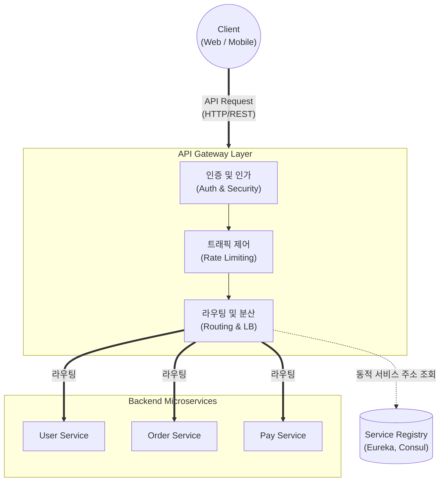

# API Gateway

---

## I. MSA 환경의 단일 진입점, API Gateway의 개요

* **정의**: 마이크로서비스 아키텍처([[MSA (Micro Service Architecture)|MSA]]) 환경에서 클라이언트의 모든 요청을 받아 백엔드 서비스로 라우팅하고, 공통 기능(인증, 로깅, 제어 등)을 일괄 처리하는 단일 진입점(Single Entry Point) 역할의 미들웨어
* **등장배경**: MSA 도입에 따른 서비스 파편화 심화, 클라이언트-서비스 간 직접 통신으로 인한 강한 [[결합도]] 증가 및 다중 네트워크 호출 오버헤드 문제 해결 필요
* **특징**: 단일 엔드포인트 제공을 통한 구조 단순화, 인프라적 횡단 관심사(Cross-cutting Concerns)의 일괄 오프로딩(Off-loading), 이기종 [[프로토콜]] 변환 및 응답 데이터 통합(Composition)

---

## II. API Gateway의 아키텍처 및 핵심 구성요소

### 가. API Gateway의 아키텍처 및 동작 원리

* 외부 클라이언트의 요청은 단일화된 API Gateway를 거치며 보안 및 트래픽 검증을 수행하고, Service Registry를 통해 동적으로 식별된 내부 마이크로서비스로 라우팅됨

### 나. API Gateway의 핵심 기술 요소

| 구분 | 요소기술(키워드) | 세부 설명 |
| --- | --- | --- |
| **요청 전달** | 동적 라우팅 (Routing) | 클라이언트의 요청 URL, 헤더 정보를 기반으로 적절한 백엔드 마이크로서비스로 경로 지정 |
| **요청 전달** | API Composition | 여러 마이크로서비스의 응답 데이터를 취합(Aggregation)하여 단일 응답으로 클라이언트에 반환 |
| **보안/인증** | 인증 및 인가 (Auth) | JWT 검증, OAuth 2.0 연동 등을 통해 개별 서비스가 아닌 Gateway 레벨에서 중앙 집중식 권한 통제 |
| **보안/인증** | SSL 터미네이션 | 복호화 처리를 Gateway에서 수행하여 내부 마이크로서비스의 [[CPU]] 부하 경감 |
| **안정성 확보** | Rate Limiting / Throttling | 특정 클라이언트의 단위 시간당 API 호출 횟수를 제한하여 백엔드 서버 과부하 및 [[DDOS|DDoS]] 공격 방지 |
| **안정성 확보** | 로드밸런싱 (Load Balancing) | 다수의 서비스 [[인스턴스]] 간 트래픽을 균등하게 분산 (Round Robin, Least Connection 등) |
| **유연성 제공** | 프로토콜 변환 (Translation) | 외부의 HTTP/REST 요청을 내부 통신용 gRPC, AMQP 등 이기종 프로토콜로 변환하여 전달 |
| **가시성 확보** | 중앙 집중식 로깅/모니터링 | 모든 API 인입/반환 트래픽의 메트릭 수집 및 분산 추적(Distributed Tracing)용 상관 ID 발급 |

---

## III. API Gateway와 Service Mesh의 비교 및 향후 전망

### 가. 네트워크 통신 제어 패턴 비교 (API Gateway vs Service Mesh)

| 비교 항목 | API Gateway | Service Mesh |
| --- | --- | --- |
| **주요 목적** | 클라이언트 노출 단일 진입점 제공 및 비즈니스 도메인 보호 | 마이크로서비스 간의 [[신뢰성]] 있는 네트워크 통신 제어 및 관측성 확보 |
| **트래픽 방향** | **North-South** (외부 클라이언트 $\leftrightarrow$ 내부 서비스) | **East-West** (내부 서비스 $\leftrightarrow$ 내부 서비스) |
| **배치 아키텍처** | 클라이언트와 서비스 군(Cluster) 사이의 중앙화된 프록시 레이어 | 각 서비스 인스턴스에 밀착된 사이드카(Sidecar) 프록시 형태 배포 |
| **담당 계층/성격** | 애플리케이션 레벨(L7) 중심의 횡단 관심사 처리 | 인프라 레벨(L4~L7) 통신, 재시도, 서킷 브레이커 통제 |
| **대표 솔루션** | Spring Cloud Gateway, Kong, AWS API Gateway | Istio, Linkerd, Consul Connect |

### 나. 실무 도입 시 한계점 및 발전 전망

* **BFF (Backend for Frontend) 패턴으로의 진화**: 단일 API Gateway에 모든 로직이 집중되면 SPOF(단일 장애점) 및 성능 병목(Bottleneck)이 발생할 수 있으므로, 웹, 모바일 등 클라이언트 접점 유형별로 API Gateway를 분리하여 운영하는 BFF 아키텍처 도입이 가속화됨
* **지능형(AI-driven) Gateway로의 발전**: 단순 라우팅을 넘어 AI/ML을 결합하여 비정상적인 API 남용(Abuse) 패턴을 실시간으로 차단하고, WAF(웹 [[방화벽]]) 기능까지 내재화한 통합 API 보안 플랫폼([[WAAP]]) 형태로 발전 중임

---

### 🔗 연관 토픽

- **소속 도메인**: [[00_소프트웨어공학_MOC|🏗️ 소프트웨어공학]]
- **세부 분류**: `4. 아키텍처 스타일 & 객체지향 설계 원리`
- **핵심 연관 토픽**:
  - [[MSA (Micro Service Architecture)]]
  - [[결합도]]
  - [[모듈화|모듈화 (Modularity)]]
  - [[정보은닉|정보은닉 (Information Hiding)]]
  - [[인스턴스]]
