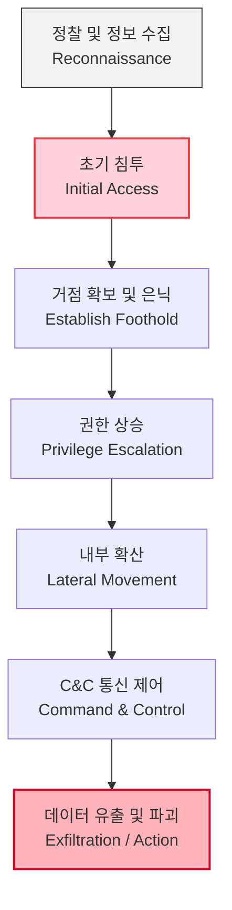

# APT(Advanced Persistent Threat) 공격

---

## I. 표적형 지능형 지속 위협, APT 공격의 개요

* **가. APT 공격의 정의**
* 특정 조직이나 대상을 표적으로 삼아 장기간 은밀하게 잠복하며, 다양한 지능적 기법을 동원하여 기밀 정보를 유출하거나 시스템을 파괴하는 고도화된 사이버 위협

* **나. APT 공격의 필요성(공격자 측면) 및 특징**
* **등장배경**: 국가 주도의 기밀 탈취 목적 증가, 다크웹 기반의 [[RaaS(Ransomware as a Service)|RaaS]](Ransomware-as-a-Service) 진화, [[방화벽]] 및 백신 등 레거시 방어 체계 우회 필요성 대두
* **특징**: 타겟 지향성(Targeted), 지속적 잠복성(Persistent), 지능적 기법(Advanced), 사회공학적 기법과 제로데이(Zero-Day) 취약점의 결합

---

## II. APT 공격의 사이버 킬 체인(Cyber Kill Chain) 및 핵심 기술 요소

### 가. APT 공격의 개념도 및 동작 원리

* 스피어 피싱 등을 통해 내부망에 **초기 침투**한 후, 백도어를 설치해 **거점을 확보**하고, 관리자 **권한을 상승**시켜 네트워크 전반으로 **확산**하며 최종적으로 기밀을 유출하는 [[사이버 킬 체인]](Cyber Kill Chain) 구조를 가짐.

### 나. APT 공격의 핵심 기법 및 구성 요소

| 분류 | 요소기술(키워드) | 세부 설명 |
| --- | --- | --- |
| **초기 침투** | **Spear Phishing** | 특정 대상을 정교하게 겨냥하여 악성 첨부파일이나 링크를 포함한 이메일 발송 |
| **초기 침투** | **Water Holing** | 표적 집단이 자주 방문하는 정상 웹사이트를 미리 감염시켜 악성코드 유포 |
| **초기 침투** | **Zero-Day [[Exploit]]** | 소프트웨어 벤더가 인지하거나 패치하기 전의 취약점을 악용하여 시스템 침투 |
| **거점 확보** | **Rootkit / Backdoor** | 시스템 깊숙이 은닉하여 탐지를 회피하고, 공격자가 언제든 재접속할 수 있는 통로 유지 |
| **내부 확산** | **Privilege Escalation** | 시스템 취약점을 악용하여 일반 사용자 계정에서 관리자(System/Root) 권한 획득 |
| **내부 확산** | **Lateral Movement** | 초기 감염된 단말을 교두보로 삼아 내부 네트워크의 다른 주요 서버나 단말기로 수평 이동 |
| **통신/제어** | **C&C 통신** | 공격자의 외부 명령제어(Command & Control) 서버와 [[암호화]] 통신을 연결하여 원격 제어 |
| **목적 달성** | **Exfiltration** | 탈취한 민감 데이터를 압축/암호화하여 분할 전송하거나 정상 트래픽으로 위장하여 유출 |

---

## III. 일반 사이버 공격과의 비교 및 APT 방어 동향

### 가. 일반 해킹과 APT 공격의 비교 및 최신 대응 전략

| 비교 항목 | 일반 사이버 공격 | APT 공격 |
| --- | --- | --- |
| **공격 대상** | 불특정 다수 (무차별적) | 특정 타겟 (정부, 기관, 핵심 기업 등) |
| **공격 목적** | 단기적 금전 획득, 단순 시스템 파괴 | 장기적인 기밀 유출, 국가 안보 위협, [[랜섬웨어]] 결합 |
| **지속성** | 일회성, 단기적 (단일 시점) | 수개월 ~ 수년 간 장기 잠복 (Persistent) |
| **공격 기법** | 알려진 취약점, 단순 스팸, 무작위 대입 | 제로데이(Zero-Day), 스피어 피싱, 크리덴셜 스터핑 |
| **탐지 난이도** | 상대적으로 탐지 용이 (시그니처 패턴 기반) | 탐지 매우 어려움 (행위 기반 이상 징후 분석 필요) |

* **최신 방어 및 동향**:
* **[[MITRE ATT&CK (Adversarial Tactics, Techniques & Common Knowledge)|MITRE ATT&CK]] [[프레임워크]] 적용**: 공격자의 전술, 기법, 절차(TTPs)를 분석하여 선제적 [[위협 헌팅|위협 헌팅(Threat Hunting)]] 및 [[SIEM]]/[[SOAR (Security Orchestration, Automation and Response)|SOAR]] 기반 침해 대응 자동화 수행.
* **제로 트러스트([[제로 트러스트 보안모델|Zero Trust]]) 아키텍처**: "절대 신뢰하지 않고, 항상 검증한다(Never Trust, Always Verify)"는 원칙 하에 내부망에서도 최소 권한 접근 통제 및 마이크로 세그먼테이션 적용.
* **행위 기반 엔드포인트 방어([[EDR(Endpoint Detection and Response)|EDR]]/[[XDR]])**: 단일 백신을 넘어 네트워크와 엔드포인트 전반의 이상 행위를 모니터링하고 즉각적으로 단말을 격리하는 다층 방어 체계 구축 필요.

---

### 🔗 연관 토픽

- **소속 도메인**: [[00_보안_MOC|🛡️ 보안]]
- **세부 분류**: `3. 네트워크 & 엔드포인트 · 인프라 보안`
- **핵심 연관 토픽**:
  - [[EDR(Endpoint Detection and Response)]]
  - [[SIEM]]
  - [[위협 헌팅|위협 헌팅(Threat Hunting)]]
  - [[SOAR (Security Orchestration, Automation and Response)]]
  - [[방화벽]]
