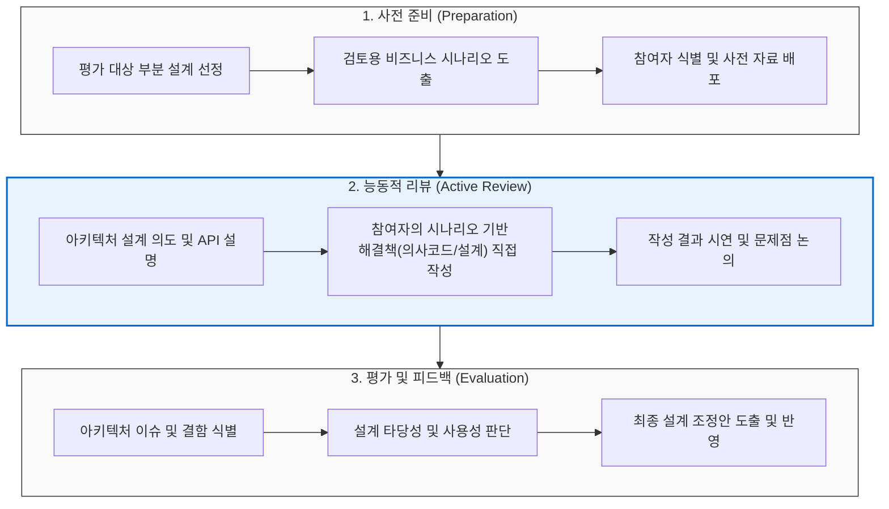

# ARID

---

## I. 초기/부분 설계 타당성 검증 평가, ARID의 개요

* **가. ARID(Active Reviews for Intermediate Designs)의 정의**
* [[소프트웨어 아키텍처]] 전체가 완성되기 전, 초기 단계의 특정 부분(중간 설계)에 대해 설계 타당성과 사용성을 검증하는 아키텍처 평가 방법

* **나. ARID의 등장배경 및 특징**
* **등장배경**: 아키텍처 최종 완성 후 결함 발견 시 막대한 재작업(Rework) 비용 발생, 초기 단계의 부분적 아키텍처에 대한 빠른 검증 필요성 대두
* **특징**: [[ATAM]](시나리오 기반 평가)과 ADR(능동적 설계 리뷰)의 장점 결합, 평가 대상의 부분 평가 가능, 실무 개발자의 적극적 참여를 통한 검증

---

## II. ARID의 개념도 및 핵심 기술 요소

### 가. ARID의 평가 절차 및 동작 원리

* 아키텍처 초기에 검토진행자가 시나리오를 제시하고, 실무 개발자가 능동적(Active)으로 해당 설계를 활용하여 코드를 작성해보며 사용성을 검증함

### 나. ARID의 핵심 기술 및 구성 요소

| 구분 | 요소기술(키워드) | 세부 설명 |
| --- | --- | --- |
| **기반 방법론** | **ATAM (Architecture Tradeoff Analysis Method)** | 품질 속성 요구사항을 도출하고 검증하기 위한 시나리오 기반 분석 기법 적용 |
| **기반 방법론** | **ADR (Active Design Review)** | 수동적 문서 열람을 탈피하여, 리뷰어가 직접 설계를 사용해보는 능동적 기법 차용 |
| **평가 대상** | **Intermediate Design (중간 설계)** | 시스템 전체가 아닌 서브시스템, 컴포넌트, 공통 인터페이스(API) 등 초기 부분 설계 |
| **핵심 활동** | **Active Review (능동적 검토)** | 제공된 API나 설계를 바탕으로 시나리오를 해결하는 의사코드(Pseudo Code) 직접 작성 |
| **핵심 활동** | **Scenario Test (시나리오 테스트)** | 시스템이 직면하게 될 구체적 상황을 정의하여 설계가 요구사항을 수용하는지 평가 |
| **주요 참여자** | **리뷰어 (Reviewer)** | 해당 아키텍처나 컴포넌트를 향후 직접 사용하게 될 실무 개발자 및 엔지니어 |
| **평가 기준** | **설계 타당성 및 사용성 (Usability)** | 제시된 중간 설계가 개발자의 목적 달성에 적합하고 명확히 이해 가능한지 여부 검증 |
| **도출 산출물** | **Refined Design (설계 조정안)** | 리뷰 과정에서 식별된 오류, 제약사항, 모호성을 개선한 아키텍처 수정 방향 |

---

## III. ARID와 주요 SW 아키텍처 평가 방법론 비교

### 가. 시나리오 기반 SW 아키텍처 평가 방법론(SAAM, ATAM, CBAM, ARID) 비교

| 비교 항목 | ARID | ATAM | [[SAAM]] | [[CBAM]] |
| --- | --- | --- | --- | --- |
| **평가 대상** | **중간 단계 부분 설계** (컴포넌트, API 등) | 아키텍처 전체 (완성 또는 구체화 단계) | 아키텍처 전체 | 아키텍처 대안 (복수 개) |
| **평가 목적** | **설계 타당성 및 사용성 조기 검증** | 품질 속성 간의 Trade-off 분석 및 리스크 식별 | 변경 용이성 및 기능성, 재사용성 평가 | 아키텍처 변경에 따른 경제적 비용-편익 분석 |
| **핵심 기법** | **ATAM + ADR** (참여자의 능동적 설계 사용) | [[유틸리티 트리]], 시나리오 분석 | 시나리오 기반 (최초의 아키텍처 평가) | ATAM 확장 + ROI, 경제성 평가 (재무 모델) |
| **수행 시점** | **설계 초기 ~ 중간** | 설계 완료 전후 | 설계 완료 후 | ATAM 수행 직후 |
| **주요 장점** | 초기 리스크 발견, 실사용자(개발자) 피드백 반영 | 아키텍처 결정의 명확한 근거 확보 | 평가 프로세스의 단순성과 범용성 | 경영진의 투자 의사결정(ROI) 근거 제공 |

* 최근 애자일([[Agile]]) 환경 및 마이크로서비스 아키텍처([[MSA (Micro Service Architecture)|MSA]]) 도입이 가속화됨에 따라, 전체 시스템 완성 전 서비스 단위의 조기 검증이 가능한 ARID의 활용성이 더욱 부각되고 있음.

---

### 🔗 연관 토픽

- **소속 도메인**: [[00_소프트웨어공학_MOC|🏗️ 소프트웨어공학]]
- **세부 분류**: `4. 아키텍처 스타일 & 객체지향 설계 원리`
- **핵심 연관 토픽**:
  - [[CBAM|CBAM(Cost Benefit Analysis Method)]]
  - [[SW Architecture 평가]]
  - [[MSA (Micro Service Architecture)]]
  - [[ATAM]]
  - [[SAAM]]
