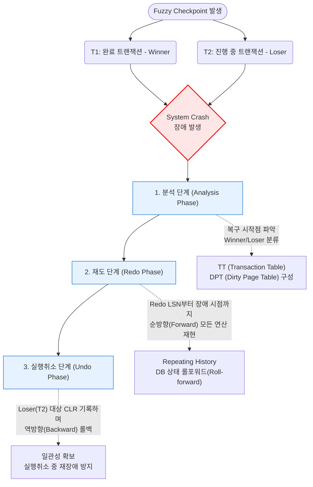

# ARIES (Algorithms for Recovery and Isolation Exploiting Semantics)

---

## I. 데이터베이스 복구의 표준 알고리즘, ARIES의 개요

* **가. ARIES의 정의**
* 시스템 장애 발생 시 데이터베이스의 일관성과 [[무결성]](ACID)을 보장하기 위해, WAL(Write-Ahead Logging) 기반으로 분석, 재도(Redo), 실행취소(Undo)의 3단계를 거쳐 복구를 수행하는 [[데이터베이스]] 장애 복구 [[알고리즘]]

* **나. ARIES의 등장배경 및 특징**
* **등장배경**: 기존 복구 기법(지연 갱신 등)의 성능 한계 극복, 시스템 비정상 종료 시 트랜잭션의 원자성(Atomicity) 및 영속성(Durability)을 완벽히 보장할 필요성 대두
* **특징**: WAL 기반의 로그 선기록, 과거의 완벽한 재현(Repeating History), Undo 과정에서의 보상 로그(CLR) 기록을 통한 재장애 대비, Fuzzy Checkpoint를 통한 성능 최적화

---

## II. ARIES의 아키텍처 및 핵심 구성요소

### 가. ARIES의 복구 프로세스(3단계) 및 개념도

* **동작 흐름**: 장애 발생 시 **분석 단계**를 통해 트랜잭션의 상태와 Redo 시작점을 찾고, **재도 단계**에서 장애 시점까지의 상태를 똑같이 재현(Roll-forward)한 뒤, **실행취소 단계**에서 실패한 트랜잭션을 역순으로 롤백(Roll-back)함.

### 나. ARIES의 핵심 기술 및 구성 요소

| 구분 | 요소기술(키워드) | 세부 설명 |
| --- | --- | --- |
| **기본 원칙** | **WAL (Write Ahead Logging)** | 변경된 데이터 페이지를 디스크에 기록하기 전에, 관련된 로그 레코드를 먼저 안전하게 디스크에 기록하는 원칙 |
| **기본 원칙** | **Repeating History** | Redo 수행 시, Commit/Abort 여부에 상관없이 장애 발생 전까지의 모든 연산을 로그 기반으로 동일하게 재현 |
| **데이터 구조** | **LSN (Log Sequence Number)** | 각 로그 레코드에 부여되는 고유하고 단조 증가하는(Monotonically Increasing) 식별 번호 |
| **데이터 구조** | **TT (Transaction Table)** | 장애 발생 시점에 활성화되어 있는 트랜잭션의 상태 정보(Winner/Loser 여부 등)를 관리하는 테이블 |
| **데이터 구조** | **DPT (Dirty Page Table)** | 메인 메모리(버퍼 캐시)에서 변경되었으나 아직 디스크에 쓰이지 않은(Dirty) 페이지 정보 관리 |
| **복구 기법** | **CLR (Compensation Log Record)** | Undo 연산 수행 시 남기는 보상 로그로, 복구 과정 중 다시 장애가 발생하더라도 중복 Undo를 방지 |
| **성능 최적화** | **Fuzzy Checkpoint** | 체크포인트 수행 시 모든 더티 페이지를 강제로 디스크에 기록하지 않고 상태만 기록하여 DB I/O 부하 최소화 |
| **로깅 기법** | **Physiological Logging** | 논리적(Logical) 로깅과 물리적(Physical) 로깅의 장점을 결합, 페이지 단위의 독립적 복구를 지원하는 기법 |

---

## III. ARIES 복구 방식과 대안 기법 비교 및 동향

### 가. ARIES와 타 데이터베이스 장애 복구 기법 비교

| 비교 항목 | ARIES (즉시 갱신 기반) | 지연 갱신 (Deferred Update) | 그림자 페이징 ([[그림자페이지 기법|Shadow Paging]]) |
| --- | --- | --- | --- |
| **핵심 매커니즘** | 로그 선기록(WAL), 3단계 복구 | [[트랜잭션]] 완료 시까지 디스크 기록 지연 | 현재/그림자 페이지 복제 기반 디렉터리 스위칭 |
| **수행 연산** | **Redo 및 Undo 모두 수행** | Redo만 수행 (Undo 불필요) | Redo/Undo 불필요 (로그 기록 없음) |
| **I/O 부하** | 로그의 순차적 I/O로 디스크 부하 낮음 | 완료 시점에 일괄 반영하여 부하 집중 | 페이지 단위의 빈번한 복사로 I/O 오버헤드 심화 |
| **동시성 제어** | 레코드 단위 잠금 등 정밀 제어 가능 | 블록/테이블 단위 잠금으로 동시성 저하 발생 | 동시 다발적 트랜잭션 처리에 매우 취약 |
| **적합한 환경** | 대규모 트랜잭션 및 현대 상용 [[DBMS]] | 동시성이 낮은 소규모 배치 작업 시스템 | 로그 관리가 제한되는 특정 임베디드 시스템 |

* **전망 및 동향**: ARIES 알고리즘은 성능과 안정성을 완벽히 조화시킨 설계로 평가받으며, Oracle, Microsoft [[SQL(Structured Query Language)|SQL]] Server, IBM DB2 등 현대 RDBMS의 표준 장애 복구 매커니즘으로 자리매김함. 최근 [[클라우드 네이티브]] 데이터베이스에서는 ARIES 기반의 논리적 아키텍처를 분산 스토리지 로그 기반으로 확장하여 가용성을 극대화(예: Amazon Aurora)하는 방향으로 진화하고 있음.

---

### 🔗 연관 토픽

- **소속 도메인**: [[00_데이터베이스_MOC|🗄️ 데이터베이스]]
- **세부 분류**: `2. 트랜잭션 & 동시성 제어 (Concurrency)`
- **핵심 연관 토픽**:
  - [[데이터베이스]]
  - [[무결성]]
  - [[트랜잭션]]
  - [[그림자페이지 기법|그림자페이지(Shadow Paging) 기법]]
  - [[DB 회복기법]]
