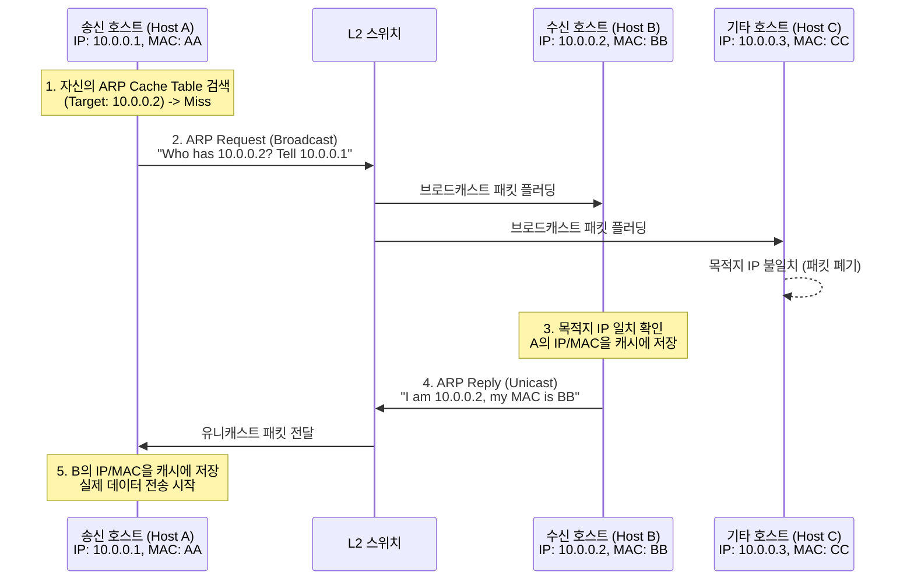

# ARP (Address Resolution Protocol)

---

## I. 논리적 주소와 물리적 주소의 연결고리, ARP의 개요

* **가. ARP(Address Resolution Protocol)의 정의**
* IP 네트워크 상에서 통신하고자 하는 대상 기기의 논리적 주소(IP Address)를 기반으로 실제 데이터 프레임 전송에 필요한 물리적 주소([[MAC]] Address)를 매핑해주는 [[네트워크 계층]] [[프로토콜]]

* **나. ARP의 필요성 및 특징**
* **필요성**: 라우팅을 통해 목적지 서브넷에 도달한 후, 동일 LAN 구간 내에서 호스트 간 실제 통신(L2 프레임 전달)을 수행하기 위해 물리적 하드웨어 주소 파악 필수
* **특징**: 브로드캐스트 질의(Request) 및 유니캐스트 응답(Reply) 방식, 통신 효율을 위한 ARP Cache Table 운용, 상태 비저장(Stateless) 구조에 따른 보안 취약성(Spoofing) 존재

---

## II. ARP의 개념도 및 핵심 기술 요소

### 가. ARP의 개념도 및 동작 원리

* 송신 노드가 대상 IP를 포함한 ARP Request를 전체 네트워크에 브로드캐스트(Broadcast)로 전송하고, 해당 IP를 가진 노드가 자신의 MAC 주소를 담은 ARP Reply를 유니캐스트(Unicast)로 응답하여 주소를 변환함.

### 나. ARP의 핵심 기술 및 구성 요소

| 분류 | 요소기술(키워드) | 세부 설명 |
| --- | --- | --- |
| **핵심 동작** | **ARP Request** | 목적지 MAC 주소를 알아내기 위해 FF:FF:FF:FF:FF:FF (브로드캐스트)로 전송하는 질의 패킷 |
| **핵심 동작** | **ARP Reply** | Request를 수신한 대상 노드가 자신의 MAC 주소를 담아 요청자에게 보내는 유니캐스트 응답 |
| **캐싱 기법** | **ARP Cache Table** | IP와 MAC 주소 매핑 정보를 임시 저장하여 반복적인 브로드캐스트 발생을 방지 (타이머 기반 갱신) |
| **확장 기법** | **Proxy ARP** | 동일 서브넷이 아닌 외부 네트워크 호스트에 대한 ARP 요청 시, 라우터가 대신 응답을 수행하는 기능 |
| **확장 기법** | **Gratuitous ARP (GARP)** | 자신의 IP와 MAC을 송수신자로 설정하여 브로드캐스트 송신 (IP 충돌 감지 및 HA/클러스터링 목적) |
| **연관 프로토콜** | **[[RARP]] (Reverse ARP)** | 디스크 없는 단말(Diskless Node)이 자신의 MAC을 이용해 IP 주소를 RARP 서버에 요청하는 프로토콜 |
| **보안 위협** | **ARP Spoofing** | 공격자가 위조된 ARP Reply를 지속적으로 전송하여 희생자의 ARP 캐시를 변조하는 중간자 공격(MITM) |
| **보안 대응** | **DAI (Dynamic ARP Inspection)** | 스위치에서 ARP 패킷을 가로채어 [[DHCP]] 스누핑 바인딩 데이터베이스와 비교, 위조 패킷을 차단하는 기법 |

---

## III. ARP와 NDP(IPv6) 비교 및 발전 동향

### 가. IPv4 환경의 ARP와 IPv6 환경의 NDP 비교

| 비교 항목 | ARP (Address Resolution Protocol) | NDP (Neighbor Discovery Protocol) |
| --- | --- | --- |
| **적용 프로토콜** | [[IPv4]] | [[IPv6]] |
| **동작 기반** | ARP 자체 프로토콜 헤더 사용 (L2와 L3 사이) | ICMPv6 메시지 기반 (완전한 L3 프로토콜) |
| **패킷 전송 방식** | **브로드캐스트 (Broadcast)** | **멀티캐스트 (Multicast)** |
| **네트워크 부하** | 브로드캐스트 패킷 플러딩으로 네트워크 대역폭 소모 큼 | Solicited-Node 멀티캐스트 활용으로 불필요한 단말 부하 감소 |
| **핵심 메시지** | ARP Request / ARP Reply | Neighbor Solicitation (NS) / Neighbor Advertisement (NA) |
| **보안성** | ARP Spoofing 공격 등 기본적으로 보안에 취약함 | SEND (Secure Neighbor Discovery) 및 [[IP Sec|IPsec]] 적용으로 보안 강화 |

* **전망 및 동향**:
* 기존 레거시 인프라에서는 ARP Spoofing 방지를 위해 포트 보안(Port Security) 및 802.1x 인증이 필수로 요구됨.
* 최근 [[SDN(Software Defined Network)|SDN]]/[[NFV]] 기반의 클라우드 데이터센터 환경에서는 브로드캐스트 트래픽으로 인한 BUM(Broadcast, Unknown Unicast, Multicast) 스톰을 방지하기 위해, SDN 컨트롤러가 분산 가상 [[스위치 (Layer 3 Switch)|스위치]](OVS)를 통해 ARP 요청을 중앙 집중적으로 가로채어 직접 응답하는 **ARP Proxying(ARP Suppression)** 기법이 핵심 기술로 활용되고 있음.

---

### 🔗 연관 토픽

- **소속 도메인**: [[00_네트워크_MOC|🌐 네트워크]]
- **세부 분류**: `1. OSI 7계층 & 데이터링크 계층 (L1/L2)`
- **핵심 연관 토픽**:
  - [[네트워크 계층|네트워크 계층 (Network Layer)]]
  - [[RARP]]
  - [[IPv6]]
  - [[IPv4]]
  - [[스위치 (Layer 3 Switch)]]
