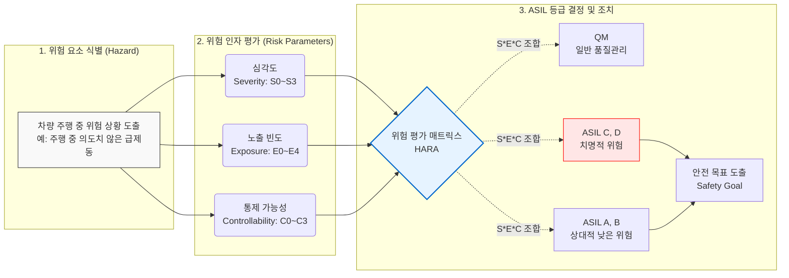

# ASIL (Automotive Safety Integrity Level)

---

## I. 자동차 E/E 시스템 안전의 기준, ASIL의 개요

* **가. ASIL(Automotive Safety Integrity Level)의 정의**
* 자동차의 전기/전자(E/E) 시스템 결함으로 인한 사고 위험을 방지하기 위해, 국제 표준 [[ISO 26262]]에서 정의한 자동차 기능안전(Functional Safety) [[무결성]] 수준

* **나. ASIL의 등장배경 및 특징**
* **등장배경**: [[Smart Car(자율주행)|자율주행]] 및 ADAS 적용 확대로 차량 내 소프트웨어 및 전장 부품의 복잡도 급증, 오작동으로 인한 인명 피해 위험성 증가로 엄격한 통제 기준 필요
* **특징**: HARA(위험원 분석 및 위험 평가) 기반 정량적/정성적 등급 산정, 심각도(S)·노출빈도(E)·통제가능성(C)의 3요소 조합, ASIL D(최고 위험)부터 QM(일반 품질)까지 차등적 안전 요구사항 적용

---

## II. ASIL의 산정 메커니즘 및 핵심 구성요소

### 가. ASIL 결정(HARA) 개념도 및 프로세스

* 차량 수준의 기능 분석을 통해 위험원을 식별하고, S/E/C 지표를 종합하여 HARA 매트릭스에 따라 ASIL 등급을 결정한 후, 최상위 안전 목표(Safety Goal)를 도출함.

### 나. ASIL 산정을 위한 핵심 기술 및 구성 요소

| 분류 | 요소기술(키워드) | 세부 설명 |
| --- | --- | --- |
| **평가 지표** | **심각도 (Severity, S)** | 사고 발생 시 운전자, 승객 및 보행자가 입을 수 있는 상해의 정도 (S0: 무상해 ~ S3: 치명상/사망) |
| **평가 지표** | **노출 빈도 (Exposure, E)** | 운전자가 해당 위험 상황에 노출될 수 있는 확률이나 시간의 비율 (E0: 거의 없음 ~ E4: 매우 높음) |
| **평가 지표** | **통제 가능성 (Controllability, C)** | 위험 발생 시 운전자나 외부 조치로 사고를 회피할 수 있는 능력 (C0: 통제 용이 ~ C3: 통제 불가) |
| **산출 등급** | **ASIL A ~ D** | 위험 수준에 따른 기능안전 등급 (A가 최저, D가 최고 엄격한 하드웨어/소프트웨어 설계 기준 적용) |
| **산출 등급** | **QM (Quality Management)** | ISO 26262의 특수한 안전 요구사항은 불필요하며, 일반적인 품질 관리 시스템(IATF 16949 등)으로 충분한 수준 |
| **핵심 활동** | **HARA (Hazard Analysis & Risk Assessment)** | 차량 레벨에서 발생 가능한 모든 위험원을 식별하고 S, E, C를 조합하여 최종 ASIL 등급을 결정하는 과정 |
| **최적화 기법** | **ASIL 분할 (Decomposition)** | 상위 수준의 높은 ASIL 요구사항을 독립성을 가진 여러 하위 컴포넌트로 분배(예: ASIL D → ASIL C + ASIL A)하여 개발 비용 절감 |
| **연계 활동** | **안전 목표 (Safety Goal)** | HARA를 통해 식별된 각 위험을 회피하거나 완화하기 위한 최상위 요구사항으로, 단일 ASIL 등급이 부여됨 |

---

## III. ASIL과 최신 차량 안전 표준 비교 및 향후 전망

### 가. 자율주행 시대를 위한 차량 안전 표준 3대 축 비교

| 비교 항목 | ISO 26262 (Functional Safety) | ISO 21448 (SOTIF) | ISO/SAE 21434 (Cybersecurity) |
| --- | --- | --- | --- |
| **주요 목적** | 시스템의 결함/오류로 인한 위험 방지 | 의도된 기능의 한계로 인한 위험 방지 | 사이버 공격으로 인한 차량 제어권 탈취 방지 |
| **핵심 지표/등급** | **ASIL** (Automotive Safety Integrity Level) | 시나리오 기반 수용 가능 위험 수준 | **CAL** (Cybersecurity Assurance Level) |
| **주요 원인** | 하드웨어 마모, 소프트웨어 버그 | 센서의 인지 한계, AI 알고리즘의 판단 오류 | 악의적 해커, V2X 통신 취약점, 악성코드 |
| **핵심 분석 기법** | HARA (위험원 분석 및 위험 평가) | [[STPA]] (시스템 이론 기반 [[프로세스]] 분석) | TARA (위협 및 위험 평가) |
| **적용 주요 대상** | ADAS, 제동/조향 등 일반 E/E 시스템 | 레벨 3 이상의 자율주행 인지/판단 시스템 | 커넥티드 카, OTA(Over-The-Air) 업데이트 |

* **전망 및 동향**:
* **통합 엔지니어링 요구**: 레벨 3 이상의 자율주행차에서는 하드웨어 결함이 없더라도 폭우/폭설 등 환경적 제약으로 센서가 오작동할 수 있으므로, 기존 ASIL 중심의 ISO 26262만으로는 완벽한 안전 보장이 불가능함.
* **Safety & Security Co-engineering**: 따라서 최신 완성차 업계(OEM) 및 부품사(Tier-1)는 시스템 고장을 다루는 기능안전(ISO 26262), 성능 한계를 다루는 의도된 기능안전(SOTIF), 외부 공격을 방어하는 사이버보안([[차량 사이버 보안 국제 표준(ISO 21434)|ISO 21434]])을 개발 초기 단계부터 통합적으로 적용하는 아키텍처 설계 역량을 최우선으로 확보하고 있음.

---

### 🔗 연관 토픽

- **소속 도메인**: [[00_디지털서비스_MOC|🚀 디지털서비스]]
- **세부 분류**: `3. 사물인터넷 (IoT) & 스마트 플랫폼 · 메타버스`
- **핵심 연관 토픽**:
  - [[ISO 26262]]
  - [[차량 사이버 보안 국제 표준(ISO 21434)]]
  - [[Smart Car(자율주행)]]
  - [[IEC 61508]]
  - [[STPA|STPA (System-Theoretic Process Analysis)]]
