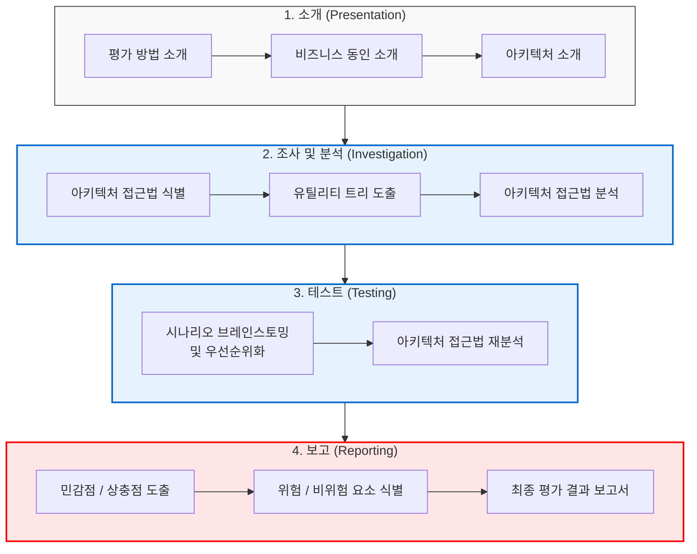

# ATAM (Architecture Tradeoff Analysis Method)

---

## I. 품질 속성 간 상충관계 분석, ATAM의 개요

* **가. ATAM(Architecture Tradeoff Analysis Method)의 정의**
* 소프트웨어 아키텍처가 성능, 보안성, 가용성 등 다양한 품질 속성(Quality Attributes) 요구사항을 얼마나 잘 충족하는지 평가하고, 속성 간의 상충관계(Trade-off)를 분석하는 시나리오 기반 아키텍처 평가 방법론

* **나. ATAM의 등장배경 및 특징**
* **등장배경**: 단일 품질 속성([[SAAM]]) 평가의 한계 극복, 시스템 규모 확장에 따른 품질 간 충돌(예: 보안성 강화 시 성능 저하) 문제의 조기 해결 필요
* **특징**: 이해관계자 전원 참여, [[유틸리티 트리]](Utility Tree) 기반 품질 속성 구체화, 아키텍처 결정의 조기 위험(Risk) 식별 및 검증

---

## II. ATAM의 프로세스 및 핵심 기술 요소

### 가. ATAM의 평가 절차(4단계 9활동) 및 프로세스

* 이해관계자가 모여 유틸리티 트리와 시나리오를 정의하고, 아키텍처 결정 사항이 품질 속성에 미치는 영향을 분석하여 최종적으로 민감점, 상충점, 위험/비위험 요소를 도출함.

### 나. ATAM의 핵심 산출물 및 기술 요소

| 구분 | 요소기술(키워드) | 세부 설명 |
| --- | --- | --- |
| **품질 구체화** | **Utility Tree (유틸리티 트리)** | 최상위 시스템 품질 속성(유용성)을 시작으로 하위 속성, 시나리오 단위까지 트리 구조로 구체화한 도구 |
| **평가 기준** | **Scenario (시나리오)** | 시스템 상황을 구체화한 명세 (Use Case 시나리오, Growth 시나리오, Exploratory 시나리오로 구분) |
| **분석 요소** | **Sensitivity Point (민감점)** | 하나의 특정 품질 속성에 크게 영향을 미치는 아키텍처 결정 요소 (예: 응답시간에 민감한 [[암호화]] [[알고리즘]]) |
| **분석 요소** | **Trade-off Point (상충점)** | 두 개 이상의 품질 속성에 긍정적/부정적 영향을 동시에 미치는 결정 (예: 보안성 ⬆️ 성능 ⬇️) |
| **결과 요인** | **Risk (위험 요소)** | 요구되는 품질 속성 달성을 방해하거나 실패하게 만들 가능성이 있는 아키텍처 결정 |
| **결과 요인** | **Non-Risk (비위험 요소)** | 요구되는 품질 속성 달성에 긍정적이며, 안전한 것으로 검증된 훌륭한 아키텍처 설계 결정 |
| **참여자** | **Stakeholders (이해관계자)** | 프로젝트 관리자, 개발자, 테스터, 고객, 사용자 등 아키텍처 평가에 참여하는 모든 주체 |
| **분석 도구** | **Architecture Approach** | 품질 요구사항을 달성하기 위해 적용된 특정 패턴, 전술(Tactics), [[프레임워크]] 등의 아키텍처적 접근 방식 |

---

## III. ATAM의 활용 및 마이크로서비스(MSA) 환경에서의 향후 전망

### 가. 클라우드 네이티브(MSA) 환경에서의 ATAM 활용 방안 및 동향

| 구분 | [[MSA (Micro Service Architecture)|MSA]] 설계 시 주요 Trade-off (상충점) | ATAM 기반 아키텍처 의사결정 방안 |
| --- | --- | --- |
| **데이터 일관성** | **강결합 정합성(ACID) vs [[HA(High Availability)|고가용성]]/성능** | Saga 패턴, Event Sourcing 적용에 따른 복잡도 증대(Risk)와 [[트랜잭션]] 성능(Sensitivity) 평가 |
| **서비스 분할** | **민첩성/확장성 vs 통신 오버헤드** | 서비스 분할 입도(Granularity) 설정 시 네트워크 지연시간 시나리오 기반 타당성 분석 |
| **보안 및 접근 제어** | **Zero-Trust 보안 vs 응답 지연** | [[API Gateway]] 및 Service Mesh 도입 시 인증/인가 로직의 중앙화 대비 병목 현상 평가 |

* **전망 및 동향**:
* 모노리틱(Monolithic) 환경에서 ATAM은 주로 완성 전 아키텍처의 리스크 제거에 집중되었으나, 최근 클라우드 및 MSA 전환(Modernization) 프로젝트에서는 **기존 시스템 분할 모델의 타당성을 검증하고 분산 환경의 가용성/성능/보안 간의 타협점(Trade-off)을 찾는 최적의 프레임워크**로 적극 활용되고 있음.
* 또한, [[CBAM]](경제성 평가)과 결합하여 아키텍처 리팩토링 및 클라우드 이전 비용 대비 비즈니스 ROI를 검증하는 모델로 확장 적용 중임.

---

### 🔗 연관 토픽

- **소속 도메인**: [[00_소프트웨어공학_MOC|🏗️ 소프트웨어공학]]
- **세부 분류**: `3. 요구사항 공학 & UML 객체지향 분석/설계`
- **핵심 연관 토픽**:
  - [[SAAM]]
  - [[유틸리티 트리|유틸리티 트리 (Utility Tree)]]
  - [[CBAM|CBAM(Cost Benefit Analysis Method)]]
  - [[SW 아키텍처 평가|SW 아키텍처 평가 (Software Architecture Evaluation)]]
  - [[소프트웨어 품질 속성 시나리오]]
