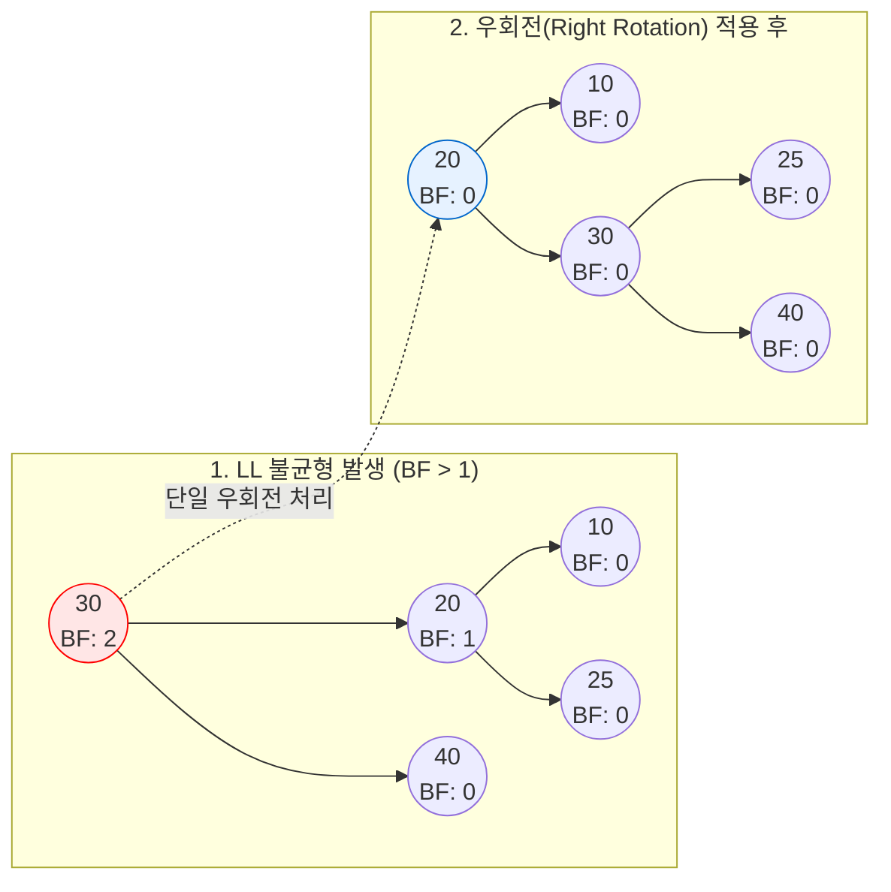

# AVL 트리

---

## I. 탐색 속도 최적화를 위한 자가 균형 트리, AVL 트리의 개요

* **가. AVL 트리의 정의**
* [[이진 탐색 트리]](BST)의 [[편향]] 현상을 방지하기 위해, 모든 노드의 좌우 서브트리 높이 차이(균형 인수)가 최대 1이 되도록 스스로 균형을 유지하는 자가 균형(Self-Balancing) 이진 탐색 트리

* **나. AVL 트리의 등장배경 및 특징**
* **등장배경**: 데이터가 정렬된 상태로 지속 삽입될 경우 트리가 한쪽으로 편향(Skewed)되어 탐색 효율이 선형 시간($O(N)$)으로 악화되는 문제 발생
* **특징**: 엄격한 높이 균형 유지(Balance Factor $\in \{-1, 0, 1\}$), 데이터 삽입/삭제 시 회전(Rotation) 연산 수행, 최악의 경우에도 탐색 시간 $O(\log N)$ 완벽 보장

---

## II. AVL 트리의 동작원리 및 핵심 구성요소

### 가. AVL 트리의 균형 유지 개념도 (회전 연산)

* 데이터 삽입/삭제 후 특정 노드의 균형 인수가 ±1을 벗어나면, 회전 연산(Single/Double Rotation)을 통해 즉시 트리의 높이 균형을 재조정하여 편향 트리를 방지함.

### 나. AVL 트리의 핵심 기술 및 구성 요소

| 구분 | 요소기술(키워드) | 세부 설명 |
| --- | --- | --- |
| **핵심 지표** | **Balance Factor (BF)** | 왼쪽 서브트리의 높이에서 오른쪽 서브트리의 높이를 뺀 값 ($BF = H_L - H_R$) |
| **제약 조건** | **엄격한 균형 조건** | 트리 내의 모든 노드는 반드시 $BF \in \{-1, 0, 1\}$ 조건을 만족해야 함 |
| **단일 회전** | **LL 회전 (Right Rotation)** | 왼쪽 자식의 왼쪽 서브트리에 노드 삽입으로 불균형 발생 시, 전체 트리를 **우회전** 처리 |
| **단일 회전** | **RR 회전 (Left Rotation)** | 오른쪽 자식의 오른쪽 서브트리에 노드 삽입으로 불균형 발생 시, 전체 트리를 **좌회전** 처리 |
| **이중 회전** | **LR 회전 (Left-Right)** | 왼쪽 자식의 오른쪽 서브트리 삽입 시, **부분 좌회전** 후 **전체 우회전** 처리 |
| **이중 회전** | **RL 회전 (Right-Left)** | 오른쪽 자식의 왼쪽 서브트리 삽입 시, **부분 우회전** 후 **전체 좌회전** 처리 |
| **성능 지표** | **시간 복잡도** | 균형 유지로 인해 노드 탐색, 삽입, 삭제 연산 모두 항상 최악의 경우에도 **$O(\log N)$** 보장 |

---

## III. 자가 균형 이진 탐색 트리 비교 (AVL 트리 vs Red-Black 트리)

### 가. AVL 트리와 Red-Black(RB) 트리 비교

| 비교 항목 | AVL 트리 | Red-Black 트리 |
| --- | --- | --- |
| **균형 유지 조건** | **엄격함** (좌우 높이 차이 최대 1) | **상대적 느슨함** (루트부터 리프까지 Black 노드 수 동일) |
| **탐색 (Search) 성능** | 매우 빠름 (트리의 높이가 최대한 낮게 유지됨) | AVL 트리 대비 미세하게 느림 (높이가 다소 높을 수 있음) |
| **삽입/삭제 성능** | **상대적 느림** (엄격한 균형으로 잦은 회전 연산 발생) | **상대적 빠름** (느슨한 균형 조건으로 회전 연산 최소화) |
| **메모리 오버헤드** | 노드당 균형 인수(정수형) 저장을 위한 메모리 필요 | 노드당 1비트(색상 정보: Red/Black)만 추가 소모 |
| **주요 활용 분야** | 삽입/삭제보다 **탐색 연산이 압도적으로 많은** 시스템 (DB 인덱싱 등) | 삽입, 삭제, 탐색이 빈번하게 일어나는 범용 라이브러리 (C++ `std::map`, Java `TreeMap`, Linux [[스케줄러]]) |

* 최근의 범용 프로그래밍 환경에서는 극단적인 탐색 속도보다 삽입/삭제 시 회전 오버헤드가 적은 **Red-Black 트리가 맵(Map)이나 셋(Set) 자료구조의 표준 [[알고리즘]]**으로 더 널리 활용되고 있음.

---

### 🔗 연관 토픽

- **소속 도메인**: [[00_컴퓨터구조_MOC|💻 컴퓨터구조]]
- **세부 분류**: `4. 기본 자료구조 (Data Structures)`
- **핵심 연관 토픽**:
  - [[이진 탐색 트리|이진 탐색 트리(Binary Search Tree)]]
  - [[알고리즘]]
  - [[편향]]
  - [[스케줄러|스케줄러 (Scheduler)]]
  - [[트리 순회|트리 순회 (Tree Traversal)]]
