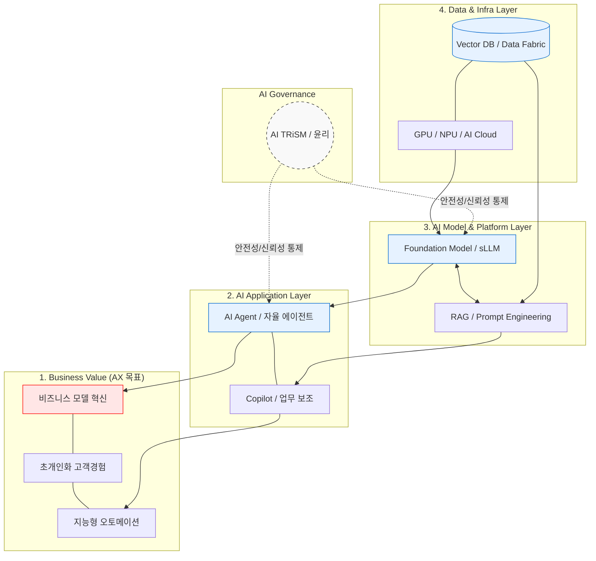

# AX (AI Transformation)

---

## I. 비즈니스 패러다임의 새로운 진화, AX의 개요

* **가. AX(AI Transformation)의 정의**
* [[디지털 전환]](DX)을 넘어, 생성형 AI 등 첨단 [[인공지능]] 기술을 기업의 비즈니스 모델, [[프로세스]], 조직 문화 전반에 내재화하여 근본적인 혁신과 경쟁 우위를 창출하는 비즈니스 혁신 패러다임

* **나. AX의 등장배경 및 특징**
* **등장배경**: 생성형 AI([[초거대 언어 모델|LLM]])의 폭발적 발전, 단순 반복 업무 자동화의 한계 봉착, 인지/추론 기반의 하이퍼오토메이션(Hyper-automation) 요구 증대
* **특징**: AI-First 전략(AI를 도구가 아닌 핵심 엔진으로 활용), 데이터-모델-서비스의 선순환 생태계 구축, 비즈니스 모델의 파괴적 혁신(Disruptive Innovation)

---

## II. AX의 아키텍처 및 핵심 기술 요소

### 가. AX 구현을 위한 기업 아키텍처 개념도

* AX 아키텍처는 데이터/인프라를 기반으로 파운데이션 모델을 학습 및 최적화(RAG)하고, 이를 AI 에이전트와 코파일럿 형태로 애플리케이션화하여 최종 비즈니스 가치를 창출하는 계층적 구조를 가짐.

### 나. AX의 핵심 기술 요소

| 분류 | 요소기술(키워드) | 세부 설명 |
| --- | --- | --- |
| **인프라** | **AI Cloud / [[NPU]]** | 초거대 모델의 학습 및 추론을 뒷받침하는 고성능 컴퓨팅 및 전력 효율화(NPU) 클라우드 인프라 |
| **데이터** | **Vector DB** | 텍스트, 이미지 등 비정형 데이터를 벡터(Embedding) 형태로 저장하여 의미 기반의 초고속 [[유사도]] 검색 지원 |
| **모델** | **[[sLLM (Smaller Large Language Model)|sLLM]] (소형언어모델)** | 파라미터 규모를 줄이면서도 특정 도메인(금융, 의료 등)에 특화하여 비용 효율성과 보안성을 극대화한 언어모델 |
| **최적화 기법** | **RAG (검색 증강 생성)** | 기업 내부의 신뢰할 수 있는 최신 지식베이스를 검색하여 LLM의 환각(Hallucination) 현상을 방지하고 정확도 향상 |
| **최적화 기법** | **PE (Prompt Engineering)** | 모델의 파라미터 수정 없이 입력 프롬프트를 정교하게 설계하여 원하는 최적의 결과물을 유도하는 기법 |
| **애플리케이션** | **[[AI Agent]]** | 단순 질의응답을 넘어 주어진 목표를 스스로 인지, 계획, 판단하여 도구(API)를 호출하고 업무를 자율 수행하는 주체 |
| **애플리케이션** | **Copilot** | 인간의 업무 맥락을 이해하고 코드 작성, 문서 요약, 데이터 분석 등을 실시간으로 지원하는 지능형 어시스턴트 |
| **거버넌스** | **[[AI TRiSM]]** | AI 모델의 [[신뢰성]], 위험, 보안 관리를 위한 [[프레임워크]](Trust, Risk and Security Management) |

---

## III. DX와 AX의 비교 및 발전 동향

### 가. DX(디지털 전환)와 AX(AI 전환)의 패러다임 비교

| 비교 항목 | DX ([[Digital Transformation]]) | AX (AI Transformation) |
| --- | --- | --- |
| **목적 및 방향성** | 업무 프로세스의 전산화, 효율화 및 비용 절감 | 새로운 비즈니스 모델 창출, 인지 노동의 지능화 |
| **핵심 기술 엔진** | 클라우드(Cloud), 빅데이터(Big Data), IoT | **생성형 AI(Generative AI), 초거대 언어모델(LLM)** |
| **데이터 활용** | 정형 데이터 중심의 통계 및 대시보드 시각화 | **비정형 데이터** 중심의 의미론적 분석 및 콘텐츠 생성 |
| **자동화 수준** | **Rule-based** (RPA 등 사전 정의된 규칙 기반) | **Context-driven** (자연어 맥락 이해 및 자율적 판단) |
| **조직 내 역할** | IT 부서 중심의 인프라 및 시스템 혁신 주도 | **현업 중심(Citizen Developer)**의 프로세스 및 서비스 혁신 |

* **전망 및 동향**:
* **AI-Native Enterprise로의 진화**: 기존 레거시 시스템에 AI를 단순 추가(Add-on)하는 수준을 넘어, 기획 단계부터 AI를 핵심 엔진으로 설계하는 'AI-Native' 아키텍처로의 전환이 가속화되고 있음.
* **소버린 AI([[Sovereign AI (소버린 AI)|Sovereign AI]]) 대두**: 데이터 주권과 보안을 위해 자체적인 인프라와 도메인 특화 sLLM을 구축하여 국가 및 기업 고유의 문맥과 규제를 반영하는 소버린 AI 체계가 AX의 핵심 경쟁력으로 부상 중임.

---

### 🔗 연관 토픽

- **소속 도메인**: [[00_인공지능_MOC|🤖 인공지능]]
- **세부 분류**: `4. 거대언어모델 (LLM) & 생성형 AI`
- **핵심 연관 토픽**:
  - [[디지털 전환|디지털 전환(DX)]]
  - [[Digital Transformation]]
  - [[AI Agent]]
  - [[sLLM (Smaller Large Language Model)]]
  - [[AI TRiSM|AI TRiSM(AI Trust Risk and Security Management)]]
