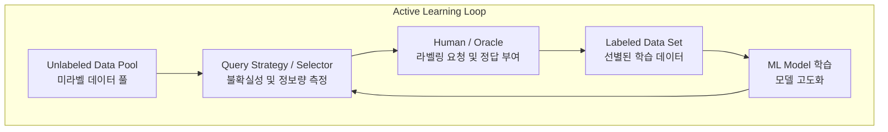

# 액티브 러닝 (Active Learning)

---

## I. 데이터 라벨링 비용 최소화의 핵심, 액티브 러닝의 개요

* **정의**: 머신러닝 모델이 성능 향상에 가장 유용할 것으로 판단되는 데이터(정보량이 높은 샘플)를 알고리즘이 스스로 선택하고, 사람(Oracle)에게 라벨링을 요청하여 효율적으로 학습하는 능동형 학습 기법
* **등장배경**: 대규모 비정형 데이터의 폭증으로 인해 전체 데이터 라벨링에 막대한 비용과 시간이 소요됨에 따라, 최소한의 라벨링 데이터로 최대의 성능을 확보할 필요성 대두
* **특징**: 질의 전략(Query [[Strategy (알고리즘 교체)|Strategy]]) 기반의 지능형 샘플 선택, 데이터 라벨링 비용(Cost) 획기적 절감, [[준지도학습]](Semi-supervised Learning)과의 유기적 결합

---

## II. 액티브 러닝의 아키텍처 및 핵심 기술 요소

### 가. 액티브 러닝의 동작 프로세스 및 아키텍처

* 레이블이 없는 대규모 데이터 풀에서 질의 전략을 통해 가장 정보 가치가 높은 샘플을 선별하고, 오라클의 라벨링을 거쳐 모델을 반복적으로 고도화함

### 나. 액티브 러닝의 핵심 기술 및 구성 요소

| 구분 | 요소기술(키워드) | 세부 설명 |
| --- | --- | --- |
| 질의 전략 | **불확실성 샘플링 (Uncertainty)** | 모델이 예측 확률이 0.5에 가까워 가장 혼란스러워하는 데이터를 우선 선택 |
| 질의 전략 | **위위원회 질의 (Query-by-Committee)** | 여러 모델(Committee) 간의 예측 결과 불일치도가 높은 샘플을 선택 |
| 질의 전략 | **예상 모델 변화 (Expected Change)** | 해당 샘플이 추가되었을 때 모델의 파라미터 변화가 가장 큰 데이터를 선택 |
| 샘플링 방식 | **풀 기반 샘플링 (Pool-based)** | 전체 미라벨 데이터 풀에서 가장 유용한 샘플을 일괄 탐색하여 추출하는 방식 |
| 샘플링 방식 | **스트림 기반 샘플링 (Stream)** | 데이터를 하나씩 순차적으로 입력받아 즉시 라벨링 여부를 결정하는 실시간 방식 |
| 평가 요소 | **오라클 (Oracle)** | 인간 전문가 또는 고정밀 사전 학습 모델 등 정답(Label)을 제공하는 주체 |
| 연계 기법 | **준지도 학습 (Semi-Supervised)** | 액티브 러닝으로 소량 라벨링 후, 대량의 언라벨 데이터로 확장 학습 수행 |
| 응용 분야 | **[[Smart Car(자율주행)|자율주행]], 의료 AI** | 고비용의 도메인 지식과 정밀 라벨링이 요구되는 데이터 수집 최적화에 활용 |

---

## III. 전통적 학습법과 액티브 러닝 비교 및 실무 활용 전략

### 가. 전통적 지도학습과 액티브 러닝 비교

| 비교 항목 | 전통적 [[지도학습]] (Supervised Learning) | 액티브 러닝 (Active Learning) |
| --- | --- | --- |
| **데이터 선택 방식** | 전체 데이터를 무작위(Random) 또는 전수 라벨링 | 알고리즘이 유용한 데이터를 능동적으로 선별 |
| **라벨링 비용** | 매우 높음 (대규모 데이터 전수 수작업 라벨링) | 최소화 (핵심 데이터만 선별하여 라벨링 비용 절감) |
| **학습 효율성** | 대량의 데이터가 필수적이며 중복 데이터 포함 가능 | 소량의 고품질 데이터로 고효율 성능 달성 가능 |
| **주요 활용 환경** | 데이터 수집 및 라벨링 비용이 비교적 저렴한 환경 | 의료, 법률, 자율주행 등 라벨링 비용이 극도로 높은 환경 |

### 나. 액티브 러닝의 최신 트렌드 및 실무 활용 전략

* **[[초거대 언어 모델|LLM]] 및 멀티모달 데이터 구축 연계**: 거대언어모델(LLM)의 파인튜닝 과정에서 [[프롬프트 엔지니어링]] 및 도메인 적응을 위한 고품질 데이터셋 선별에 핵심 도구로 활용
* **[[MLOps]] 파이프라인 자동화**: 모델 추론 결과의 불확실성을 실시간 모니터링하고, 필요시 자동 또는 반자동으로 라벨링 큐([[Queue]])에 데이터를 적재하는 MLOps 인프라 연계 구축 필수

---

### 🔗 연관 토픽

- **소속 도메인**: [[00_인공지능_MOC|🤖 인공지능]]
- **세부 분류**: `2. 머신러닝 기초 & 핵심 알고리즘`
- **핵심 연관 토픽**:
  - [[준지도학습]]
  - [[지도학습]]
  - [[MLOps]]
  - [[데이터 라벨링과 어노테이션]]
  - [[강화학습]]
