# 애자일 선언문과 12개 원칙

---

## I. 고객 가치 창출과 변화 대응의 나침반, 애자일 선언문의 개요

* **정의**: 기존 예측형, 문서 중심의 무거운 소프트웨어 개발 프로세스에서 벗어나, 유연성과 상호작용 및 작동하는 소프트웨어의 가치를 강조한 4가지 핵심 가치와 12가지 실천 지침
* **등장 배경**: 전통적 [[워터폴|폭포수]](Waterfall) 방법론의 한계 노출, 비즈니스 환경의 급격한 변화(불확실성 증가), [[SCRUM|Scrum]]/XP 등 경량화(Lightweight) 방법론 진영의 철학적 통합 필요성 (2001년)
* **특징**: 좌측 항목(공정, 문서 등)의 가치를 인정하면서도 우측 항목(사람, 소프트웨어 등)에 더 높은 가치를 부여, 적응형(Adaptive) 리더십 및 지속적인 개선(CI/CD)의 사상적 기반 제공

---

## II. 애자일 선언문의 4대 가치 개념도 및 12개 원칙

### 가. 애자일 선언문의 4대 가치 개념도

```mermaid
flowchart LR
    subgraph Agile_Manifesto ["애자일 소프트웨어 개발 선언 (4대 가치)"]
        direction TB
        
        subgraph Value1 ["가치 1: 소통 중심"]
            direction LR
            V1_L["공정과 도구<br>(Processes & Tools)"] -. 보다 .-> V1_R["개인과 상호작용<br>(Individuals & Interactions)"]
            style V1_R stroke:#333,stroke-width:3px
        end
        
        subgraph Value2 ["가치 2: 실질적 산출물 중심"]
            direction LR
            V2_L["포괄적인 문서<br>(Comprehensive Docs)"] -. 보다 .-> V2_R["작동하는 소프트웨어<br>(Working Software)"]
            style V2_R stroke:#333,stroke-width:3px
        end
        
        subgraph Value3 ["가치 3: 파트너십 중심"]
            direction LR
            V3_L["계약 협상<br>(Contract Negotiation)"] -. 보다 .-> V3_R["고객과의 협력<br>(Customer Collaboration)"]
            style V3_R stroke:#333,stroke-width:3px
        end
        
        subgraph Value4 ["가치 4: 유연성 중심"]
            direction LR
            V4_L["계획에 따르기<br>(Following a plan)"] -. 보다 .-> V4_R["변화에 대응하기<br>(Responding to Change)"]
            style V4_R stroke:#333,stroke-width:3px
        end
    end

```

* 오른쪽 항목(진한 테두리)을 왼쪽 항목보다 더욱 가치 있게 여김으로써, 통제보다는 자율과 적응력을 중시하는 개발 문화를 지향함.

### 나. 애자일 개발의 12개 핵심 원칙

| 구분 | 요소기술(키워드) | 세부 설명 |
| --- | --- | --- |
| **가치 인도** | 조기 및 지속적 인도 | 가치 있는 소프트웨어를 일찍, 지속적으로 제공하여 고객을 만족시킴 |
| **변화 수용** | 요구사항 변경 환영 | 개발 후반부라도 요구사항 변경을 기꺼이 수용하여 고객의 경쟁력을 제고함 |
| **가치 인도** | 잦은 소프트웨어 배포 | 작동하는 소프트웨어를 짧은 주기(수 주~수 개월)로 자주 인도함 |
| **소통/협업** | 비즈니스와 개발자 협력 | 비즈니스 담당자와 개발자는 프로젝트 전체 기간 동안 매일 함께 일해야 함 |
| **팀/조직** | 동기부여와 신뢰 | 동기부여된 개인들로 팀을 구성하고, 필요한 환경과 지원을 주며 신뢰함 |
| **소통/협업** | 대면 대화(Face-to-Face) | 팀 내부와 팀 간에 정보를 전달하는 가장 효율적이고 효과적인 방법은 대면 대화임 |
| **측정 기준** | 작동하는 소프트웨어 | 작동하는 소프트웨어가 진척도를 측정하는 으뜸가는(Primary) 척도임 |
| **개발 환경** | 지속 가능한 개발 | 스폰서, 개발자, 사용자는 일정한 속도(Pace)를 지속적으로 유지해야 함 |
| **기술/품질** | 기술적 탁월함과 설계 | 기술적 탁월함과 좋은 설계에 대한 지속적인 관심이 민첩성을 향상시킴 |
| **기술/품질** | 단순성 (Simplicity) | 안 해도 될 일은 최대한 안 하는 기술(단순성)이 필수적임 |
| **팀/조직** | 자기 조직화 팀 | 최상의 아키텍처, 요구사항, 설계는 스스로 조직화되는 팀에서 창출됨 |
| **개선/회고** | 정기적인 반성과 조율 | 정기적으로 효과적인 팀이 되는 방법을 숙고하고, 행동을 튜닝하고 조정함 |

*(※ 12개 원칙은 가치 인도, 소통/협업, 조직 문화, 기술적 품질 등 4가지 관점으로 분류 가능)*

---

## III. 애자일 선언문의 활용 및 향후 전망

* **기업 민첩성(Business Agility)으로의 확장**: 소프트웨어 개발 부서를 넘어 HR, 마케팅, 재무 등 전사적 차원으로 애자일 원칙이 적용되는 엔터프라이즈 애자일(Enterprise [[Agile]]) 트렌드 확산
* **대규모 프레임워크와의 결합**: 단위 팀 수준을 넘어 수백 명 단위의 대규모 조직에 애자일 철학을 일관되게 적용하기 위한 SAFe(Scaled Agile Framework), LeSS(Large-Scale Scrum)의 채택 증가
* **[[DevOps]] 및 클라우드 네이티브의 사상적 토대**: '잦은 인도'와 '지속 가능한 개발' 원칙을 기술적으로 실현하기 위해 CI/CD, 마이크로서비스 아키텍처([[MSA (Micro Service Architecture)|MSA]]), [[컨테이너]] 기술과 필수적으로 결합되어 활용됨

---

### 🔗 연관 토픽

- **소속 도메인**: [[00_프로젝트관리_MOC|📋 프로젝트관리]]
- **세부 분류**: `1. PMBOK 표준 & 프로젝트 거버넌스`
- **핵심 연관 토픽**:
  - [[SCRUM]]
  - [[Agile]]
  - [[PMBOK 프로세스 그룹 (5단계)]]
  - [[애자일 선언문]]
  - [[연동계획|연동계획 (Rolling Wave Planning)]]
