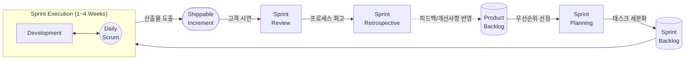

# 애자일 (Agile)

---

## I. 신속한 변화 대응과 고객 가치 극대화를 위한, 애자일(Agile)의 개요

* **정의**: 사전에 완벽한 계획을 수립하기보다 요구사항 변화에 유연하게 대응하며, 작동하는 소프트웨어를 짧은 주기(Sprint/Iteration)로 지속 제공하여 고객 만족을 극대화하는 경량화된 [[소프트웨어 개발 방법론]]
* **등장 배경**: 기존 [[워터폴|폭포수]](Waterfall) 모델의 경직성 극복, 불확실성이 높은 비즈니스 환경(VUCA) 도래, 빠른 시장 출시(Time-to-Market) 요구 증대
* **특징**: 반복적이고 점진적인(Iterative & Incremental) 인도, 사람과 상호작용 중심([[애자일 선언문]]), 피드백 기반의 지속적인 공정 개선

---

## II. 애자일 방법론의 프로세스 개념도 및 핵심 구성 요소

### 가. 애자일(Scrum 중심) 방법론의 프로세스 개념도

* 제품 백로그에서 우선순위가 높은 요구사항을 스프린트 백로그로 이관하여 1~4주 주기의 타임박스(Timebox) 내에서 실행 가능한 소프트웨어를 반복적으로 개발 및 점검함.

### 나. 애자일 방법론의 핵심 구성 요소

| 구분 | 요소기술(키워드) | 세부 설명 |
| --- | --- | --- |
| **역할** | Product Owner (PO) | 제품 백로그 관리, 요구사항 우선순위 결정 및 비즈니스 가치 극대화 책임자 |
| **역할** | [[SCRUM|Scrum]] Master (SM) | 팀의 원활한 스프린트 진행을 돕는 서번트 리더(Servant Leader), 장애요소 식별 및 제거 |
| **역할** | Cross-functional Team | 기획, 개발, 테스트 등 다기능을 갖춘 자기 조직화(Self-organizing)된 실무 팀 |
| **산출물** | Product/Sprint Backlog | 사용자 스토리 기반의 전체 요구사항 목록 및 해당 스프린트 내 구현 대상 태스크 목록 |
| **이벤트** | Daily Scrum | 매일 정해진 시간에 15분 내외로 진행 상황과 이슈(Blocker)를 공유하는 스탠드업 미팅 |
| **이벤트** | Review & Retrospective | 종료 시 결과물 시연(Review) 및 팀의 협업 [[프로세스]] 개선점 도출(Retrospective) |
| **실천기법** | User Story | 사용자 관점에서 비즈니스 가치와 요구사항을 서술한 기능 단위 (As a ~, I want ~, So that ~) |
| **실천기법** | Planning Poker | 플래닝 포커 카드 기반으로 스토리 포인트(Story Point)를 산정하는 집단 지성 기반의 공수 추정 기법 |

---

## III. 애자일 방법론과 전통적 폭포수(Waterfall) 방법론의 비교

### 가. 애자일과 폭포수 방법론 비교

| 비교 항목 | 애자일 (Agile) | 폭포수 (Waterfall) |
| --- | --- | --- |
| **대응 전략** | **변화 수용 (Adaptive)** | 계획 주도 (Predictive) |
| **개발 방식** | 반복적, 점진적 개발 (Iterative) | 순차적, 단계별 개발 (Sequential) |
| **요구사항** | 프로젝트 도중 지속적 변경 허용 | 초기 단계 확정, 이후 변경 통제 엄격 |
| **고객 참여** | 프로젝트 전반에 걸쳐 지속적 참여 및 피드백 | 요구사항 정의 및 최종 [[인수 테스트]] 시점에 집중 |
| **가치 중심** | **작동하는 소프트웨어 중심** | 포괄적인 문서 및 산출물 중심 |
| **통제 방식** | 팀 중심의 자기 조직화 및 분산 통제 | 관리자(PM) 중심의 하향식 통제 (Top-down) |
| **적합 프로젝트** | 불확실성이 높고 요구사항 변경이 잦은 신규 서비스 | 요구사항이 명확하고 안정적인 대규모 차세대 시스템 |

* 최근에는 엔터프라이즈 환경에서 폭포수 방법론의 안정성과 애자일의 유연성을 결합한 **하이브리드 애자일(Bimodal IT)** 및 대규모 조직에 애자일을 적용하는 **SAFe(Scaled Agile Framework)** 도입이 가속화되는 추세임.

---

### 🔗 연관 토픽

- **소속 도메인**: [[00_소프트웨어공학_MOC|🏗️ 소프트웨어공학]]
- **세부 분류**: `1. 소프트웨어 개발 생명주기(SDLC) & 방법론`
- **핵심 연관 토픽**:
  - [[소프트웨어 개발 방법론]]
  - [[워터폴]]
  - [[애자일 선언문]]
  - [[인수 테스트]]
  - [[SCRUM]]
