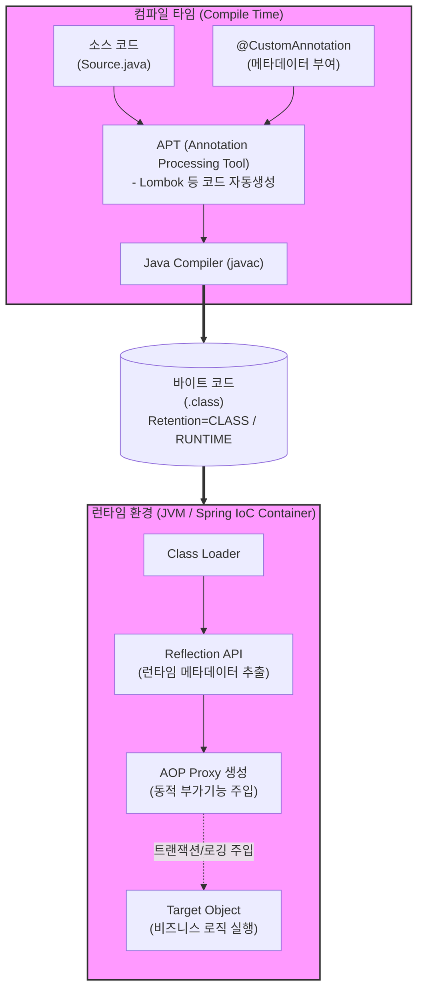

# Annotation

---

## I. 선언적 프로그래밍을 위한 메타데이터, Annotation의 개요

* **정의**: 소프트웨어 소스 코드에 메타데이터(Metadata)를 삽입하여, 컴파일 타임이나 런타임 시 컴파일러 및 프레임워크에 특정 동작(설정, 의존성 주입 등)을 지시하는 마크업 형태의 태그
* **필요성/특징**:
* **복잡성 해소**: 기존 [[XML]] 기반의 방대한 외부 설정 파일(Configuration)을 대체하여 코드의 가독성 및 유지보수성 향상
* **관심사 분리**: 비즈니스 로직과 횡단 관심사(로깅, [[트랜잭션]], 보안 등)를 분리하는 [[AOP (Aspect Oriented Programming)|AOP]](Aspect-Oriented Programming) 구현의 핵심 요소
* **생산성 증대**: 보일러플레이트 코드 감소 및 선언적 방식(`@태그명`)을 통한 동적 의존성 주입(DI) 지원

---

## II. Annotation의 동작 원리 및 핵심 구성 요소

### 가. Annotation의 아키텍처 및 동작 원리

* 소스 코드에 작성된 어노테이션은 유지 정책(Retention Policy)에 따라 바이트코드에 저장되며, 런타임에 Reflection API를 통해 동적으로 해석되어 프록시(Proxy) 기반의 AOP 부가 기능을 주입함

### 나. Annotation의 핵심 기술 요소

| 분류 | 요소기술(키워드) | 세부 설명 |
| --- | --- | --- |
| **메타 태그** | Meta-Annotation | 커스텀 어노테이션을 정의할 때 사용하는 어노테이션 (예: `@Target`, `@Retention`) |
| **적용 시점** | Retention Policy | 어노테이션 정보의 생명주기 설정 (SOURCE: 컴파일 전, CLASS: 컴파일 후, RUNTIME: 실행 시) |
| **적용 대상** | Target | 어노테이션이 부착될 수 있는 위치 지정 (TYPE, FIELD, METHOD, PARAMETER 등) |
| **런타임 해석** | Reflection API | JVM 런타임에 구체적인 클래스의 타입이나 메서드, 어노테이션 정보를 동적으로 분석하는 기법 |
| **부가기능 주입** | AOP (관점 지향 프로그래밍) | 특정 어노테이션을 포인트컷(Pointcut)으로 지정하여, 타겟 메서드 실행 전후에 공통 로직 실행 |
| **객체 관리** | DI (의존성 주입) | `@Autowired`, `@Inject` 등을 통해 IoC 컨테이너가 런타임에 객체의 생명주기와 의존성을 동적 바인딩 |
| **전처리 도구** | APT (Annotation Processor) | 컴파일 타임에 소스코드의 어노테이션을 스캔하여 새로운 소스나 파일(예: Getter/Setter)을 생성 |
| **표준화 규격** | JSR-250, JSR-330 | Java 표준 어노테이션 스펙 (의존성 주입 및 공통 어노테이션 명세) |

---

## III. Annotation 설정 방식과 XML 설정 방식의 비교 및 동향

### 가. 외부 구성(XML)과 내부 구성(Annotation) 설정 방식 비교

| 비교 항목 | XML 기반 설정 (External Configuration) | Annotation 기반 설정 (Internal Configuration) |
| --- | --- | --- |
| **설정 위치** | 소스 코드와 분리된 별도 XML 파일 | 소스 코드 내부에 직접 선언 ([[응집도]] 높음) |
| **가독성 및 관리** | 설정이 한곳에 집중되어 전체 흐름 파악 용이 | 해당 클래스의 역할과 설정을 직관적으로 파악 가능 |
| **유지보수성** | 설정 변경 시 재컴파일 불필요 (런타임 반영 가능) | 설정 변경 시 소스 코드 수정 및 재컴파일 필수 |
| **타입 안정성** | 런타임에서야 오류 확인 가능 (문자열 기반 매핑) | 컴파일 타임에 문법적/타입 오류 사전 검증 가능 |
| **주요 활용 트렌드** | 레거시 시스템, 전역적/인프라성 설정, DB 매퍼 | Spring Boot 등 모던 프레임워크의 비즈니스 로직 및 DI 설정 |

### 나. 향후 활용 전망 및 시사점

* **코드 최소화(Zero Configuration) 트렌드 주도**: Spring Boot의 `@SpringBootApplication`과 같은 메타 어노테이션의 발전으로 개발자는 인프라 설정에 대한 고민 없이 비즈니스 로직에만 집중할 수 있는 환경이 고도화됨
* **(참고) AI 영역에서의 용어 확장**: 소프트웨어 공학의 메타데이터 주입을 의미하는 Annotation 기술과 별개로, 최근 AI/ML 도메인에서는 학습 데이터에 정답(Bounding Box, Label)을 태깅하는 **'Data Annotation(데이터 라벨링)'** 의미로도 혼용되므로 문맥에 따른 정확한 용어 식별 및 활용이 요구됨

---

### 🔗 연관 토픽

- **소속 도메인**: [[00_소프트웨어공학_MOC|🏗️ 소프트웨어공학]]
- **세부 분류**: `6. 소프트웨어 테스팅 & 품질 보증 (QA/QC)`
- **핵심 연관 토픽**:
  - [[XML]]
  - [[AOP (Aspect Oriented Programming)]]
  - [[응집도]]
  - [[트랜잭션]]
  - [[응답시간]]
