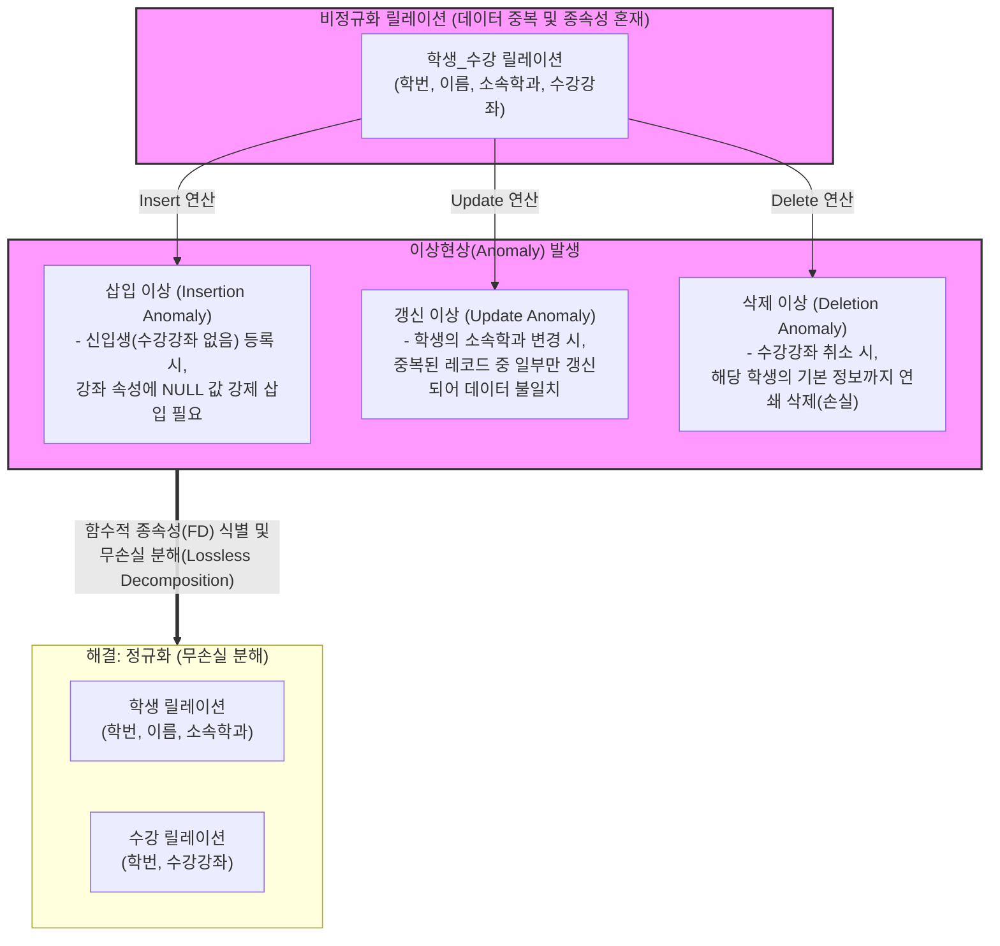

# Anomaly (이상현상)

---

## I. 데이터 무결성 저해 요인, Anomaly(이상현상)의 개요

* **정의**: 관계형 데이터베이스에서 릴레이션(테이블) 설계의 결함으로 인해 데이터 중복이 발생하고, 이로 인해 데이터 삽입·삭제·갱신 연산 시 논리적 오류나 불일치가 발생하는 현상
* **등장배경 및 원인**:
* **정규화 원칙 위배**: 릴레이션 내에 잘못된 [[함수적 종속성]](Functional Dependency)이 혼재되어 존재
* **데이터 중복(Redundancy)**: 하나의 릴레이션에 불필요하게 많은 속성을 묶어두어 저장 공간 낭비 및 관리 복잡성 증가

* **특징**: 데이터의 일관성(Consistency)과 [[무결성]](Integrity)을 심각하게 훼손하며, 이를 해결하기 위해 릴레이션을 무손실 분해하는 정규화(Normalization) 과정이 필수적임

---

## II. Anomaly의 발생 메커니즘 개념도 및 세부 유형

### 가. Anomaly 발생 메커니즘 및 정규화 기반 해결 개념도

* 비정규화된 단일 릴레이션에서 [[DML]] 연산 시 3가지 주요 이상현상이 발생하며, 이를 함수적 종속성에 기반하여 여러 릴레이션으로 분해(정규화)함으로써 이상현상을 원천 차단함

### 나. Anomaly의 핵심 세부 유형 및 관련 기술 요소

| 구분 | 이상현상 / 요소기술 | 세부 설명 |
| --- | --- | --- |
| **이상 유형** | 삽입 이상 (Insertion) | 특정 데이터를 삽입하려 할 때 불필요한 데이터까지 함께 삽입해야 하거나 NULL 값이 발생하는 현상 |
| **이상 유형** | 갱신 이상 (Update) | 중복 저장된 데이터 중 일부만 갱신되어 동일 엔티티에 대한 데이터 간 모순(Inconsistency)이 발생하는 현상 |
| **이상 유형** | 삭제 이상 (Deletion) | 특정 데이터를 삭제할 때 릴레이션에 유지되어야 할 다른 독립적인 정보까지 함께 연쇄 삭제되는 현상 |
| **핵심 원인** | 데이터 중복 (Redundancy) | 릴레이션 내에 동일한 데이터가 여러 행에 걸쳐 반복적으로 저장되는 상태 |
| **핵심 원인** | 함수적 종속성 (FD) | 속성 X의 값이 속성 Y의 값을 유일하게 결정할 때, Y는 X에 함수적으로 종속된다고 정의함 (X → Y) |
| **해결 기법** | 정규화 (Normalization) | 이상현상을 제거하기 위해 제1정규형(1NF)부터 제5정규형(5NF), [[BCNF]]까지 릴레이션을 단계별로 분해하는 과정 |
| **분해 원칙** | 무손실 분해 (Lossless) | 릴레이션을 분해한 후 다시 조인(Join)했을 때 원래의 릴레이션과 동일하게 정보 손실 없이 복원되는 성질 |
| **분해 원칙** | 종속성 보존 (Dependency) | 분해된 릴레이션들이 원래 릴레이션이 가지고 있던 모든 함수적 종속성을 그대로 유지하는 성질 |

---

## III. 정규화와 반정규화(De-normalization) 환경에서의 이상현상 비교 및 전망

### 가. 환경별 이상현상 취급 비교 (관계형 DB vs 분산/NoSQL DB)

| 비교 항목 | RDBMS (정규화 환경) | [[NoSQL (CAP 이론 BASE 속성)|NoSQL]] / BigData (반정규화 환경) |
| --- | --- | --- |
| **설계 목표** | 데이터 무결성 보장 및 중복 최소화 | 읽기 성능(Read Performance) 극대화 및 [[HA(High Availability)|가용성]] 보장 |
| **이상현상 대응** | 철저한 정규화를 통해 **이상현상 원천 제거** | 성능을 위해 **데이터 중복 및 이상현상 발생 리스크 수용** |
| **데이터 일관성** | 강력한 일관성 (ACID 준수) | 최종적 일관성 (Eventual Consistency / BASE 준수) |
| **이상현상 통제 주체** | [[데이터베이스]] 자체 (제약조건, 정규형) | 애플리케이션 로직 (배치 동기화, [[트랜잭션]] 보상 로직) |

### 나. 최신 데이터 아키텍처 환경에서의 전망

* **의도적 반정규화의 증가**: 마이크로서비스 아키텍처([[MSA (Micro Service Architecture)|MSA]]) 및 대규모 분산 환경에서는 [[조인|조인(Join)]] 연산의 비용이 크기 때문에, 데이터를 복제하여 저장하는 의도적 반정규화 패턴(CQRS 등)이 널리 사용됨
* **데이터 옵저버빌리티(Data Observability) 부각**: 반정규화로 인해 갱신 이상 등의 불일치가 발생할 위험이 커짐에 따라, 데이터 파이프라인 전반에서 데이터의 정합성과 품질 이상을 실시간으로 탐지하고 교정하는 데이터 관측성 플랫폼의 중요성이 대두되고 있음

---

### 🔗 연관 토픽

- **소속 도메인**: [[00_데이터베이스_MOC|🗄️ 데이터베이스]]
- **세부 분류**: `1. 데이터 모델링 & 관계형 DB 설계`
- **핵심 연관 토픽**:
  - [[조인|조인(Join)]]
  - [[BCNF|BCNF (Boyce-Codd Normal Form 3.5NF)]]
  - [[함수적 종속성|함수적 종속성 (Functional Dependency)]]
  - [[무결성]]
  - [[데이터베이스]]
