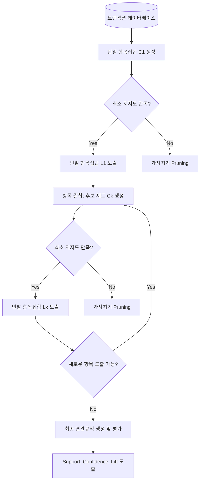

# Apriori 알고리즘

---

## I. 장바구니 분석의 핵심, Apriori 알고리즘의 개요

* **가. Apriori 알고리즘의 정의**
* [[데이터베이스]] 내의 방대한 트랜잭션에서 항목 간의 연관규칙(Association Rule)을 찾기 위해 최소 [[지지도]](Minimum Support) 이상의 빈발 항목집합(Frequent Itemset)을 도출하는 [[데이터 마이닝]] [[알고리즘]]

* **나. Apriori 알고리즘의 등장배경 및 특징**
* **등장배경**: 대규모 유통 데이터 내 숨겨진 구매 패턴 발견(장바구니 분석) 및 교차판매(Cross-selling) 전략 수립 요구 증대
* **특징**: 하향식(Bottom-up) 탐색, 부분집합 빈도 원리(Apriori Property) 적용, 후보 생성 및 가지치기(Candidate Generation & Pruning)

---

## II. Apriori 알고리즘의 동작원리 및 핵심 구성요소

### 가. Apriori 알고리즘의 아키텍처 및 동작 원리

* 초기 단일 항목부터 시작하여 항목을 지속 결합(Join)하고, 최소 지지도에 미달하는 항목을 사전에 제거(Prune)하여 최종 연관규칙을 도출하는 반복적 [[프로세스]] 수행

### 나. Apriori 알고리즘의 핵심 기술 요소

| 분류 | 요소기술(키워드) | 세부 설명 |
| --- | --- | --- |
| **평가 지표** | **지지도 (Support)** | 전체 거래 중 항목 A와 B가 동시에 포함된 거래의 비율 ($P(A \cap B)$) |
| **평가 지표** | **신뢰도 (Confidence)** | 항목 A를 포함한 거래 중 항목 A와 B가 동시에 포함된 거래 비율 ($P(B\Vert{}A)$) |
| **평가 지표** | **향상도 (Lift)** | A가 주어지지 않았을 때 B의 구매 확률 대비 A가 주어졌을 때 B의 구매 확률 증가 비율 |
| **핵심 원리** | **Apriori Property** | 어떤 항목집합이 빈발(Frequent)하면 그 부분집합도 반드시 빈발하다는 선험적 원리 |
| **탐색 기법** | **가지치기 (Pruning)** | 최소 지지도에 미달하는 비빈발 항목을 포함하는 상위 집합을 탐색 대상에서 조기 제외 |
| **탐색 기법** | **후보 생성 (Join)** | 크기가 $k-1$인 빈발 항목집합들을 결합하여 크기가 $k$인 새로운 후보 항목집합 생성 |
| **적용 분야** | **장바구니 분석** | 고객의 동시 구매 패턴을 분석하여 상품 배치, 추천 시스템(Recommendation) 등에 활용 |
| **성능 최적화** | **Hash Tree** | 방대한 트랜잭션에서 후보 항목집합의 지지도 계산 시 탐색 속도를 높이기 위한 자료구조 |

---

## III. Apriori 알고리즘과 FP-Growth 알고리즘 비교

### 가. 연관규칙 탐색 알고리즘 비교

| 비교 항목 | Apriori 알고리즘 | FP-Growth (Frequent Pattern) 알고리즘 |
| --- | --- | --- |
| **작동 방식** | 후보 생성 및 테스트 (Candidate Gen & Test) | FP-Tree 구축을 통한 패턴 성장 (Pattern Growth) |
| **DB 스캔 횟수** | 최대 빈발 항목집합의 크기만큼 반복 (다중 스캔) | 트리 구축을 위해 단 2회 스캔 |
| **메모리 사용** | 대규모 후보 집합 생성으로 막대한 메모리 소모 | 후보 집합 미생성, 트리를 메모리에 압축 상주 |
| **탐색 기법** | 상향식(Bottom-up) 결합 및 가지치기 | 분할 정복(Divide and Conquer) 방식의 트리 탐색 |
| **처리 속도** | 대규모 데이터셋 및 낮은 지지도 환경에서 매우 느림 | Apriori 대비 속도가 매우 빠름 |
| **적합한 환경** | [[트랜잭션]] 데이터가 비교적 작고 단순할 때 | 대용량 트랜잭션 데이터의 고속 병렬 처리 시 |

* 최근 빅데이터 환경에서는 Apriori의 과도한 I/O 부하 및 메모리 한계를 극복하기 위해 FP-Growth 계열 알고리즘이나 분산 처리 환경(Spark MLlib의 FPGrowth 등)을 주로 활용하는 추세임.

---

### 🔗 연관 토픽

- **소속 도메인**: [[00_데이터베이스_MOC|🗄️ 데이터베이스]]
- **세부 분류**: `2. 트랜잭션 & 동시성 제어 (Concurrency)`
- **핵심 연관 토픽**:
  - [[지지도]]
  - [[연관성 분석]]
  - [[FP(Frequent Pattern) - Growth 알고리즘]]
  - [[트랜잭션]]
  - [[데이터베이스]]
