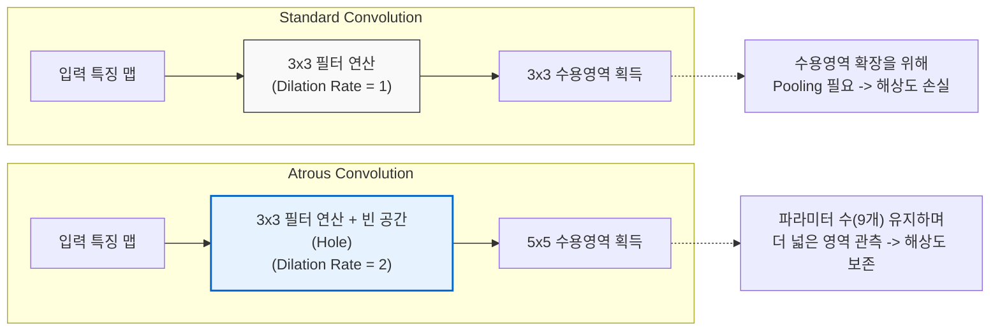

# Atrous Convolution (Dilated Convolution)

---

## I. 파라미터 증가 없이 수용영역을 확장하는, Atrous Convolution의 개요

* **가. Atrous Convolution의 정의**
* 합성곱 필터(Filter) 내부에 빈 공간(Hole)을 두어 가중치 간의 간격을 넓힘으로써, 파라미터 수와 연산량의 증가 없이 모델의 수용영역(Receptive Field)을 확장하는 합성곱 연산 기법

* **나. Atrous Convolution의 등장배경 및 특징**
* **등장배경**: 기존 [[CNN]]은 수용영역을 넓히기 위해 풀링(Pooling)을 거치며 공간 해상도(Spatial Resolution)가 저하되어, 픽셀 단위의 정밀한 분할(Segmentation) 시 디테일 정보가 손실되는 한계 존재
* **특징**: 확장 비율(Dilation Rate) 적용, 파라미터 수 유지, 공간 문맥 정보(Contextual Information) 확보, 시맨틱 세그먼테이션(DeepLab 등)의 핵심 기술로 활용

---

## II. Atrous Convolution의 동작 원리 및 핵심 구성요소

### 가. Atrous Convolution의 동작 원리 및 개념도

* 필터 내 가중치 사이에 0으로 채워진 공간(Hole)을 삽입하여, 실제 연산량(예: 3x3=9개)은 동일하게 유지하면서도 필터가 덮는 전체 면적(5x5, 7x7 등)을 기하급수적으로 확대함.

### 나. Atrous Convolution의 핵심 기술 요소

| 분류 | 요소기술(키워드) | 세부 설명 |
| --- | --- | --- |
| **핵심 파라미터** | **Dilation Rate ($r$)** | 필터의 가중치 간 간격을 정의하는 값 ($r=1$이면 일반 합성곱, $r>1$이면 간격 생성) |
| **성능 지표** | **Receptive Field (수용영역)** | 출력 뉴런 하나가 참조하는 입력 차원의 공간 크기 (Rate 증가 시 공간 정보 참조 범위를 넓힘) |
| **네트워크 구조** | **ASPP (Atrous Spatial Pyramid Pooling)** | 여러 개의 다양한 Dilation Rate를 병렬로 적용해 입력 이미지의 다중 스케일(Multi-scale) 특성 추출 |
| **해결 과제** | **해상도 보존 (Resolution)** | Pooling과 [[STRIDE|Stride]] 연산을 최소화하여 특징 맵의 축소를 방지하고 원래 이미지의 공간적 세부 정보(Spatial Detail) 유지 |
| **연산 효율** | **파라미터 수 유지** | 필터의 논리적 크기는 확장되나, 빈 공간(Hole) 부분은 연산에서 제외되어 실제 가중치 및 연산량은 동일 |
| **적용 분야** | **Semantic Segmentation** | 이미지 내 모든 픽셀 단위에 대해 클래스를 예측하여 객체의 정밀한 경계선을 분할하는 컴퓨터 비전 태스크 |
| **대표 모델** | **DeepLab 시리즈** | 구글에서 제안한 영상 분할 모델로, Atrous Conv와 CRF(Conditional Random Field) 등을 결합하여 성능 극대화 |
| **구현 기법** | **Zero-Padding 보정** | 확장된 필터 크기만큼 입력 특징 맵의 경계에 패딩을 추가하여 출력 특징 맵의 크기를 입력과 동일하게 유지 |

---

## III. 일반 합성곱과의 비교 및 향후 전망

### 가. 일반 합성곱(Standard Conv)과 확장 합성곱(Atrous Conv) 비교

| 비교 항목 | Standard Convolution (일반 합성곱) | Atrous Convolution (확장 합성곱) |
| --- | --- | --- |
| **수용영역 확장 방식** | 풀링(Pooling) 또는 Stride 연산 반복 사용 | **Dilation Rate** 조절을 통한 필터 자체 확장 |
| **공간 해상도 변화** | 감소함 (Downsampling으로 인한 정보 손실) | **원본 수준으로 유지 가능** (공간 정보 보존) |
| **파라미터 / 연산량** | 수용영역을 넓히기 위해 레이어 추가 시 급증 | 필터 내부가 비어(Hole) 있어 **연산량 증가 없음** |
| **미세 객체(Detail)** | 위치 정보 및 정밀한 경계선 파악에 취약 | **픽셀 단위의 정밀한 문맥/위치 정보 파악 우수** |
| **주요 활용 분야** | 이미지 분류 (Classification), 객체 탐지 (Detection) | **시맨틱 세그먼테이션**, 의료 영상 정밀 분할 |

* **전망 및 동향**:
* 초기에는 DeepLab 모델을 필두로 정적 이미지 분할에 주로 사용되었으나, 최근에는 파라미터 효율성과 넓은 시야각 확보라는 장점을 살려 [[Smart Car(자율주행)|자율주행]] 차량의 실시간 도로/보행자 인식 및 의료 AI의 미세 종양 탐지 등으로 응용 범위가 크게 확대되고 있음.
* 자연어 처리(NLP) 분야의 TCN(Temporal Convolutional Network)에서도 순차 데이터의 장기 의존성(Long-term Dependency)을 학습하기 위해 Atrous Conv(Dilated Conv) 개념을 차용하는 등 [[딥러닝]] 전반의 범용적인 핵심 아키텍처로 자리매김함.

---

### 🔗 연관 토픽

- **소속 도메인**: [[00_인공지능_MOC|🤖 인공지능]]
- **세부 분류**: `3. 딥러닝 핵심 아키텍처 & 신경망`
- **핵심 연관 토픽**:
  - [[딥러닝]]
  - [[CNN|CNN (Convolutional Neural Network)]]
  - [[GradCAM]]
  - [[LRP]]
  - [[인공지능]]
