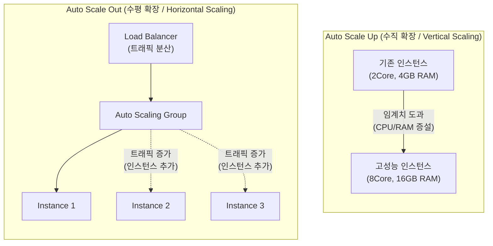

# Auto Scale Up과 Auto Scale Out

---

## I. 클라우드 자원 최적화의 핵심, Auto Scale Up/Out의 개요

* **가. Auto Scale Up / Auto Scale Out의 정의**
* 클라우드 및 [[컨테이너]] 환경에서 애플리케이션의 부하([[CPU]], Memory, 트래픽 등) 변화를 감지하여, 단일 서버의 성능을 높이거나(Scale Up) 서버의 개수를 늘려(Scale Out) 동적으로 자원을 할당하는 자동화 기술

* **나. Auto Scaling의 등장배경 및 특징**
* **등장배경**: 예기치 못한 트래픽 스파이크(Spike)로 인한 서비스 장애 방지, 유휴 자원 최소화를 통한 클라우드 비용 효율성(Pay-as-you-go) 극대화 요구
* **특징**: 무중단 서비스 제공, 상태 유지(Stateful) 및 무상태(Stateless) 워크로드 특성에 따른 맞춤형 확장 지원, 정책(Threshold) 및 예측(Predictive) 기반 자동화

---

## II. Auto Scaling의 개념도 및 핵심 기술 요소

### 가. Auto Scale Up / Auto Scale Out 개념도

* **Scale Up**은 단일 노드의 물리적/논리적 자원 크기를 증설하여 처리 능력을 향상시키며, **Scale Out**은 로드밸런서를 통해 인스턴스의 수를 늘려 분산 처리 능력을 확보함.

### 나. Auto Scaling의 핵심 기술 및 구성 요소

| 분류 | 요소기술(키워드) | 세부 설명 |
| --- | --- | --- |
| **모니터링** | **Metric Collector** | CPU, 메모리, 네트워크 I/O, 활성 [[세션]] 수 등 시스템/애플리케이션 지표 수집 (예: CloudWatch, Prometheus) |
| **트리거/제어** | **Scaling Policy (정책)** | 자원을 언제 늘리고 줄일지 결정하는 규칙 (Target Tracking, Step Scaling, 머신러닝 기반 예측 스케일링) |
| **리소스 관리** | **ASG (Auto Scaling Group)** | 동일한 설정(AMI)을 가진 인스턴스들의 논리적 그룹으로, 최소/최대/원하는 용량(Desired Capacity) 관리 |
| **트래픽 분배** | **Load Balancer** | Scale Out으로 추가된 다수의 인스턴스에 네트워크 트래픽을 균등하게 분배 (ALB, NLB) |
| **K8s (수직 확장)** | **VPA (Vertical Pod Autoscaler)** | [[쿠버네티스]] 환경에서 파드(Pod)의 CPU/Memory 요청량(Requests)과 제한량(Limits)을 자동으로 상향/하향 조정 |
| **K8s (수평 확장)** | **[[HPA (Horizontal Pod Autoscaler)]]** | 쿠버네티스 환경에서 CPU 사용률 등 메트릭에 따라 레플리카(Replica) 파드 개수를 동적으로 증감 |
| **K8s (노드 확장)** | **CA (Cluster Autoscaler)** | 파드를 할당할 노드(Node, VM)의 리소스가 부족할 때, 클러스터 자체의 노드 개수를 늘리거나 줄임 |
| **상태 체크** | **Health Check** | 인스턴스의 정상 작동 여부를 주기적으로 확인하여, 비정상 인스턴스는 제거(Terminate) 후 새 인스턴스로 교체 |

---

## III. Auto Scale Up과 Auto Scale Out의 비교 및 최신 동향

### 가. Auto Scale Up과 Auto Scale Out 비교

| 비교 항목 | Auto Scale Up (수직 확장) | Auto Scale Out (수평 확장) |
| --- | --- | --- |
| **확장 방식** | 단일 인스턴스의 자원(CPU, RAM) 크기 증대 | 동일한 스펙의 [[인스턴스]] 개수(Number) 증가 |
| **적합한 워크로드** | [[데이터베이스]](RDBMS), 상태 유지(Stateful) 앱 | Web/WAS 서버, 무상태(Stateless) 애플리케이션 |
| **장점** | 아키텍처 복잡도 낮음, 데이터 정합성 유지 용이 | 무제한에 가까운 확장성, 무중단 확장([[HA(High Availability)|고가용성]]) 용이 |
| **단점 (한계점)** | 단일 장비의 물리적 한계 존재, 증설 시 재시작(Downtime) 발생 가능성 | 로드밸런서 필수, 분산 환경에 따른 아키텍처 및 상태 동기화 복잡도 증가 |
| **축소 시 명칭** | Auto Scale Down | Auto Scale In |

### 나. Auto Scaling 분야의 발전 동향

* **예측 기반 확장 (Predictive Autoscaling)**: 과거의 트래픽 패턴을 머신러닝(ML) 알고리즘으로 분석하여, 부하가 급증하기 전(미리) 선제적으로 자원을 프로비저닝하여 지연 시간 방지.
* **이벤트 기반 스케일링 (KEDA)**: CPU/Memory와 같은 인프라 메트릭뿐만 아니라, Kafka 메시지 큐 길이, DB 쿼리 수 등 외부 이벤트 트리거를 기반으로 컨테이너(파드)를 확장하는 구조(Kubernetes Event-driven Autoscaling) 도입.
* **서버리스(Serverless) 스케일링**: 개발자가 인스턴스나 클러스터 관리에 신경 쓸 필요 없이, 호출(Invocation) 횟수에 따라 초 단위로 컨테이너 단위 자원이 무한 확장되는 구조(AWS Fargate, Google Cloud Run)로 진화.

---

### 🔗 연관 토픽

- **소속 도메인**: [[00_디지털서비스_MOC|🚀 디지털서비스]]
- **세부 분류**: `1. 클라우드 컴퓨팅 & 가상화 인프라`
- **핵심 연관 토픽**:
  - [[쿠버네티스|쿠버네티스(Kubernates)]]
  - [[HPA (Horizontal Pod Autoscaler)]]
  - [[컨테이너|컨테이너 (Container)]]
  - [[클라우드 네이티브]]
  - [[가상화]]
