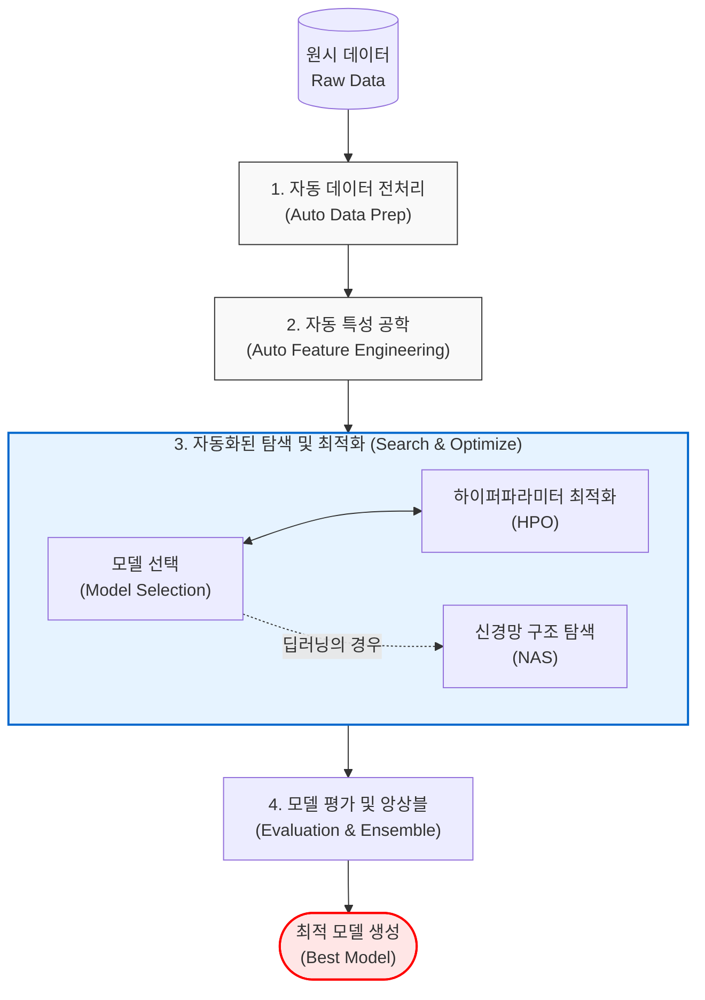

# AutoML (Automated Machine Learning)

---

## I. 머신러닝의 민주화, AutoML의 개요

* **가. AutoML의 정의**
* [[데이터 전처리]], 특성 공학(Feature Engineering), 모델 선택, 하이퍼파라미터 최적화 등 머신러닝 파이프라인의 전 과정을 자동화하여, 비전문가도 고성능의 AI 모델을 쉽게 구축할 수 있도록 지원하는 기술

* **나. AutoML의 등장배경 및 특징**
* **등장배경**: 전문 데이터 사이언티스트 인력 부족, 수동적인 시행착오(Trial & Error) 기반 모델링으로 인한 개발 장기화 및 높은 진입장벽 해소 필요
* **특징**: 머신러닝 파이프라인 자동화([[End-to-End]]), 휴먼 인더 루프(Human-in-the-loop) 최소화, 시티즌 데이터 사이언티스트(Citizen Data Scientist) 양성, 메타 학습(Meta-Learning) 및 [[최적화 알고리즘]] 활용

---

## II. AutoML의 프로세스 및 핵심 기술 요소

### 가. AutoML의 파이프라인 프로세스 및 개념도

* 데이터 입력 시 [[결측치]]/[[이상치]] 처리부터 최적의 특성 도출, [[알고리즘]] 선택 및 튜닝을 거쳐 최종적으로 가장 성능이 우수한 앙상블 모델을 배포하는 파이프라인을 자동 수행함.

### 나. AutoML의 핵심 기술 요소

| 분류 | 요소기술(키워드) | 세부 설명 |
| --- | --- | --- |
| **데이터 준비** | **Auto Data Imputation** | 결측치(Missing Value) 및 이상치(Outlier)를 자동으로 감지하고 최적의 통계적 기법으로 대체/제거 |
| **특성 공학** | **Auto Feature Engineering** | 기존 변수들을 조합하여 수학적 변환, 원-핫 인코딩(One-hot) 등을 통해 예측력 높은 새로운 파생 변수 자동 생성 |
| **모델 선택** | **Meta-Learning (메타 학습)** | 과거의 다양한 데이터셋과 모델 학습 경험(메타 데이터)을 바탕으로, 새로운 데이터에 적합한 알고리즘을 추천 |
| **최적화(일반)** | **HPO (Hyperparameter Optimization)** | Grid Search, Random Search를 넘어 **Bayesian Optimization(베이지안 최적화)** 등을 활용해 최적의 하이퍼파라미터 탐색 |
| **최적화([[딥러닝]])** | **[[NAS]] (Neural Architecture Search)** | [[강화학습]](RL)이나 진화 알고리즘(EA)을 사용하여 주어진 문제에 가장 적합한 심층 신경망(DNN) 구조를 자동 탐색 |
| **모델 평가** | **Ensemble Selection** | 단일 최고 모델뿐만 아니라, 다양한 모델의 예측 결과를 결합(Stacking, Blending)하여 성능과 [[일반화]] 능력 극대화 |
| **설명력** | **[[XAI]] (설명 가능한 AI)** | SHAP, [[LIME]] 등을 통합하여 AutoML이 생성한 블랙박스 모델의 예측 근거 및 피처 중요도를 사용자에게 시각적으로 제공 |
| **운영/배포** | **AutoMLOps** | AutoML로 생성된 모델을 [[MLOps]] 파이프라인에 이식하여 지속적 학습(CT) 및 모니터링 자동화 수행 |

---

## III. 기존 ML과 AutoML의 비교 및 발전 동향

### 가. 수동 기반 기존 머신러닝과 AutoML 방식의 비교

| 비교 항목 | 기존 머신러닝 (Manual ML) | AutoML |
| --- | --- | --- |
| **주요 수행 주체** | 전문 데이터 사이언티스트 (Data Scientist) | 도메인 전문가, 시민 데이터 과학자 (Citizen Data Scientist) |
| **파이프라인 구성** | 전문가의 직관과 수동 코딩에 의한 시행착오 | 알고리즘 기반 파이프라인 전체 자동화 탐색 |
| **소요 시간** | 수 주 ~ 수 개월 (비효율적) | 수 시간 ~ 수 일 (생산성 극대화) |
| **특성 공학(FE)** | 도메인 지식 기반의 수동 변수 생성 | 수학적/통계적 조합을 통한 대규모 자동 특성 생성 |
| **주요 솔루션** | Scikit-learn, TensorFlow, PyTorch 직접 활용 | Google Cloud AutoML, H2O.ai, DataRobot, Auto-sklearn |

* **향후 전망 및 동향**:
* 초기에는 고전적인 머신러닝 위주였으나, 최근에는 **NAS(Neural Architecture Search)를 통한 딥러닝 최적화**와 비전/자연어 처리(NLP) 분야로 영역이 크게 확장됨.
* 특히 최근 대형언어모델([[초거대 언어 모델|LLM]])과 결합하여, 사용자가 **자연어 프롬프트(Prompt)만으로 데이터 분석 목적을 입력하면 LLM이 AutoML 에이전트를 제어하여 최종 모델과 분석 리포트까지 도출**하는 LLM 기반 AutoML 프레임워크로 빠르게 진화하고 있음.

---

### 🔗 연관 토픽

- **소속 도메인**: [[00_인공지능_MOC|🤖 인공지능]]
- **세부 분류**: `5. 컴퓨터 비전 · 음성 & 에이전트`
- **핵심 연관 토픽**:
  - [[딥러닝]]
  - [[XAI]]
  - [[이상치]]
  - [[강화학습]]
  - [[LIME]]
