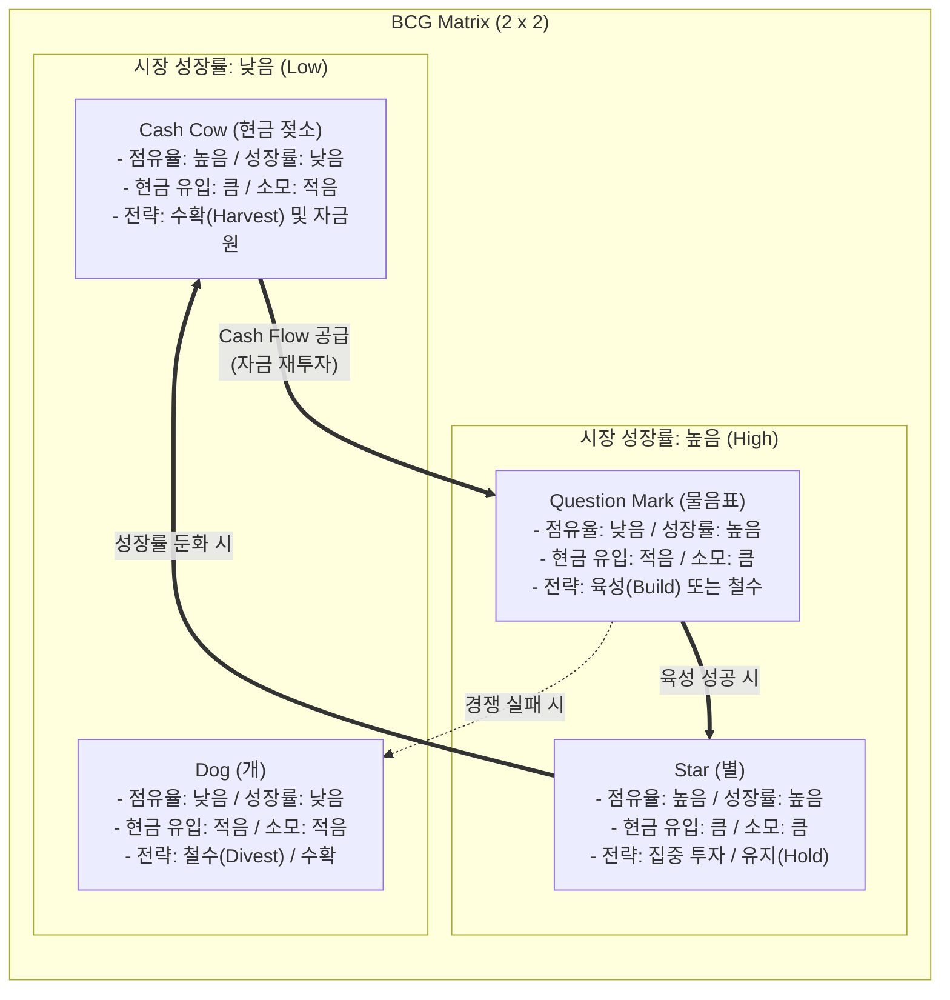

# BCG Matrix

---

## I. 전략적 사업 단위(SBU) 평가 및 자원 배분 도구, BCG Matrix의 개요

* **가. BCG Matrix의 정의**
* 보스턴 컨설팅 그룹(BCG)이 개발한 전략 분석 도구로, 산업의 시장 성장률과 기업의 상대적 시장 점유율을 축으로 사업 포트폴리오(SBU)를 4분면으로 분류하여 자원 배분 전략을 수립하는 포트폴리오 관리 기법(PPM)

* **나. BCG Matrix의 필요성 및 특징**
* **필요성**: 다각화된 기업 환경에서 한정된 자본의 효율적 재배분, 지속 가능한 성장과 현금 흐름(Cash Flow)의 균형 달성
* **특징**: 2x2 매트릭스 구조, 경험 곡선 효과(Experience Curve)와 제품 수명주기(PLC) 이론 기반, 현금 창출력과 현금 소모량의 직관적 시각화

---

## II. BCG Matrix의 구조 및 핵심 전략 요소

### 가. BCG Matrix의 4분면 구조 및 현금 흐름(Cash Flow) 개념도

* Cash Cow에서 창출된 잉여 현금을 Question Mark에 집중 투자(Build)하여 Star로 육성하고, 시장 성숙기 도래 시 Star가 다시 Cash Cow로 전환되는 선순환 사이클을 구축함.

### 나. BCG Matrix의 핵심 구성 요소 및 전략 방향

| 구분 | 요소기술(키워드) | 세부 설명 |
| --- | --- | --- |
| **평가 축** | **상대적 시장 점유율** | 선도 경쟁사 대비 자사의 시장 점유율 비율 ($x$축, 경험 곡선 기반의 비용 우위 및 현금 창출력 측정) |
| **평가 축** | **시장 성장률** | 해당 산업의 연간 매출 성장률 ($y$축, 제품 수명주기 단계 및 현금 투자 소요량 측정) |
| **4분면** | **Star (별)** | 고성장·고점유율 분면, 시장 지위 방어를 위해 막대한 재투자가 지속적으로 필요한 핵심 사업군 |
| **4분면** | **Cash Cow (현금 젖소)** | 저성장·고점유율 분면, 추가 설비투자 비용이 적어 타 사업(QM, Star) 육성을 위한 주 자금원 역할 |
| **4분면** | **Question Mark (물음표)** | 고성장·저점유율 분면, 시장 점유율 확대를 위해 현금 투입이 필수적이며 성공 시 Star로 전환 가능 |
| **4분면** | **Dog (개)** | 저성장·저점유율 분면, 수익성과 성장성이 모두 낮아 자본 회수 및 사업 철수가 검토되는 영역 |
| **실행 전략** | **Build (확대/육성)** | Question Mark의 시장 점유율을 끌어올려 Star로 전환하기 위한 대규모 투자 전략 |
| **실행 전략** | **Harvest (수확)** | 추가 투자 없이 단기적인 현금 흐름을 극대화하는 전략 (Cash Cow 유지 및 사양길 Dog 대상) |

---

## III. BCG Matrix와 GE/McKinsey Matrix 비교

### 가. 전략적 포트폴리오 관리 기법(BCG Matrix vs GE/McKinsey Matrix) 비교

| 비교 항목 | BCG Matrix | GE / McKinsey Matrix |
| --- | --- | --- |
| **매트릭스 크기** | **2 x 2** (4개 영역) | **3 x 3** (9개 영역) |
| **평가 축 (X / Y)** | **상대적 시장 점유율 / 시장 성장률** | **사업 강점(경쟁력) / 산업 매력도** |
| **평가 변수 특성** | 단일 정량 지표 중심 (단순, 직관적) | 다차원 복합 지표 종합 평가 (정량 + 정성) |
| **복잡도 및 비용** | 적용이 용이하고 데이터 수집 비용 저렴 | 지표 가중치 산정 및 평가 과정이 주관적이고 복잡 |
| **사업 분류 기준** | Star, Cash Cow, Question Mark, Dog | 투자/성장(Grow), 선별 유지(Hold), 철수/수확(Harvest) |
| **주요 한계점** | 사업 간 시너지 간과, 시장 점유율과 수익성의 상관관계 왜곡 가능 | 지표 선정 및 주관적 점수 부여에 따른 [[편향]] 위험 |

* **동향 및 현대적 시사점**:
* 최근 [[디지털 전환|디지털 전환(DX)]] 및 AI 생태계 환경에서는 플랫폼 간 네트워크 효과와 사업 간 데이터 융합(Synergy)이 핵심 경쟁력이 되면서, 사업부를 완전히 독립적으로 평가하는 고전적 BCG Matrix의 한계가 지적됨.
* 이에 따라 현대 기업들은 단순 4분면 배치를 넘어, 신기술 R&D 및 플랫폼 비즈니스를 평가할 수 있도록 **옵션 가치 평가(Real Options Valuation)** 및 **생태계 포트폴리오 관리 모델**과 연계하여 고도화된 자원 배분 의사결정을 수행하고 있음.

---

### 🔗 연관 토픽

- **소속 도메인**: [[00_경영전략_MOC|📈 경영전략]]
- **세부 분류**: `1. 경영 환경 분석 & 전략 수립 프레임워크`
- **핵심 연관 토픽**:
  - [[디지털 전환|디지털 전환(DX)]]
  - [[Ansoff Matrix]]
  - [[편향]]
  - [[환경분석]]
  - [[Backcasting|Backcasting (백캐스팅)]]
