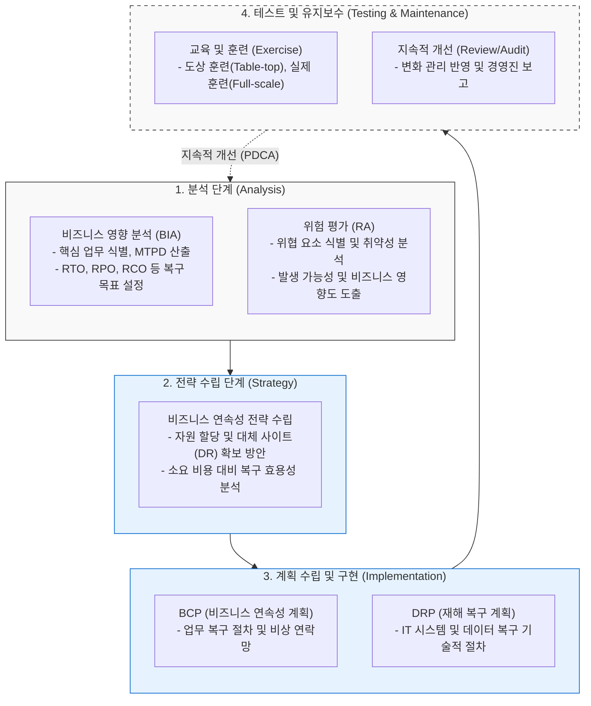

# BCM (Business Continuity Management)

---

## I. 기업의 생존과 회복 탄력성 확보를 위한 전사적 관리 체계, BCM의 개요

* **가. BCM(Business Continuity Management)의 정의**
* 재난, 재해, 사이버 공격 등 각종 위협 발생 시 비즈니스 중단을 최소화하고, 사전에 설정된 목표 복구 시간(RTO) 내에 핵심 업무를 복원하기 위한 전사적 위기 관리 체계([[ISO 22301]] 표준)

* **나. BCM의 등장배경 및 특징**
* **등장배경**: 재난/재해의 대형화 및 복잡화, IT 의존도 심화에 따른 시스템 중단 파급력 증가, 기업의 레질리언스(Resilience, 회복 탄력성) 확보 및 규제 준수(Compliance) 요구 증대
* **특징**: 비즈니스 관점의 포괄적 접근(IT 중심의 [[DRP(RTO, RPO 등)|DRP]] 한계 극복), 위험 기반(BIA/RA) 정량적/정성적 분석, [[PDCA(Plan-Do-Check-Act, Deming Cycle)|PDCA]](Plan-Do-Check-Act) 사이클 기반의 지속적 [[유지보수]] 및 개선 체계

---

## II. BCM의 라이프사이클 및 핵심 기술 요소

### 가. BCM 라이프사이클(Lifecycle) 개념도

* 조직의 위협과 영향을 분석(BIA/RA)하여 전략을 도출하고, 이를 바탕으로 구체적인 실행 계획([[BCP]]/DRP)을 수립한 뒤 주기적인 모의훈련과 피드백을 통해 체계를 지속적으로 개선함.

### 나. BCM의 핵심 구성 요소

| 분류 | 요소기술(키워드) | 세부 설명 |
| --- | --- | --- |
| **핵심 분석** | **[[BIA (Business Impact Analysis)]]** | 재난 시 비즈니스 중단이 초래하는 재무적/운영적 영향을 정량/정성적으로 분석하여 업무 중요도 및 복구 우선순위 결정 |
| **핵심 분석** | **RA (Risk Assessment)** | 조직을 위협하는 위험 요소를 식별하고 발생 가능성(Likelihood)과 영향도(Impact)를 평가하여 리스크 매트릭스 도출 |
| **복구 지표** | **RTO (Recovery Time Objective)** | 재난 발생 후 특정 업무 및 IT 시스템이 완전히 복구되어 서비스를 재개해야 하는 '최대 허용 복구 시간' |
| **복구 지표** | **RPO (Recovery Point Objective)** | 재난 발생 시 허용될 수 있는 데이터 손실의 최대 한계 시점 (백업 시점과 재난 발생 시점 간의 차이) |
| **복구 지표** | **MTPD (Maximum Tolerable Period of Disruption)** | 업무 중단 시 조직의 생존에 치명적인 영향을 미치기 전까지 감내할 수 있는 최대 허용 중단 시간 |
| **실행 계획** | **BCP (Business Continuity Plan)** | IT뿐만 아니라 인력, 시설, 공급망을 포함한 비즈니스 전반의 연속성을 유지하기 위한 상세 대응 절차 및 지침서 |
| **실행 계획** | **DRP (Disaster Recovery Plan)** | 물리적/논리적 재해 상황에서 서버, 네트워크, [[데이터베이스]] 등 IT 인프라를 신속하게 복구하기 위한 기술적 절차서 |
| **복구 자원** | **DR 센터 (Disaster Recovery Center)** | 주 센터 장애 시 서비스를 대행하는 백업 센터 (복구 수준에 따라 Mirror, Hot, Warm, Cold 사이트로 구분) |

---

## III. BCM과 BCP/DRP 비교 및 최신 동향

### 가. 재난 대응 체계 범위 비교 (BCM vs BCP vs DRP)

| 비교 항목 | BCM (Business Continuity Management) | BCP (Business Continuity Plan) | DRP (Disaster Recovery Plan) |
| --- | --- | --- | --- |
| **개념 범위** | 최상위 개념 (전사적 위기관리 체계) | 중간 개념 (업무 연속성 유지 계획) | 최하위 개념 (IT 시스템 복구 계획) |
| **주요 목적** | 비즈니스 회복 탄력성(Resilience) 내재화 및 지속 개선 | 비즈니스 중단 최소화 및 기업 생존 보장 | IT 인프라 및 데이터의 신속하고 안전한 복원 |
| **관리 대상** | 조직, 정책, [[프로세스]], 문화 전반 (거버넌스) | 비즈니스 프로세스, 인력, 시설, 공급망 | 전산 장비, 네트워크, 데이터베이스, 백업 데이터 |
| **결과물** | BCM 정책서, ISO 22301 인증 체계, 감사 보고서 | 업무 복구 매뉴얼, 비상 연락망, 대체 업무 지침 | 시스템 복구 매뉴얼, 백업/소산 지침서 |
| **운영 방식** | 계획-수립-운영-검토의 순환적 관리 (Lifecycle) | 재난 발생 전/중/후의 행동 지침 (Plan) | 재난 발생 후의 기술적 조치 절차 (Plan) |

* **최신 동향 및 전망**:
* **클라우드 기반 DR ([[DRaaS]])**: 초기 구축 비용이 막대한 물리적 DR 센터 대신, 퍼블릭 클라우드를 활용하여 온디맨드로 인프라를 복구하는 DRaaS(Disaster Recovery as a Service)의 도입이 대중화되고 있음.
* **[[사이버 레질리언스|사이버 레질리언스(Cyber Resilience)]] 연계**: [[랜섬웨어]] 및 지능형 위협(APT) 등 논리적 파괴 공격이 급증함에 따라, 단순히 데이터를 복원하는 것을 넘어 오염되지 않은 클린 백업본(Air-gapped Backup) 기반의 사이버 생존성 확보 체계로 BCM이 고도화되는 추세임.

---

### 🔗 연관 토픽

- **소속 도메인**: [[00_경영전략_MOC|📈 경영전략]]
- **세부 분류**: `3. 비즈니스 프로세스 혁신 & 디지털 전환 (DX)`
- **핵심 연관 토픽**:
  - [[BCP|BCP (Business Continuity Planning)]]
  - [[BIA (Business Impact Analysis)]]
  - [[DRaaS]]
  - [[ISO 22301]]
  - [[DRP(RTO, RPO 등)]]
