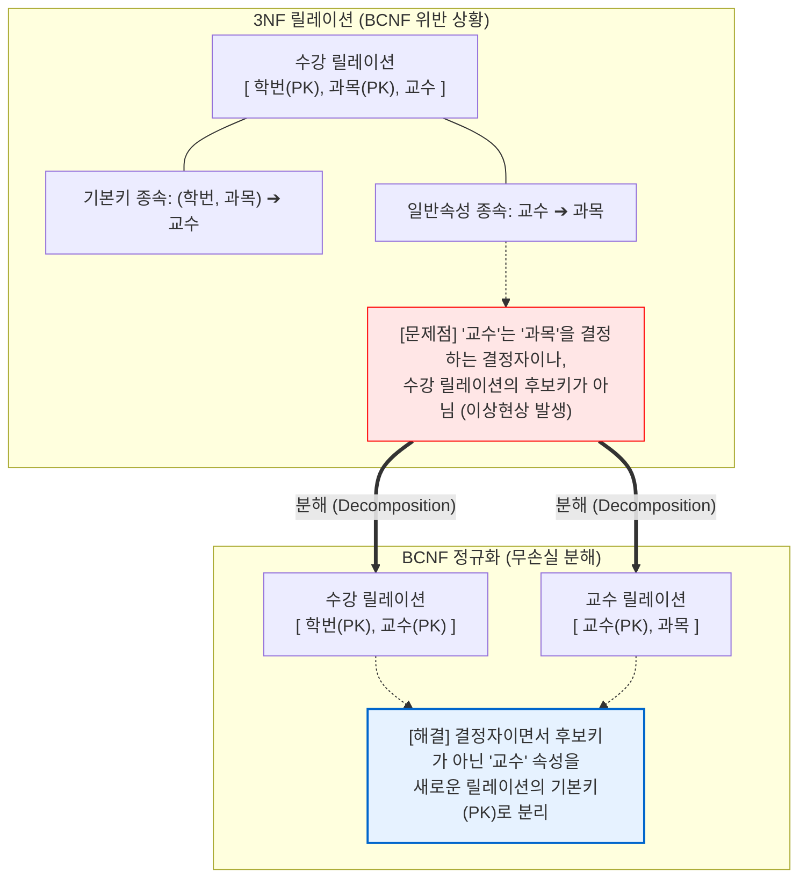

# BCNF (Boyce-Codd Normal Form)

---

## I. 모든 결정자가 후보키인 강한 정규형, BCNF의 개요

* **가. BCNF(Boyce-Codd Normal Form, 3.5NF)의 정의**
* 제3정규형(3NF)을 만족하면서, 릴레이션에 존재하는 모든 결정자(Determinant)가 항상 후보키(Candidate Key)가 되도록 함수 종속성을 제거한 정규형

* **나. BCNF의 등장배경 및 특징**
* **등장배경**: 제3정규형을 만족하더라도, 복수의 후보키가 존재하고 이들이 중첩되는 부분집합을 가질 때 갱신 이상([[Anomaly(이상현상)|Anomaly]]) 현상이 여전히 발생하는 한계 극복
* **특징**: 강한 제3정규형(3.5NF), 다수의 후보키 존재 시 적용, 부분 함수 종속 및 이행 함수 종속 완전 제거, 릴레이션의 무손실 분해(Lossless Decomposition) 원칙 적용

---

## II. BCNF의 개념도 및 핵심 기술 요소

### 가. BCNF의 분해 메커니즘 및 개념도

* 릴레이션 내에 $X \rightarrow Y$ 성립 시, 결정자인 $X$가 후보키 집합에 속하지 않으면 이를 분해하여 새로운 릴레이션으로 구성함으로써 이상현상을 원천 차단함.

### 나. BCNF의 핵심 기술 요소

| 분류 | 요소기술(키워드) | 세부 설명 |
| --- | --- | --- |
| **핵심 요건** | **후보키 (Candidate Key)** | 릴레이션의 튜플을 유일하게 식별할 수 있는 속성들의 부분집합 (유일성 및 최소성 만족) |
| **핵심 요건** | **결정자 (Determinant)** | 함수적 종속 관계($X \rightarrow Y$)에서 주어진 릴레이션의 다른 속성($Y$)을 고유하게 결정하는 속성($X$) |
| **대상 장애** | **이상현상 (Anomaly)** | 릴레이션 설계 시 속성 간 논리적 종속성으로 인해 발생하는 데이터 중복 및 [[데이터베이스]] 불일치(삽입, 삭제, 갱신 이상) |
| **분해 원칙** | **무손실 분해 (Lossless Decomposition)** | 정규화를 위해 릴레이션을 분해한 후, 자연 조인(Natural Join)을 통해 원래의 릴레이션으로 정보 손실 없이 완벽히 복원 가능한 성질 |
| **평가 기준** | **[[함수적 종속성|함수적 종속성 (Functional Dependency)]]** | 릴레이션 $R$에서 속성 $X$의 값이 속성 $Y$의 값을 유일하게 결정하는 논리적 관계 |
| **종속 유형** | **이행적 함수 종속 (Transitive FD)** | $X \rightarrow Y$, $Y \rightarrow Z$ 일 때 $X \rightarrow Z$ 가 성립하는 관계로, 제3정규형(3NF)에서 제거됨 |
| **제약 조건** | **종속성 보존 (Dependency Preservation)** | 릴레이션 분해 전의 모든 함수적 종속성이 분해된 릴레이션들에서도 유지되는 성질 (BCNF는 이를 항상 보장하지는 않음) |
| **이전 단계** | **제3정규형 (3NF)** | 제2정규형을 만족하면서, 기본키가 아닌 모든 속성이 기본키에 이행적 함수 종속이 되지 않는 상태 |

---

## III. 제3정규형(3NF)과 BCNF의 비교 및 향후 전망

### 가. 3NF와 BCNF의 상세 비교

| 비교 항목 | 제3정규형 (3NF) | BCNF (Boyce-Codd Normal Form) |
| --- | --- | --- |
| **제거 대상 (정규화 조건)** | 기본키에 대한 **이행적 함수 종속** 제거 | 결정자이면서 **후보키가 아닌 함수 종속** 제거 |
| **결정자 자격** | 모든 결정자가 반드시 후보키일 필요는 없음 | **모든 결정자는 반드시 후보키(Candidate Key)여야 함** |
| **이상현상 발생 여부** | 겹치는 복합 후보키가 존재할 경우 이상현상 발생 가능 | 다수의 후보키가 중첩되는 상황에서도 **이상현상 완벽 제거** |
| **종속성 보존 여부** | 분해 시 모든 함수적 종속성이 **항상 보존됨** | 분해 과정에서 특정 함수적 종속성이 **보존되지 않을 수 있음** |
| **데이터베이스 적용** | 일반적인 관계형 DB 설계의 기본 목표 수준 | 복합키가 많고 상호 의존성이 높은 복잡한 [[스키마]] 설계 시 필수 |

* **전망 및 실무적 시사점**:
* BCNF는 3NF보다 강력한 정규형으로 데이터 무결성을 보장하지만, 정규화 과정에서 원본 릴레이션의 종속성을 잃어버리는 '종속성 미보존' 현상이 발생할 수 있어 물리 DB 설계 시 역정규화(Denormalization)와의 Trade-off 분석이 필수적임.
* 현대의 대용량 [[분산 데이터베이스]] 환경([[NoSQL (CAP 이론 BASE 속성)|NoSQL]], [[New SQL|NewSQL]])에서는 [[조인|조인(Join)]] 비용을 줄이기 위해 BCNF 수준의 고도 정규화보다는 데이터 정합성(Eventual Consistency)을 보장하는 선에서의 비정규화 데이터 모델링 방식이 널리 통용되고 있음.

---

### 🔗 연관 토픽

- **소속 도메인**: [[00_데이터베이스_MOC|🗄️ 데이터베이스]]
- **세부 분류**: `1. 데이터 모델링 & 관계형 DB 설계`
- **핵심 연관 토픽**:
  - [[Anomaly(이상현상)]]
  - [[함수적 종속성|함수적 종속성 (Functional Dependency)]]
  - [[데이터베이스]]
  - [[NoSQL (CAP 이론 BASE 속성)]]
  - [[스키마]]
