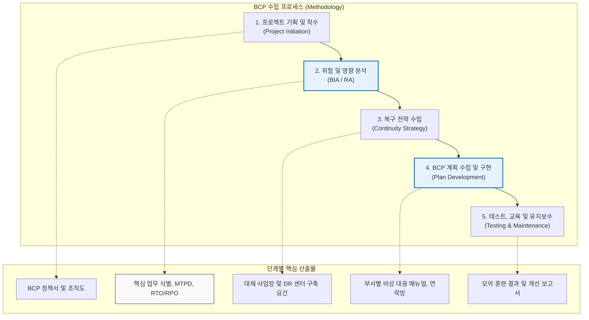

# BCP (Business Continuity Planning)

---

## I. 중단 없는 기업 운영을 위한 전사적 대응 체계, BCP의 개요

* **가. BCP([[비즈니스 연속성 계획|Business Continuity Planning]])의 정의**
* 재난, 재해, 테러, 사이버 공격 등 예기치 못한 위기 상황에서도 기업의 핵심 비즈니스 기능을 중단 없이 지속하거나 목표 복구 시간(RTO) 내에 복원하기 위해 수립하는 전사적 위기 대응 계획

* **나. BCP의 등장배경 및 특징**
* **등장배경**: 재난의 대형화 및 예측 불가능성 증대, IT 시스템 의존도 심화에 따른 서비스 중단 파급력 극대화, 각종 컴플라이언스([[ISO 22301]] 등) 및 이해관계자의 요구 강화
* **특징**: IT 복구([[DRP(RTO, RPO 등)|DRP]])를 넘어선 비즈니스 중심의 전사적 관점, 사전 예방(Prevention) 및 사후 복구(Recovery)의 통합, 정량적/[[정성적 위험 분석]](BIA/RA) 기반의 전략 수립

---

## II. BCP 수립 프로세스 및 핵심 구성요소

### 가. BCP 수립 방법론 및 수행 프로세스 개념도

* 조직의 업무 현황을 분석(BIA)하고 리스크(RA)를 평가하여 목표 지표(RTO, RPO)를 설정한 후, 구체적인 자원 확보 전략과 상세 매뉴얼(BCP)을 작성하여 주기적으로 훈련함.

### 나. BCP의 핵심 기술 및 구성 요소

| 분류 | 요소기술(키워드) | 세부 설명 |
| --- | --- | --- |
| **현황 분석** | **[[BIA (Business Impact Analysis)]]** | 재해로 인한 업무 중단 시 예상되는 재무적/비재무적 손실을 분석하여 핵심 업무 및 복구 우선순위 결정 |
| **위험 분석** | **RA (Risk Assessment)** | 기업에 발생 가능한 잠재적 위협 요소를 식별하고, 발생 확률(Likelihood)과 영향(Impact)을 정량화 |
| **복구 지표** | **RTO (Recovery Time Objective)** | 재해 발생 후 비즈니스 [[프로세스]] 및 IT 서비스가 완전히 복구되어야 하는 목표 시간 한계점 |
| **복구 지표** | **RPO (Recovery Point Objective)** | 재난 발생 시 데이터 손실을 감내할 수 있는 최대 시점 (백업 데이터의 최신성 기준) |
| **허용 지표** | **MTPD (최대 허용 중단 시간)** | 업무 중단 시 기업의 생존 및 신뢰도에 치명적인 손실을 입기 전까지 버틸 수 있는 최대 시간 |
| **세부 계획** | **DRP (Disaster Recovery Plan)** | 전사적 BCP 전략 하에, 정보시스템(IT 서버, 네트워크, DB 등)을 실제 복원하기 위한 기술적 하위 계획 |
| **대응 자원** | **DR 센터 (대체 사업장)** | 본 센터 기능 상실 시 즉시 업무를 재개할 수 있는 백업 센터 (Hot, Warm, Cold Site로 구분) |
| **유지 관리** | **모의 훈련 (Exercise)** | 수립된 BCP의 실효성을 검증하기 위한 도상 훈련(Table-top) 및 실제 전환 훈련(Mock/Full-scale Test) |

---

## III. 기업 위기관리 체계 비교 및 BCP 발전 동향

### 가. 위기관리 포괄 범위에 따른 BCP, DRP, BCM 비교

| 비교 항목 | DRP (Disaster Recovery Plan) | BCP (Business Continuity Plan) | [[BCM]] (Business Continuity Mgmt.) |
| --- | --- | --- | --- |
| **기본 개념** | **재해 복구 계획** | **업무 연속성 계획** | **업무 연속성 관리 체계** |
| **포괄 범위** | 최하위 체계 (IT 중심) | 중간 체계 (비즈니스 중심) | 최상위 체계 (전사적 경영 활동) |
| **복구 대상** | 데이터, 서버 인프라, 네트워크 장비 | 핵심 비즈니스 프로세스, 인력, 시설 | 조직의 전체 생존력 및 거버넌스 |
| **주요 활동** | 백업 데이터 소산 시스템 페일오버(Failover) | 비상 연락 체계 가동 대체 업무장소(Workplace) 전환 | BCP/DRP 통합 관리 정기적 검토, 감사(ISO 22301) |
| **대응 시점** | 주로 재해 발생 **이후**의 기술적 조치 | 재해 발생 직후부터 복구까지의 지침 | 평상시 사전 예방 및 사후 관리 |

* **전망 및 실무적 시사점**:
* **[[DRaaS]](Disaster Recovery as a Service) 확산**: 클라우드 인프라의 발달로 대규모 물리적 DR 센터를 자체 구축하지 않고 퍼블릭 클라우드 자원을 온디맨드로 활용하는 DRaaS 기반의 경제적인 BCP 구현이 대세로 자리 잡고 있음.
* **[[사이버 레질리언스]] 연계**: 최근 [[랜섬웨어]] 위협이 기업 생존의 핵심 리스크로 부상함에 따라, 전통적인 화재/정전 대비 BCP에서 나아가 오프라인/불변(Immutable) 백업 기반의 데이터 [[무결성]] 보장 모델이 BCP의 필수 항목으로 융합되는 추세임.

---

### 🔗 연관 토픽

- **소속 도메인**: [[00_경영전략_MOC|📈 경영전략]]
- **세부 분류**: `3. 비즈니스 프로세스 혁신 & 디지털 전환 (DX)`
- **핵심 연관 토픽**:
  - [[BIA (Business Impact Analysis)]]
  - [[ISO 22301]]
  - [[BCM|BCM (Business Continuity Management)]]
  - [[DRaaS]]
  - [[DRP(RTO, RPO 등)]]
