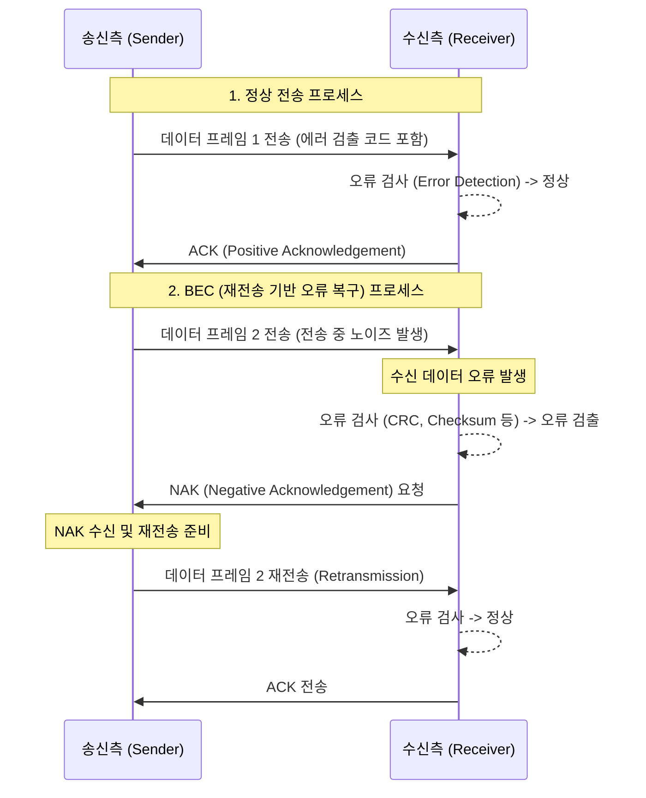

# BEC (Backward Error Correction)

---

## I. 신뢰성 있는 데이터 전송을 위한 역방향 제어, BEC의 개요

* **가. BEC(Backward Error Correction)의 정의**
* 데이터 전송 중 발생한 오류를 수신측에서 검출(Detection)한 후, 송신측에 역방향 채널(Feedback Channel)을 통해 재전송(Retransmission)을 요구하여 오류를 복구하는 데이터 통신 오류 제어 기법

* **나. BEC의 등장배경 및 특징**
* **등장배경**: 전송 매체의 노이즈나 간섭으로 인한 데이터 훼손 복구 필요, 잉여 데이터(Redundancy)를 최소화하면서 높은 신뢰성을 확보하기 위한 방안 요구
* **특징**: ARQ(Automatic Repeat Request) 메커니즘 활용, 피드백(역방향) 채널 필수, 수신측 자체 정정이 아닌 재전송에 의존하므로 전송 지연(Delay) 발생, 대역폭 효율성 우수

---

## II. BEC의 동작 원리 및 핵심 구성요소

### 가. BEC의 개념도 및 동작 원리

* 송신측은 오류 검출을 위한 부가 비트를 포함하여 데이터를 전송하며, 수신측은 오류 발견 시 NAK(부정 응답)를 보내어 송신측이 해당 프레임을 재전송(ARQ)하도록 유도함.

### 나. BEC의 핵심 기술 및 구성 요소

| 구분 | 요소기술(키워드) | 세부 설명 |
| --- | --- | --- |
| **오류 검출** | **Parity Check** | 데이터 블록에 1비트의 패리티 비트(짝수/홀수)를 추가하여 단일 비트 오류를 검출하는 가장 단순한 기법 |
| **오류 검출** | **[[CRC]] (순환 중복 검사)** | 다항식 코드(Polynomial Code)를 사용하여 송수신측이 동일한 제수(Divisor)로 연산해 집단 오류(Burst Error) 검출 |
| **오류 검출** | **Checksum** | 전송 데이터를 일정 단위로 분할 및 합산하여 1의 보수를 취한 값을 추가 전송, 수신측에서 검증 ([[네트워크 계층]] 이상 적용) |
| **오류 제어** | **Stop-and-Wait ARQ** | 송신측이 하나의 프레임을 전송한 후, 수신측으로부터 ACK 또는 NAK가 올 때까지 대기하는 가장 단순한 재전송 기법 |
| **오류 제어** | **Go-Back-N ARQ** | 슬라이딩 윈도우 기반으로, 오류가 발생한 프레임부터 그 이후에 전송된 모든 프레임을 일괄 재전송하는 기법 |
| **오류 제어** | **Selective-Repeat ARQ** | 오류가 발생하여 NAK를 수신한 특정 프레임(손상된 프레임)만 선별적으로 재전송하여 대역폭 낭비를 최소화하는 기법 |
| **필수 환경** | **Feedback Channel** | 수신측이 송신측으로 제어 신호(ACK, NAK, 슬라이딩 윈도우 상태 등)를 전달하기 위한 역방향 통신 선로 |

---

## III. 통신 오류 제어 기법(BEC vs FEC) 비교 및 발전 동향

### 가. BEC와 FEC(Forward Error Correction) 비교

| 비교 항목 | BEC (Backward Error Correction) | FEC (Forward Error Correction) |
| --- | --- | --- |
| **오류 제어 방식** | 수신측 검출 후 송신측 **재전송 (ARQ)** | 수신측에서 오류 검출 및 **자체 정정** |
| **역방향(피드백) 채널** | **반드시 필요** (ACK/NAK 전송용) | **불필요** (단방향 통신에서도 가능) |
| **부가 데이터(오버헤드)** | 적음 (오류 검출용 비트만 포함) | 많음 (오류 정정용 잉여 비트 포함, 대역폭 소모 큼) |
| **전송 지연 (Delay)** | 오류 발생 시 재전송에 따른 **지연 발생** | 오류를 즉시 복구하므로 **지연 없음** (실시간성 보장) |
| **주요 [[알고리즘]]** | CRC, Checksum + ARQ (Go-Back-N 등) | 해밍 코드(Hamming), 리드-솔로몬(RS), LDPC, Turbo |
| **주요 활용 분야** | 유선 통신, [[TCP]]/IP 등 [[신뢰성]] 최우선 환경 | 위성 통신, 심우주 통신, 실시간 미디어 스트리밍 |

* **전망 및 동향**:
* 최근 이동통신망(5G/6G, LTE) 및 무선 채널 환경에서는 FEC와 BEC의 장점을 결합한 **HARQ (Hybrid ARQ)** 기법이 표준 기술로 채택되고 있음.
* HARQ는 수신된 에러 데이터 패킷을 버리지 않고 메모리에 임시 저장(Soft Combining)한 뒤, 재전송된 패킷과 결합하여 오류 복구 확률을 극대화함으로써 열악한 무선 환경에서도 처리율(Throughput)과 신뢰성을 동시에 보장하는 방향으로 고도화되고 있음.

---

### 🔗 연관 토픽

- **소속 도메인**: [[00_네트워크_MOC|🌐 네트워크]]
- **세부 분류**: `1. OSI 7계층 & 데이터링크 계층 (L1/L2)`
- **핵심 연관 토픽**:
  - [[CRC|CRC(Cyclic Redundancy Check)]]
  - [[FEC(Forward Error Correction) BEC(Backward Error Correction)|FEC(Forward Error Correction) / BEC(Backward Error Correction)]]
  - [[TCP]]
  - [[네트워크 계층|네트워크 계층 (Network Layer)]]
  - [[데이터 링크 계층|데이터 링크 계층 (Data Link Layer)]]
