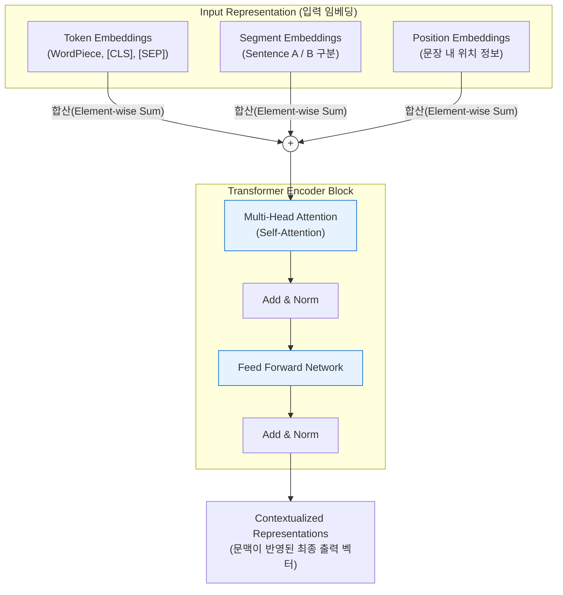

# BERT

---

## I. 양방향 문맥 이해 기반 사전학습 언어모델, BERT의 개요

* **가. BERT(Bidirectional Encoder Representations from Transformers)의 정의**
* 구글이 제안한 [[트랜스포머]](Transformer)의 인코더(Encoder) 아키텍처를 기반으로, 대규모 텍스트 코퍼스를 양방향으로 읽어 문맥을 파악하는 사전학습(Pre-trained) 기반 자연어 처리 모델

* **나. BERT의 등장배경 및 특징**
* **등장배경**: 기존 단방향(좌에서 우로) 언어 모델(GPT-1 등) 및 얕은 양방향 모델(ELMo)이 지닌 문맥 이해 한계 극복, 범용적인 NLU(자연어 이해) 태스크 성능 향상 필요성 대두
* **특징**: 양방향(Bidirectional) 컨텍스트 동시 반영, MLM(Masked Language Model) 및 NSP(Next Sentence Prediction) 기법 적용, 사전학습-미세조정(Pre-training & [[Fine-Tuning|Fine-tuning]]) 패러다임 확립

---

## II. BERT의 아키텍처 및 핵심 구성요소

### 가. BERT의 아키텍처 및 동작 원리

* 입력 텍스트는 Token, Segment, Position 3가지 임베딩의 합산으로 구성되며, 여러 층의 트랜스포머 인코더 블록(Self-Attention)을 통과하며 주변 단어들과의 관계가 완벽히 반영된 벡터를 출력함.

### 나. BERT의 핵심 기술 요소

| 분류 | 요소기술(키워드) | 세부 설명 |
| --- | --- | --- |
| **핵심 아키텍처** | **Transformer Encoder** | 순환 신경망([[RNN (Recurrent Neural Network)|RNN]]) 없이 Self-Attention 메커니즘만을 사용하여 병렬 처리를 수행하고 양방향 문맥을 동시에 파악하는 신경망 |
| **입력 처리** | **WordPiece Tokenizer** | BPE(Byte Pair Encoding) 기반으로 서브워드(Subword) 단위 토큰화를 수행하여 미등록 단어(OOV) 문제를 해결하는 기법 |
| **입력 처리** | **[CLS] / [SEP] 토큰** | [CLS]는 문장 전체의 요약 정보를 담는 분류용 토큰이며, [SEP]는 두 문장(예: 질의와 응답)을 논리적으로 분리하는 경계 토큰 |
| **사전학습(PT)** | **MLM (Masked Language Model)** | 전체 입력 토큰의 약 15%를 무작위로 마스킹([MASK])한 후, 양쪽 문맥을 모두 활용하여 가려진 원래 단어를 예측하는 방식 |
| **사전학습(PT)** | **NSP (Next Sentence Prediction)** | 두 문장(A, B)을 입력받아, 문장 B가 문장 A의 논리적인 '다음 문장'인지 여부(IsNext / NotNext)를 이진 분류로 예측 |
| **[[전이학습]]** | **Fine-tuning (미세 조정)** | 사전학습을 마친 범용 모델의 가중치를 초기값으로 사용하여, 질의응답(QA), 개체명 인식(NER) 등 특정 태스크에 맞게 파라미터를 미세 업데이트 |

---

## III. BERT와 GPT 비교 및 향후 전망

### 가. 대표적인 대규모 언어 모델 아키텍처 (BERT vs GPT) 비교

| 비교 항목 | BERT (Bidirectional Encoder Rep.) | GPT (Generative Pre-trained Transformer) |
| --- | --- | --- |
| **기반 아키텍처** | 트랜스포머의 **인코더(Encoder)** 기반 | 트랜스포머의 **디코더(Decoder)** 기반 |
| **학습 방향** | **양방향 (Bidirectional)** | **단방향 (Unidirectional, Left-to-Right)** |
| **주요 사전학습** | MLM (마스크 토큰 예측), NSP (다음 문장 예측) | 다음 단어 예측 (Autoregressive Language Modeling) |
| **강점 분야** | 자연어 이해 (NLU): 문장 분류, 감성 분석, 형태소 분석 | 자연어 생성 (NLG): 텍스트 생성, 번역, 대화(Chat) |
| **주요 변형 모델** | RoBERTa, ALBERT, DistilBERT, KoBERT | GPT-3, GPT-4, LLaMA, Claude |

* **전망 및 동향**:
* 최근 생성형 AI 트렌드의 확산으로 GPT와 같은 디코더 기반의 텍스트 생성형 [[초거대 언어 모델|LLM]]이 시장을 주도하고 있으나, 연산 비용이 높다는 단점이 존재함.
* 이에 따라 BERT 계열 모델은 성능을 경량화(DistilBERT 등)하여 비용 효율을 극대화하는 방향으로 발전 중이며, 빠른 속도와 높은 정확도가 요구되는 **문서 분류 시스템(Spam/Abuse Detection)** 및 **RAG 기반 시맨틱 검색(Semantic Search) 엔진의 벡터 임베딩 모델** 분야에서 대체 불가능한 핵심 인프라로 지속 활용되고 있음.

---

### 🔗 연관 토픽

- **소속 도메인**: [[00_인공지능_MOC|🤖 인공지능]]
- **세부 분류**: `3. 딥러닝 핵심 아키텍처 & 신경망`
- **핵심 연관 토픽**:
  - [[트랜스포머|트랜스포머(Transformer)]]
  - [[전이학습|전이학습 (Transfer Learning)]]
  - [[초거대 언어 모델|초거대 언어 모델(Large Language Model)]]
  - [[RNN (Recurrent Neural Network)]]
  - [[자기 집중]]
